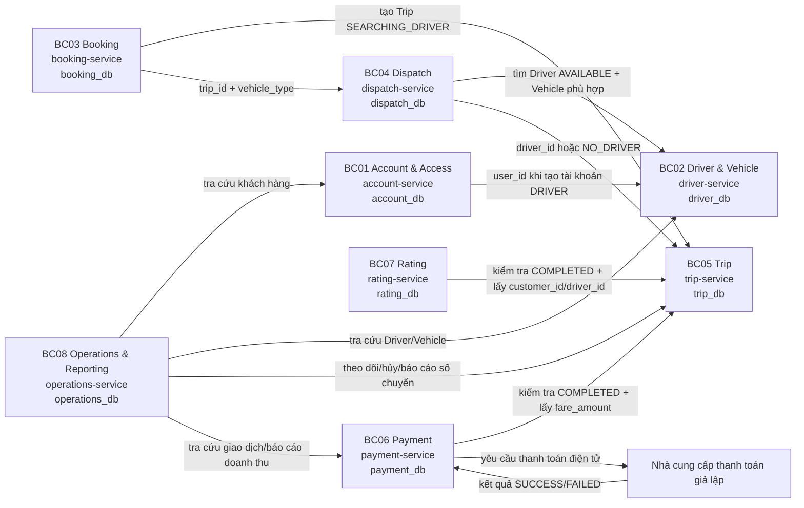
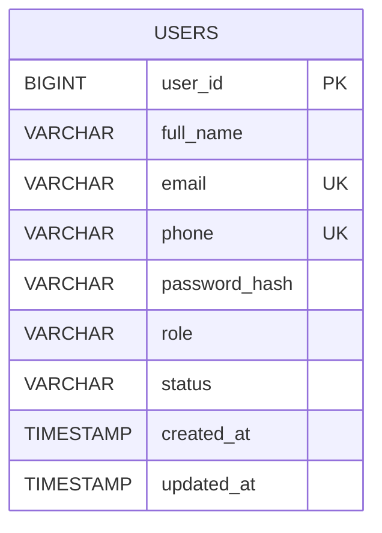
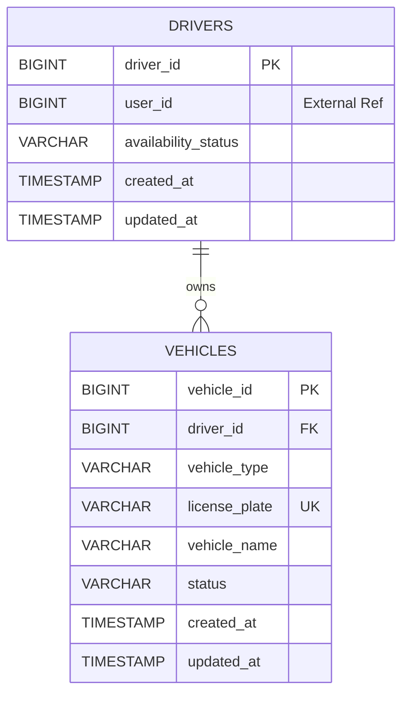
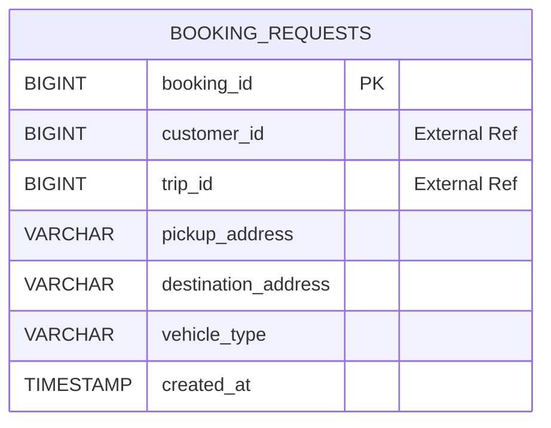
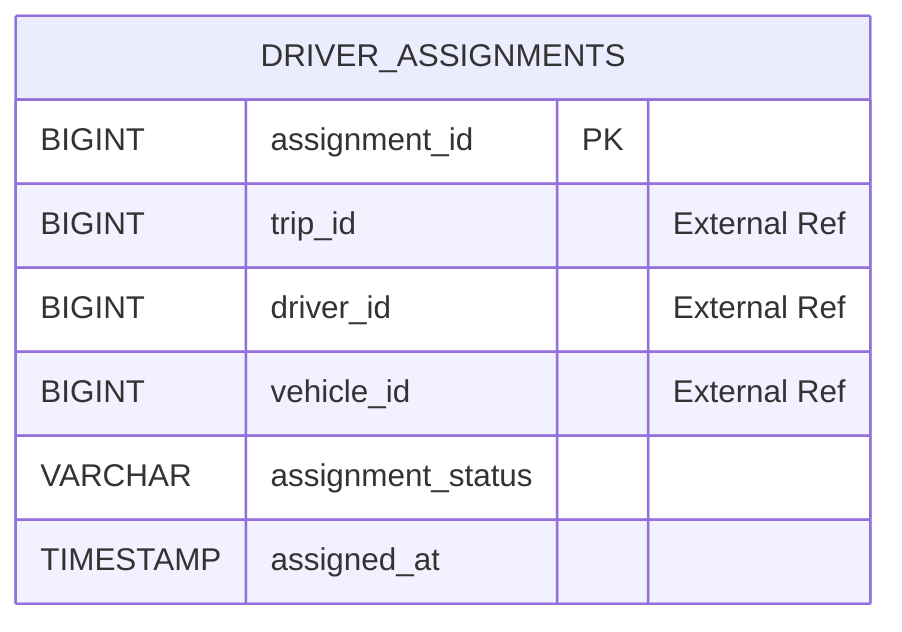
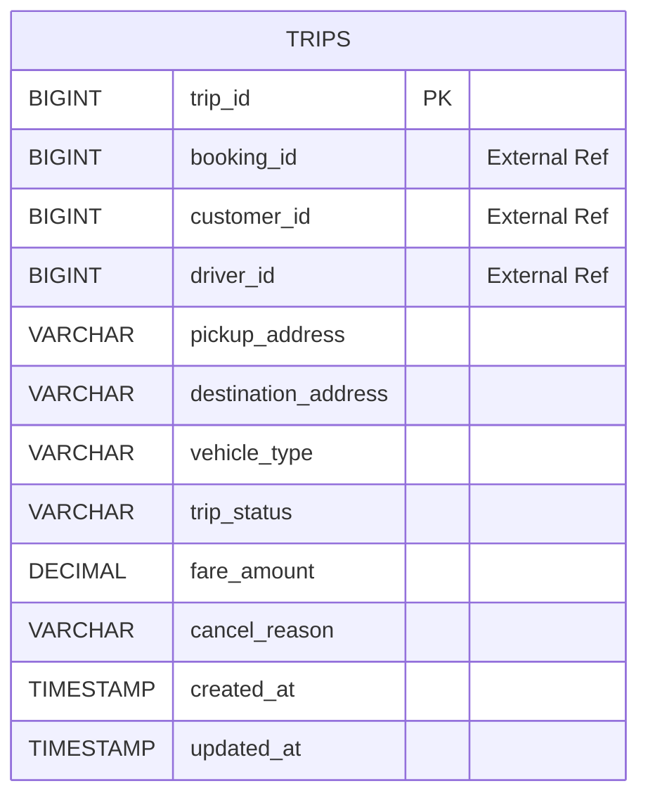
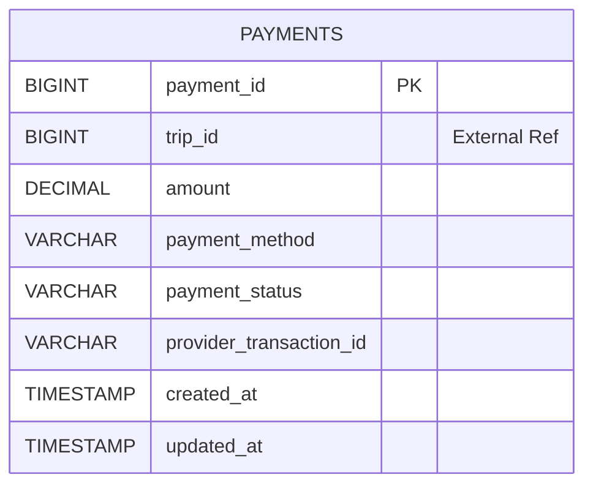
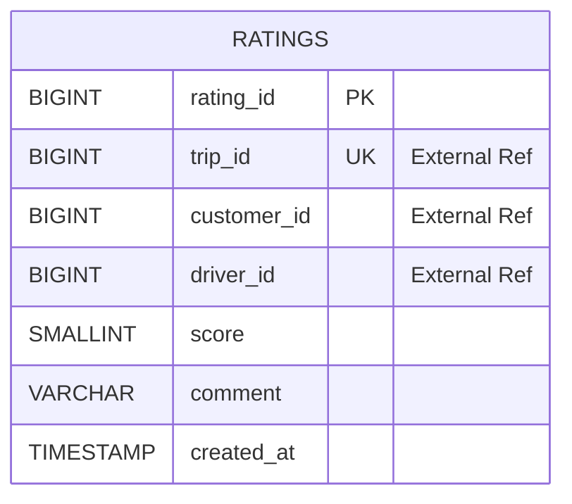
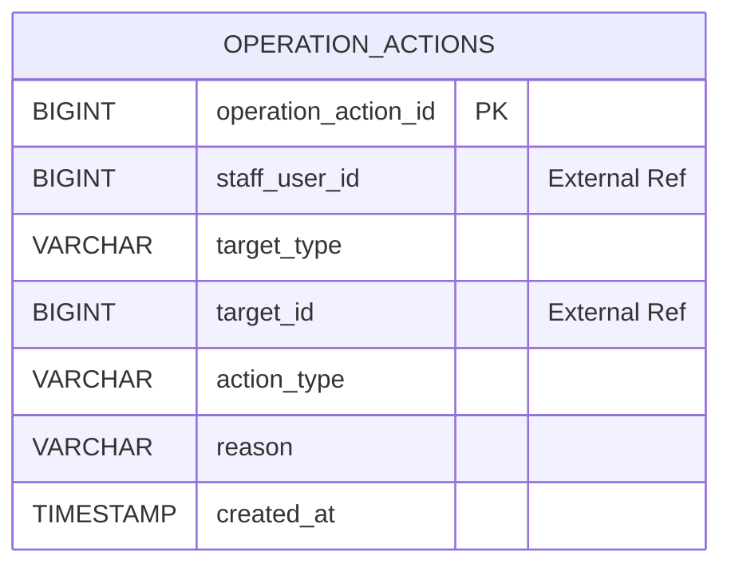

# DDD BOUNDED CONTEXT & MICROSERVICE DESIGN – CAB SYSTEM
# 1. XÁC ĐỊNH BOUNDED CONTEXT

## 1.1. Cơ sở phân rã

SRS hiện tại có workflow chính:

```text
Khách hàng đăng nhập
        ↓
Tạo yêu cầu đặt xe
        ↓
Hệ thống tạo chuyến SEARCHING_DRIVER
        ↓
Tìm tài xế AVAILABLE
        ↓
Kiểm tra phương tiện phù hợp
        ↓
Tự động gán tài xế phù hợp đầu tiên
        ↓
Tài xế thực hiện và cập nhật trạng thái chuyến
        ↓
Hoàn thành chuyến
        ↓
Tính cước
        ↓
Khách hàng thanh toán
        ↓
Khách hàng đánh giá tài xế
```

Ngoài workflow chính, hệ thống còn có nghiệp vụ dành cho nhân viên vận hành và quản lý: tra cứu khách hàng, tài xế, phương tiện, chuyến, giao dịch; hủy chuyến gặp sự cố; xem báo cáo số chuyến và doanh thu.

### Nguyên tắc phân rã

Không chia Context theo tên bảng hoặc tên file YAML một cách máy móc. Việc phân rã dựa trên **ranh giới nghiệp vụ và trách nhiệm dữ liệu**.

Sau khi tách chi tiết hơn so với phiên bản 4 Context ban đầu, CAB System được phân thành **8 Bounded Context**. Cách tách này vẫn bám đúng FR01–FR33, không thêm chức năng mới.

> **Lưu ý:** Không tạo `Notification Service` riêng. Trong SRS chỉ có FR12 thông báo khi không tìm được tài xế, còn SMS/push notification thực tế nằm ngoài phạm vi. FR12 được đặt trong Dispatch Context.  
> `Rating` được tách thành Context riêng vì SRS có nhóm nghiệp vụ đánh giá rõ ràng với FR22–FR23 và API `06_rating.yaml` riêng.

## 1.2. Bảng tổng quan 8 Bounded Context

| STT | Bounded Context | Sub-domain | Microservice | Database | FR chính | Business Process |
|---|---|---|---|---|---|---|
| 1 | **BC01 – Account & Access** | Identity & Access | `account-service` | `account_db` | FR01–FR04, FR32–FR33 | Đăng ký, đăng nhập, cập nhật tài khoản, tạo tài khoản tài xế, xác thực và phân quyền |
| 2 | **BC02 – Driver & Vehicle** | Driver Operations | `driver-service` | `driver_db` | FR05–FR07 | Quản lý hồ sơ tài xế, phương tiện, trạng thái sẵn sàng |
| 3 | **BC03 – Booking** | Ride Booking | `booking-service` | `booking_db` | FR08 | Tiếp nhận và lưu yêu cầu đặt xe của khách hàng |
| 4 | **BC04 – Dispatch** | Driver Dispatch | `dispatch-service` | `dispatch_db` | FR09–FR12 | Tìm tài xế, kiểm tra phương tiện, tự động gán tài xế, xử lý không có tài xế |
| 5 | **BC05 – Trip** | Trip Lifecycle | `trip-service` | `trip_db` | FR13–FR17 | Theo dõi, hủy, lịch sử, cập nhật tiến trình chuyến, tính cước |
| 6 | **BC06 – Payment** | Payment Transaction | `payment-service` | `payment_db` | FR18–FR21 | Chọn phương thức và ghi nhận thanh toán tiền mặt/điện tử |
| 7 | **BC07 – Rating** | Driver Rating | `rating-service` | `rating_db` | FR22–FR23 | Khách hàng đánh giá tài xế sau chuyến hoàn thành |
| 8 | **BC08 – Operations & Reporting** | Back-office Operations | `operations-service` | `operations_db` | FR24–FR31 | Tra cứu vận hành, xử lý chuyến sự cố, báo cáo số chuyến và doanh thu |

---

## 1.3. BC01 – Account & Access Context

### Mục đích

Quản lý danh tính, thông tin tài khoản, đăng nhập, tài khoản tài xế do nhân viên vận hành tạo, xác thực và phân quyền.

### Functional Requirements

| Mã FR | Chức năng | Vai trò trong Context |
|---|---|---|
| FR01 | Hệ thống cho phép khách hàng đăng ký tài khoản | Owner |
| FR02 | Hệ thống cho phép người dùng đăng nhập | Owner |
| FR03 | Hệ thống cho phép khách hàng cập nhật thông tin cá nhân | Owner |
| FR04 | Hệ thống cho phép nhân viên vận hành tạo tài khoản tài xế | Owner tài khoản; Driver Service nhận `user_id` để tạo hồ sơ Driver |
| FR32 | Hệ thống xác thực người dùng | Owner |
| FR33 | Hệ thống kiểm tra quyền truy cập | Owner cơ chế xác thực/phân quyền; từng service kiểm tra role tại endpoint |

### Business Process / Workflow

| Workflow | Bước xử lý | Kết quả |
|---|---|---|
| Đăng ký khách hàng | Kiểm tra dữ liệu → kiểm tra email/phone → băm mật khẩu → tạo User role CUSTOMER | Tài khoản khách hàng được tạo |
| Đăng nhập | Kiểm tra email/mật khẩu → xác thực password hash → phát token | Người dùng đăng nhập thành công |
| Cập nhật thông tin | Xác định User từ token → kiểm tra dữ liệu → cập nhật | Hồ sơ tài khoản được cập nhật |
| Tạo tài khoản tài xế | Staff tạo User role DRIVER → gọi Driver Service tạo Driver theo `user_id` | Có tài khoản và hồ sơ tài xế |
| Phân quyền | Kiểm tra token và role trước khi xử lý API | Request được cho phép hoặc từ chối |

### Dữ liệu Service sở hữu

- `User`
- `Role`
- `AccountStatus`
- `Email`
- `Phone`
- `PasswordHash`

---

## 1.4. BC02 – Driver & Vehicle Context

### Mục đích

Quản lý hồ sơ nghiệp vụ tài xế, phương tiện và trạng thái sẵn sàng. Cung cấp dữ liệu tài xế phù hợp cho Dispatch Service.

### Functional Requirements

| Mã FR | Chức năng | Vai trò trong Context |
|---|---|---|
| FR05 | Hệ thống cho phép tài xế cập nhật hồ sơ | Owner phần hồ sơ Driver; dữ liệu tài khoản chung được đồng bộ qua Account Service |
| FR06 | Hệ thống cho phép tài xế cập nhật phương tiện | Owner |
| FR07 | Hệ thống cho phép tài xế cập nhật trạng thái tài xế | Owner |

### Business Process / Workflow

| Workflow | Bước xử lý | Kết quả |
|---|---|---|
| Khởi tạo Driver | Nhận `user_id` từ Account Service | Tạo hồ sơ Driver |
| Cập nhật hồ sơ | Tài xế cập nhật dữ liệu nghiệp vụ | Driver được cập nhật |
| Cập nhật phương tiện | Kiểm tra dữ liệu → tạo/cập nhật Vehicle | Vehicle được lưu |
| Cập nhật sẵn sàng | Driver chuyển AVAILABLE/UNAVAILABLE | Trạng thái dùng cho Dispatch |
| Cung cấp ứng viên | Lọc AVAILABLE + Vehicle ACTIVE + đúng loại xe | Trả danh sách tài xế phù hợp cho Dispatch Service |

### Dữ liệu Service sở hữu

- `Driver`
- `Vehicle`
- `AvailabilityStatus`
- `VehicleType`

`drivers.user_id` là **External Reference ID** tới Account Service.

---

## 1.5. BC03 – Booking Context

### Mục đích

Tiếp nhận yêu cầu đặt xe của khách hàng, lưu thông tin yêu cầu ban đầu và điều phối việc tạo Trip cùng quá trình tìm tài xế.

### Functional Requirements

| Mã FR | Chức năng | Vai trò trong Context |
|---|---|---|
| FR08 | Hệ thống cho phép khách hàng tạo yêu cầu đặt xe | Owner |

### Business Process / Workflow

| Workflow | Bước xử lý | Kết quả |
|---|---|---|
| Tạo yêu cầu đặt xe | Nhận điểm đón, điểm đến, loại xe → kiểm tra dữ liệu | BookingRequest hợp lệ |
| Khởi tạo chuyến | Gọi Trip Service tạo Trip trạng thái `SEARCHING_DRIVER` | Có `trip_id` |
| Yêu cầu điều phối | Gọi Dispatch Service với `trip_id` và loại xe | Bắt đầu tìm/gán tài xế |

### Dữ liệu Service sở hữu

- `BookingRequest`
- `PickupAddress`
- `DestinationAddress`
- `RequestedVehicleType`

`customer_id` là External Reference ID tới Account Service.  
`trip_id` là External Reference ID tới Trip Service sau khi chuyến được tạo.

> `BookingRequest` là entity kỹ thuật để tách trách nhiệm giữa nhận yêu cầu và quản lý vòng đời Trip. Việc thêm entity này **không tạo Functional Requirement mới** và không thay đổi workflow trong SRS.

---

## 1.6. BC04 – Dispatch Context

### Mục đích

Tự động tìm tài xế đang sẵn sàng, kiểm tra phương tiện phù hợp, chọn tài xế phù hợp đầu tiên và ghi nhận kết quả điều phối.

### Functional Requirements

| Mã FR | Chức năng | Vai trò trong Context |
|---|---|---|
| FR09 | Hệ thống tìm tài xế đang sẵn sàng | Owner orchestration; Driver Service cung cấp dữ liệu |
| FR10 | Hệ thống tìm tài xế có phương tiện phù hợp | Owner orchestration; Driver Service cung cấp dữ liệu |
| FR11 | Hệ thống tự động gán tài xế phù hợp đầu tiên cho chuyến | Owner |
| FR12 | Hệ thống thông báo khi không tìm được tài xế | Owner kết quả điều phối; trả trạng thái để Booking/Trip hiển thị cho khách hàng |

### Business Process / Workflow

| Workflow | Bước xử lý | Kết quả |
|---|---|---|
| Tìm tài xế | Gọi Driver Service với `vehicle_type` | Có danh sách Driver phù hợp hoặc rỗng |
| Gán tài xế | Chọn ứng viên phù hợp đầu tiên | Tạo DriverAssignment |
| Cập nhật Trip | Gọi Trip Service gán `driver_id` | Trip chuyển `DRIVER_ASSIGNED` |
| Không có tài xế | Không có ứng viên phù hợp | Trip chuyển `NO_DRIVER`; kết quả được trả cho khách hàng |

### Dữ liệu Service sở hữu

- `DriverAssignment`
- `AssignmentStatus`

`trip_id`, `driver_id`, `vehicle_id` đều là **External Reference ID**, không tạo FK sang database khác.

---

## 1.7. BC05 – Trip Context

### Mục đích

Quản lý vòng đời chuyến từ khi được tạo đến khi hoàn thành hoặc bị hủy; cung cấp lịch sử, trạng thái chuyến và số tiền cuối cùng.

### Functional Requirements

| Mã FR | Chức năng | Vai trò trong Context |
|---|---|---|
| FR13 | Hệ thống cho phép khách hàng theo dõi chuyến | Owner |
| FR14 | Hệ thống cho phép khách hàng hủy chuyến | Owner |
| FR15 | Hệ thống cho phép khách hàng xem lịch sử chuyến | Owner |
| FR16 | Hệ thống cho phép tài xế cập nhật trạng thái chuyến theo đúng trình tự | Owner |
| FR17 | Hệ thống tính số tiền phải trả | Owner; kết quả được Payment Service sử dụng |

### Business Process / Workflow

| Workflow | Bước xử lý | Kết quả |
|---|---|---|
| Tạo Trip | Nhận dữ liệu từ Booking Service | Trip `SEARCHING_DRIVER` |
| Nhận kết quả Dispatch | Nhận `driver_id` hoặc kết quả không có tài xế | `DRIVER_ASSIGNED` hoặc `NO_DRIVER` |
| Theo dõi chuyến | Đọc Trip theo quyền khách hàng | Trả trạng thái hiện tại |
| Thực hiện chuyến | Driver cập nhật trạng thái đúng trình tự | Trip tiến triển qua vòng đời |
| Hoàn thành | Chuyển `COMPLETED` → tính `fare_amount` | Có số tiền phải trả |
| Hủy | Customer hoặc Operations Service yêu cầu hủy | Trip `CANCELLED` + lý do nếu có |
| Lịch sử | Truy vấn các Trip theo `customer_id` | Danh sách chuyến |

### Trạng thái Trip

```text
SEARCHING_DRIVER
    ├──> DRIVER_ASSIGNED
    │       └──> DRIVER_ARRIVED
    │               └──> PICKED_UP
    │                       └──> IN_PROGRESS
    │                               └──> COMPLETED
    ├──> NO_DRIVER
    └──> CANCELLED
```

### Dữ liệu Service sở hữu

- `Trip`
- `TripStatus`
- `FareAmount`
- `CancelReason`

`booking_id`, `customer_id`, `driver_id` là External Reference ID.

---

## 1.8. BC06 – Payment Context

### Mục đích

Quản lý giao dịch thanh toán theo chuyến, gồm tiền mặt và thanh toán điện tử qua nhà cung cấp giả lập.

### Functional Requirements

| Mã FR | Chức năng | Vai trò trong Context |
|---|---|---|
| FR18 | Hệ thống cho phép khách hàng chọn phương thức thanh toán | Owner |
| FR19 | Hệ thống ghi nhận thanh toán tiền mặt | Owner |
| FR20 | Hệ thống gửi yêu cầu thanh toán điện tử tới bộ giả lập | Owner |
| FR21 | Hệ thống ghi nhận kết quả thanh toán | Owner |

### Business Process / Workflow

| Workflow | Bước xử lý | Kết quả |
|---|---|---|
| Chuẩn bị thanh toán | Gọi Trip Service kiểm tra Trip `COMPLETED` và lấy `fare_amount` | Có số tiền hợp lệ |
| Chọn phương thức | Customer chọn CASH hoặc ELECTRONIC | Xác định cách thanh toán |
| Tiền mặt | Ghi nhận Payment SUCCESS | Giao dịch được lưu |
| Điện tử | Tạo Payment PENDING → gọi bộ giả lập → nhận kết quả | Payment SUCCESS hoặc FAILED |

### Dữ liệu Service sở hữu

- `Payment`
- `PaymentMethod`
- `PaymentStatus`
- `Amount`

`trip_id` là External Reference ID tới Trip Service.

---

## 1.9. BC07 – Rating Context

### Mục đích

Quản lý đánh giá của khách hàng cho tài xế sau khi chuyến đi đã hoàn thành.

### Functional Requirements

| Mã FR | Chức năng | Vai trò trong Context |
|---|---|---|
| FR22 | Hệ thống cho phép khách hàng đánh giá tài xế | Owner |
| FR23 | Hệ thống lưu đánh giá | Owner |

### Business Process / Workflow

| Workflow | Bước xử lý | Kết quả |
|---|---|---|
| Kiểm tra điều kiện | Gọi Trip Service kiểm tra Trip `COMPLETED` và lấy `driver_id`, `customer_id` | Cho phép hoặc từ chối đánh giá |
| Gửi đánh giá | Nhận score 1–5 và comment | Rating hợp lệ |
| Lưu đánh giá | Kiểm tra chưa đánh giá chuyến này → lưu | Rating được lưu |

### Dữ liệu Service sở hữu

- `Rating`
- `Score`
- `Comment`

`trip_id`, `customer_id`, `driver_id` đều là External Reference ID.

---

## 1.10. BC08 – Operations & Reporting Context

### Mục đích

Cung cấp giao diện nghiệp vụ cho nhân viên vận hành và quản lý. Context này **không chiếm quyền sở hữu dữ liệu** của Account, Driver, Trip hoặc Payment; thay vào đó gọi API của các service sở hữu dữ liệu.

### Functional Requirements

| Mã FR | Chức năng | Vai trò trong Context |
|---|---|---|
| FR24 | Hệ thống cho phép nhân viên vận hành tra cứu khách hàng | Owner orchestration; Account Service cung cấp dữ liệu |
| FR25 | Hệ thống cho phép nhân viên vận hành tra cứu tài xế | Owner orchestration; Driver Service cung cấp dữ liệu |
| FR26 | Hệ thống cho phép nhân viên vận hành tra cứu phương tiện | Owner orchestration; Driver Service cung cấp dữ liệu |
| FR27 | Hệ thống cho phép nhân viên vận hành theo dõi chuyến | Owner orchestration; Trip Service cung cấp dữ liệu |
| FR28 | Hệ thống cho phép nhân viên vận hành hủy chuyến kèm lý do khi có sự cố | Owner workflow; Trip Service thực hiện thay đổi Trip |
| FR29 | Hệ thống cho phép nhân viên vận hành tra cứu giao dịch | Owner orchestration; Payment Service cung cấp dữ liệu |
| FR30 | Hệ thống cho phép quản lý xem báo cáo số lượng chuyến | Owner report API; tổng hợp từ Trip Service |
| FR31 | Hệ thống cho phép quản lý xem báo cáo doanh thu | Owner report API; tổng hợp từ Payment Service |

### Business Process / Workflow

| Workflow | Bước xử lý | Kết quả |
|---|---|---|
| Tra cứu khách hàng | Gọi Account Service | Danh sách khách hàng |
| Tra cứu tài xế/phương tiện | Gọi Driver Service | Danh sách phù hợp |
| Theo dõi chuyến | Gọi Trip Service | Danh sách/trạng thái chuyến |
| Hủy chuyến sự cố | Ghi nhận OperationAction → gọi Trip Service hủy với lý do | Trip bị hủy và có lịch sử thao tác vận hành |
| Tra cứu giao dịch | Gọi Payment Service | Danh sách Payment |
| Báo cáo số chuyến | Gọi Trip Service lấy aggregate | `total_trips` |
| Báo cáo doanh thu | Gọi Payment Service lấy aggregate | `total_revenue` |

### Dữ liệu Service sở hữu

- `OperationAction`
- `ActionType`
- `ActionReason`

Các dữ liệu Customer, Driver, Vehicle, Trip và Payment chỉ được **đọc qua API**, không sao chép thành bảng chính trong `operations_db`.

---

## 1.11. Mapping toàn bộ FR → Bounded Context

| FR | Chức năng | Bounded Context | Microservice |
|---|---|---|---|
| FR01 | Khách hàng đăng ký tài khoản | BC01 | `account-service` |
| FR02 | Người dùng đăng nhập | BC01 | `account-service` |
| FR03 | Khách hàng cập nhật thông tin cá nhân | BC01 | `account-service` |
| FR04 | Nhân viên vận hành tạo tài khoản tài xế | BC01 | `account-service`; Driver Service hỗ trợ tạo hồ sơ |
| FR05 | Tài xế cập nhật hồ sơ | BC02 | `driver-service` |
| FR06 | Tài xế cập nhật phương tiện | BC02 | `driver-service` |
| FR07 | Tài xế cập nhật trạng thái tài xế | BC02 | `driver-service` |
| FR08 | Khách hàng tạo yêu cầu đặt xe | BC03 | `booking-service` |
| FR09 | Tìm tài xế đang sẵn sàng | BC04 | `dispatch-service`; Driver Service cung cấp dữ liệu |
| FR10 | Tìm tài xế có phương tiện phù hợp | BC04 | `dispatch-service`; Driver Service cung cấp dữ liệu |
| FR11 | Tự động gán tài xế phù hợp đầu tiên | BC04 | `dispatch-service` |
| FR12 | Thông báo khi không tìm được tài xế | BC04 | `dispatch-service` |
| FR13 | Khách hàng theo dõi chuyến | BC05 | `trip-service` |
| FR14 | Khách hàng hủy chuyến | BC05 | `trip-service` |
| FR15 | Khách hàng xem lịch sử chuyến | BC05 | `trip-service` |
| FR16 | Tài xế cập nhật trạng thái chuyến theo đúng trình tự | BC05 | `trip-service` |
| FR17 | Tính số tiền phải trả | BC05 | `trip-service` |
| FR18 | Khách hàng chọn phương thức thanh toán | BC06 | `payment-service` |
| FR19 | Ghi nhận thanh toán tiền mặt | BC06 | `payment-service` |
| FR20 | Gửi yêu cầu thanh toán điện tử tới bộ giả lập | BC06 | `payment-service` |
| FR21 | Ghi nhận kết quả thanh toán | BC06 | `payment-service` |
| FR22 | Khách hàng đánh giá tài xế | BC07 | `rating-service` |
| FR23 | Lưu đánh giá | BC07 | `rating-service` |
| FR24 | Nhân viên vận hành tra cứu khách hàng | BC08 | `operations-service`; Account Service cung cấp dữ liệu |
| FR25 | Nhân viên vận hành tra cứu tài xế | BC08 | `operations-service`; Driver Service cung cấp dữ liệu |
| FR26 | Nhân viên vận hành tra cứu phương tiện | BC08 | `operations-service`; Driver Service cung cấp dữ liệu |
| FR27 | Nhân viên vận hành theo dõi chuyến | BC08 | `operations-service`; Trip Service cung cấp dữ liệu |
| FR28 | Nhân viên vận hành hủy chuyến kèm lý do | BC08 | `operations-service`; Trip Service thực thi thay đổi |
| FR29 | Nhân viên vận hành tra cứu giao dịch | BC08 | `operations-service`; Payment Service cung cấp dữ liệu |
| FR30 | Quản lý xem báo cáo số lượng chuyến | BC08 | `operations-service`; Trip Service cung cấp aggregate |
| FR31 | Quản lý xem báo cáo doanh thu | BC08 | `operations-service`; Payment Service cung cấp aggregate |
| FR32 | Xác thực người dùng | BC01 | `account-service` |
| FR33 | Kiểm tra quyền truy cập | BC01 | `account-service` + middleware tại từng service |

---

## 1.12. Mapping Business Process → Microservice

| STT | Business Activity | Bounded Context | Microservice | Entity/Data liên quan |
|---|---|---|---|---|
| 1 | Khách hàng đăng nhập | BC01 | `account-service` | User |
| 2 | Khách hàng nhập điểm đón, điểm đến, loại xe | BC03 | `booking-service` | BookingRequest |
| 3 | Khách hàng gửi yêu cầu đặt xe | BC03 | `booking-service` | BookingRequest |
| 4 | Tạo Trip `SEARCHING_DRIVER` | BC05 | `trip-service` | Trip |
| 5 | Tìm Driver AVAILABLE | BC04 + BC02 | `dispatch-service` → `driver-service` | DriverCandidate |
| 6 | Kiểm tra Vehicle phù hợp | BC04 + BC02 | `dispatch-service` → `driver-service` | Vehicle |
| 7 | Gán tài xế phù hợp đầu tiên | BC04 | `dispatch-service` | DriverAssignment |
| 8 | Cập nhật `DRIVER_ASSIGNED` hoặc `NO_DRIVER` | BC05 | `trip-service` | Trip |
| 9 | Khách hàng theo dõi chuyến | BC05 | `trip-service` | Trip |
| 10 | Tài xế cập nhật tiến trình chuyến | BC05 | `trip-service` | TripStatus |
| 11 | Hoàn thành chuyến và tính cước | BC05 | `trip-service` | FareAmount |
| 12 | Khách hàng chọn phương thức thanh toán | BC06 | `payment-service` | Payment |
| 13 | Ghi nhận tiền mặt hoặc gửi bộ giả lập | BC06 | `payment-service` | Payment |
| 14 | Ghi nhận kết quả thanh toán | BC06 | `payment-service` | PaymentStatus |
| 15 | Khách hàng đánh giá tài xế | BC07 | `rating-service` | Rating |
| 16 | Nhân viên vận hành tra cứu/theo dõi | BC08 | `operations-service` | Dữ liệu tổng hợp qua API |
| 17 | Nhân viên hủy chuyến gặp sự cố | BC08 + BC05 | `operations-service` → `trip-service` | OperationAction + Trip |
| 18 | Quản lý xem báo cáo | BC08 | `operations-service` | Trip/Payment aggregate qua API |

---

## 1.13. Context Map



---

# 2. UBIQUITOUS LANGUAGE

Mỗi Bounded Context có bộ ngôn ngữ riêng. Cùng một khái niệm chỉ được hiểu theo phạm vi Context đang sử dụng.

## 2.1. BC01 – Account & Access

| Thuật ngữ | Code Term | Ý nghĩa trong Context | Quy tắc sử dụng |
|---|---|---|---|
| Người dùng | `User` | Tài khoản có thể đăng nhập CAB System | Aggregate Root của BC01 |
| Khách hàng | `CUSTOMER` | Role của User sử dụng dịch vụ đặt xe | Không đồng nghĩa Booking Customer entity riêng |
| Tài khoản tài xế | `DRIVER` | User có quyền tài xế | Khác với entity `Driver` ở BC02 |
| Nhân viên vận hành | `STAFF` | User có quyền vận hành | Không phải một service dữ liệu người dùng riêng |
| Quản lý | `MANAGER` | User có quyền xem báo cáo | Chỉ là Role |
| Xác thực | `Authentication` | Xác minh danh tính | Dùng email/password và token |
| Phân quyền | `Authorization` | Kiểm tra quyền theo Role | Thực thi tại middleware/endpoint |
| Trạng thái tài khoản | `AccountStatus` | Trạng thái sử dụng User | Do Account Service sở hữu |

## 2.2. BC02 – Driver & Vehicle

| Thuật ngữ | Code Term | Ý nghĩa trong Context | Quy tắc sử dụng |
|---|---|---|---|
| Tài xế | `Driver` | Hồ sơ nghiệp vụ của tài xế | Không chứa password hoặc token |
| Mã tài khoản | `user_id` | User tương ứng với Driver | External Reference ID |
| Phương tiện | `Vehicle` | Xe thuộc Driver | Quan hệ nội bộ với Driver |
| Loại xe | `VehicleType` | MOTORBIKE/CAR | Dùng để Dispatch lọc phù hợp |
| Trạng thái sẵn sàng | `AvailabilityStatus` | AVAILABLE/UNAVAILABLE | Driver AVAILABLE mới được xét gán |
| Phương tiện hoạt động | `ACTIVE` | Vehicle được phép dùng | Phải kết hợp với availability khi tìm tài xế |
| Ứng viên tài xế | `DriverCandidate` | DTO trả cho Dispatch | Không phải entity lưu riêng |

## 2.3. BC03 – Booking

| Thuật ngữ | Code Term | Ý nghĩa trong Context | Quy tắc sử dụng |
|---|---|---|---|
| Yêu cầu đặt xe | `BookingRequest` | Yêu cầu do khách hàng gửi | Aggregate Root của BC03 |
| Khách đặt xe | `customer_id` | User tạo yêu cầu | External Reference ID |
| Điểm đón | `PickupAddress` | Nơi bắt đầu | Bắt buộc |
| Điểm đến | `DestinationAddress` | Nơi kết thúc | Bắt buộc |
| Loại xe yêu cầu | `RequestedVehicleType` | Loại xe khách chọn | MOTORBIKE/CAR |
| Chuyến được tạo | `trip_id` | Trip tạo từ BookingRequest | External Reference ID tới BC05 |

## 2.4. BC04 – Dispatch

| Thuật ngữ | Code Term | Ý nghĩa trong Context | Quy tắc sử dụng |
|---|---|---|---|
| Điều phối | `Dispatch` | Quy trình tìm và gán Driver | Không quản lý vòng đời Trip |
| Tài xế phù hợp | `EligibleDriver` | AVAILABLE và có Vehicle phù hợp | Dữ liệu lấy từ Driver Service |
| Gán tài xế | `DriverAssignment` | Kết quả chọn Driver cho Trip | Aggregate Root của BC04 |
| Tài xế được chọn | `driver_id` | Driver được gán | External Reference ID |
| Chuyến cần gán | `trip_id` | Trip đang `SEARCHING_DRIVER` | External Reference ID |
| Không có tài xế | `NO_DRIVER` | Không có ứng viên phù hợp | Gửi kết quả về Trip Service |
| Phù hợp đầu tiên | `FirstEligibleDriver` | Ứng viên phù hợp đầu tiên | Không thêm AI/xếp hạng ngoài SRS |

## 2.5. BC05 – Trip

| Thuật ngữ | Code Term | Ý nghĩa trong Context | Quy tắc sử dụng |
|---|---|---|---|
| Chuyến | `Trip` | Vòng đời chuyến đi | Aggregate Root của BC05 |
| Mã Booking | `booking_id` | Yêu cầu nguồn tạo Trip | External Reference ID |
| Khách hàng của chuyến | `customer_id` | Người sở hữu chuyến | External Reference ID |
| Tài xế của chuyến | `driver_id` | Driver được Dispatch gán | External Reference ID |
| Trạng thái chuyến | `TripStatus` | Trạng thái vòng đời | Phải theo đúng trình tự |
| Cước chuyến | `FareAmount` | Số tiền cuối cùng sau COMPLETED | Chưa tự suy diễn công thức khi SRS còn TBD |
| Hủy chuyến | `CancelTrip` | Chuyển Trip sang CANCELLED | Theo chính sách hủy trong SRS |
| Lịch sử chuyến | `TripHistory` | Danh sách Trip theo Customer | Là truy vấn, không phải entity riêng |

## 2.6. BC06 – Payment

| Thuật ngữ | Code Term | Ý nghĩa trong Context | Quy tắc sử dụng |
|---|---|---|---|
| Thanh toán | `Payment` | Giao dịch của một chuyến | Aggregate Root của BC06 |
| Mã chuyến | `trip_id` | Trip được thanh toán | External Reference ID |
| Số tiền | `Amount` | Giá trị lấy từ `fare_amount` của Trip | Không tự tính lại cước |
| Phương thức | `PaymentMethod` | CASH/ELECTRONIC | Do khách hàng chọn |
| Trạng thái | `PaymentStatus` | PENDING/SUCCESS/FAILED | Theo API hiện tại |
| Thanh toán tiền mặt | `CashPayment` | Ghi nhận trực tiếp | Không gọi provider |
| Thanh toán điện tử | `ElectronicPayment` | Giao dịch qua bộ giả lập | Không lưu dữ liệu thẻ nhạy cảm |
| Nhà cung cấp giả lập | `MockPaymentProvider` | Hệ thống ngoài CAB | Không phải microservice nội bộ |

## 2.7. BC07 – Rating

| Thuật ngữ | Code Term | Ý nghĩa trong Context | Quy tắc sử dụng |
|---|---|---|---|
| Đánh giá | `Rating` | Phản hồi của khách sau chuyến | Aggregate Root của BC07 |
| Điểm đánh giá | `Score` | Giá trị 1–5 | Bắt buộc |
| Nhận xét | `Comment` | Nội dung tùy chọn | Không bắt buộc |
| Chuyến được đánh giá | `trip_id` | Trip đã COMPLETED | External Reference ID |
| Khách đánh giá | `customer_id` | Customer của Trip | External Reference ID |
| Tài xế được đánh giá | `driver_id` | Driver của Trip | External Reference ID |
| Đã đánh giá | `AlreadyRated` | Trip đã có Rating | Không cho tạo Rating thứ hai |

## 2.8. BC08 – Operations & Reporting

| Thuật ngữ | Code Term | Ý nghĩa trong Context | Quy tắc sử dụng |
|---|---|---|---|
| Thao tác vận hành | `OperationAction` | Hành động nghiệp vụ của STAFF cần lưu vết | Aggregate Root của BC08 |
| Hủy chuyến sự cố | `IncidentCancellation` | Staff yêu cầu hủy Trip có lý do | Trip Service thực thi thay đổi |
| Lý do xử lý | `ActionReason` | Lý do nghiệp vụ | Bắt buộc với FR28 |
| Tra cứu vận hành | `OperationalLookup` | Query dữ liệu từ service sở hữu | Không sao chép ownership |
| Báo cáo số chuyến | `TripCountReport` | Aggregate số lượng Trip | Lấy từ Trip Service |
| Báo cáo doanh thu | `RevenueReport` | Aggregate doanh thu | Lấy từ Payment Service |
| Nhân viên thực hiện | `staff_user_id` | User role STAFF | External Reference ID tới Account Service |

---

# 3. API CỦA CÁC MICROSERVICE

## 3.1. Nguyên tắc tương thích `API_document`

Các public endpoint hiện có trong repository được giữ tối đa để không phá Swagger/Postman hiện tại.

Có ba điểm cần lưu ý sau khi tách DDD:

1. `04_trip.yaml` hiện đang gom **đặt xe + điều phối + vòng đời chuyến** trong một file. Sau khi tách BC03/BC04/BC05, public API vẫn có thể giữ `POST /trips`, nhưng request được `booking-service` điều phối nội bộ sang `trip-service` và `dispatch-service`.
2. `07_staff.yaml` gom API theo actor STAFF. Sau khi tách microservice, `operations-service` giữ các endpoint `/staff/*` như một **back-office facade**, nhưng phải gọi service đang sở hữu dữ liệu thay vì đọc database của service khác.
3. `08_reports.yaml` được đặt trong BC08 để giữ thiết kế gọn trong 7 tuần; báo cáo được tổng hợp qua API của Trip/Payment Service, không dùng database chung.

## 3.2. `account-service`

| Method | Endpoint | Chức năng | Actor/Service gọi | FR | Entity/Data |
|---|---|---|---|---|---|
| POST | `/api/v1/auth/register` | Đăng ký tài khoản khách hàng | Khách hàng | FR01 | User |
| POST | `/api/v1/auth/login` | Đăng nhập | User | FR02, FR32 | User/Auth |
| GET | `/api/v1/customers/me` | Xem hồ sơ hiện tại | Khách hàng | Hỗ trợ FR03 | User |
| PUT | `/api/v1/customers/me` | Cập nhật thông tin cá nhân | Khách hàng | FR03 | User |
| POST | `/internal/accounts/drivers` | Tạo User role DRIVER từ Operations workflow | Operations Service | FR04 | User |
| GET | `/internal/customers?keyword={keyword}` | Tra cứu khách hàng | Operations Service | Hỗ trợ FR24 | User |
| POST | `/internal/auth/verify` | Xác thực token/service request khi cần | Các service | FR32, FR33 | Auth/Role |

## 3.3. `driver-service`

| Method | Endpoint | Chức năng | Actor/Service gọi | FR | Entity/Data |
|---|---|---|---|---|---|
| GET | `/api/v1/drivers/me` | Xem hồ sơ tài xế | Tài xế | Hỗ trợ FR05 | Driver |
| PUT | `/api/v1/drivers/me` | Cập nhật hồ sơ tài xế | Tài xế | FR05 | Driver |
| GET | `/api/v1/drivers/me/vehicle` | Xem phương tiện | Tài xế | Hỗ trợ FR06 | Vehicle |
| PUT | `/api/v1/drivers/me/vehicle` | Tạo/cập nhật phương tiện | Tài xế | FR06 | Vehicle |
| PUT | `/api/v1/drivers/me/availability` | Cập nhật trạng thái sẵn sàng | Tài xế | FR07 | Driver |
| POST | `/internal/drivers` | Tạo hồ sơ Driver theo `user_id` | Account/Operations Service | Hỗ trợ FR04 | Driver |
| GET | `/internal/drivers/available?vehicle_type={type}` | Trả Driver AVAILABLE có Vehicle phù hợp | Dispatch Service | Hỗ trợ FR09, FR10 | DriverCandidate |
| GET | `/internal/drivers/search?keyword={keyword}` | Tra cứu tài xế | Operations Service | Hỗ trợ FR25 | Driver |
| GET | `/internal/vehicles/search?keyword={keyword}` | Tra cứu phương tiện | Operations Service | Hỗ trợ FR26 | Vehicle |

## 3.4. `booking-service`

| Method | Endpoint | Chức năng | Actor/Service gọi | FR | Entity/Data |
|---|---|---|---|---|---|
| POST | `/api/v1/trips` | Tiếp nhận yêu cầu đặt xe | Khách hàng | FR08 | BookingRequest |
| POST | `/internal/bookings/{bookingId}/trip-link` | Ghi nhận `trip_id` được tạo | Trip Service | Hỗ trợ FR08 | BookingRequest |

> Giữ endpoint `POST /trips` để tương thích `04_trip.yaml`. Về mặt triển khai, API Gateway hoặc router có thể chuyển POST này đến `booking-service`; các GET/PUT `/trips/...` chuyển đến `trip-service`.

## 3.5. `dispatch-service`

| Method | Endpoint | Chức năng | Actor/Service gọi | FR | Entity/Data |
|---|---|---|---|---|---|
| POST | `/internal/dispatch/assign` | Tìm và tự động gán tài xế cho Trip | Booking Service | FR09–FR12 | DriverAssignment |
| GET | `/internal/dispatch/trips/{tripId}` | Lấy kết quả điều phối khi cần kiểm tra | Trip/Booking Service | Hỗ trợ FR09–FR12 | DriverAssignment |

Dispatch Service sử dụng API Driver Service và Trip Service; không có public endpoint mới cho người dùng.

## 3.6. `trip-service`

| Method | Endpoint | Chức năng | Actor/Service gọi | FR | Entity/Data |
|---|---|---|---|---|---|
| POST | `/internal/trips` | Tạo Trip `SEARCHING_DRIVER` từ Booking | Booking Service | Hỗ trợ FR08 | Trip |
| PUT | `/internal/trips/{tripId}/assignment` | Cập nhật `driver_id` hoặc `NO_DRIVER` | Dispatch Service | Hỗ trợ FR11, FR12 | Trip |
| GET | `/api/v1/trips` | Xem lịch sử chuyến | Khách hàng | FR15 | Trip |
| GET | `/api/v1/trips/{tripId}` | Theo dõi/xem chuyến | Khách hàng | FR13 | Trip |
| PUT | `/api/v1/trips/{tripId}/cancel` | Hủy chuyến | Khách hàng | FR14 | Trip |
| GET | `/api/v1/driver/trips` | Lấy chuyến được phân công | Tài xế | Hỗ trợ FR16 | Trip |
| PUT | `/api/v1/driver/trips/{tripId}/status` | Cập nhật trạng thái chuyến | Tài xế | FR16, FR17 | Trip |
| GET | `/internal/trips/{tripId}/payment-context` | Trả status + fare cho Payment | Payment Service | Hỗ trợ FR18–FR21 | Trip |
| GET | `/internal/trips/{tripId}/rating-context` | Trả status + customer/driver cho Rating | Rating Service | Hỗ trợ FR22–FR23 | Trip |
| GET | `/internal/trips/search` | Dữ liệu theo dõi chuyến | Operations Service | Hỗ trợ FR27 | Trip |
| PUT | `/internal/trips/{tripId}/operations-cancel` | Hủy chuyến do sự cố | Operations Service | Hỗ trợ FR28 | Trip |
| GET | `/internal/reports/trips` | Aggregate số lượng chuyến | Operations Service | Hỗ trợ FR30 | Trip aggregate |

## 3.7. `payment-service`

| Method | Endpoint | Chức năng | Actor/Service gọi | FR | Entity/Data |
|---|---|---|---|---|---|
| GET | `/api/v1/trips/{tripId}/payment` | Xem thông tin thanh toán | Khách hàng | Hỗ trợ FR18–FR21 | Payment |
| POST | `/api/v1/trips/{tripId}/payment` | Chọn phương thức và thanh toán | Khách hàng | FR18–FR21 | Payment |
| GET | `/internal/payments/search` | Tra cứu giao dịch | Operations Service | Hỗ trợ FR29 | Payment |
| GET | `/internal/reports/revenue` | Aggregate doanh thu | Operations Service | Hỗ trợ FR31 | Payment aggregate |

## 3.8. `rating-service`

| Method | Endpoint | Chức năng | Actor/Service gọi | FR | Entity/Data |
|---|---|---|---|---|---|
| POST | `/api/v1/trips/{tripId}/rating` | Đánh giá tài xế sau chuyến | Khách hàng | FR22, FR23 | Rating |
| GET | `/internal/ratings/by-trip/{tripId}` | Kiểm tra Trip đã được đánh giá chưa | Rating Service nội bộ/kiểm thử | Hỗ trợ FR23 | Rating |

## 3.9. `operations-service`

| Method | Endpoint | Chức năng | Actor | FR | Service nguồn |
|---|---|---|---|---|---|
| POST | `/api/v1/staff/drivers` | Tạo tài khoản tài xế | STAFF | FR04 | Account + Driver |
| GET | `/api/v1/staff/customers` | Tra cứu khách hàng | STAFF | FR24 | Account |
| GET | `/api/v1/staff/drivers` | Tra cứu tài xế | STAFF | FR25 | Driver |
| GET | `/api/v1/staff/vehicles` | Tra cứu phương tiện | STAFF | FR26 | Driver |
| GET | `/api/v1/staff/trips` | Theo dõi chuyến | STAFF | FR27 | Trip |
| PUT | `/api/v1/staff/trips/{tripId}/cancel` | Hủy chuyến gặp sự cố kèm lý do | STAFF | FR28 | Operations + Trip |
| GET | `/api/v1/staff/payments` | Tra cứu giao dịch | STAFF | FR29 | Payment |
| GET | `/api/v1/reports/trips` | Báo cáo số lượng chuyến | MANAGER | FR30 | Trip |
| GET | `/api/v1/reports/revenue` | Báo cáo doanh thu | MANAGER | FR31 | Payment |

## 3.10. API giao tiếp giữa Microservice

| Service gọi | Service được gọi | Endpoint | Dữ liệu trao đổi | Mục đích |
|---|---|---|---|---|
| Operations Service | Account Service | `POST /internal/accounts/drivers` | Thông tin tài khoản Driver | FR04 |
| Account/Operations Service | Driver Service | `POST /internal/drivers` | `user_id` | Tạo hồ sơ Driver |
| Booking Service | Trip Service | `POST /internal/trips` | customer, pickup, destination, vehicle type | Tạo Trip `SEARCHING_DRIVER` |
| Booking Service | Dispatch Service | `POST /internal/dispatch/assign` | `trip_id`, `vehicle_type` | Bắt đầu điều phối |
| Dispatch Service | Driver Service | `GET /internal/drivers/available?...` | vehicle type → DriverCandidate | FR09, FR10 |
| Dispatch Service | Trip Service | `PUT /internal/trips/{tripId}/assignment` | `driver_id` hoặc `NO_DRIVER` | FR11, FR12 |
| Payment Service | Trip Service | `GET /internal/trips/{tripId}/payment-context` | status, fare, customer | Kiểm tra điều kiện thanh toán |
| Payment Service | Mock Provider | API giả lập | amount + transaction data | FR20, FR21 |
| Rating Service | Trip Service | `GET /internal/trips/{tripId}/rating-context` | status, customer, driver | Kiểm tra điều kiện đánh giá |
| Operations Service | Account Service | `GET /internal/customers` | keyword/filter | FR24 |
| Operations Service | Driver Service | `GET /internal/drivers/search` | keyword/filter | FR25 |
| Operations Service | Driver Service | `GET /internal/vehicles/search` | keyword/filter | FR26 |
| Operations Service | Trip Service | `GET /internal/trips/search` | status/filter | FR27 |
| Operations Service | Trip Service | `PUT /internal/trips/{tripId}/operations-cancel` | reason | FR28 |
| Operations Service | Payment Service | `GET /internal/payments/search` | status/filter | FR29 |
| Operations Service | Trip Service | `GET /internal/reports/trips` | report request | FR30 |
| Operations Service | Payment Service | `GET /internal/reports/revenue` | report request | FR31 |

---

# 4. ERD VÀ CƠ SỞ DỮ LIỆU CỦA TỪNG MICROSERVICE

## 4.1. BC01 – `account-service`

### Domain/Data Model

| Thành phần | Loại | Vai trò |
|---|---|---|
| `User` | Aggregate Root / Entity | Quản lý tài khoản và credential |
| `Role` | Value Object / Enum | CUSTOMER, DRIVER, STAFF, MANAGER |
| `AccountStatus` | Value Object | Trạng thái tài khoản |
| `Email` | Value Object | Email duy nhất |
| `Phone` | Value Object | Số điện thoại duy nhất |

### Bảng `users`

| Column | Data Type | Constraint | Mô tả |
|---|---|---|---|
| `user_id` | BIGSERIAL | PK | ID nội bộ |
| `full_name` | VARCHAR(120) | NOT NULL | Họ tên |
| `email` | VARCHAR(255) | NOT NULL, UNIQUE | Email |
| `phone` | VARCHAR(20) | NOT NULL, UNIQUE | Số điện thoại |
| `password_hash` | VARCHAR(255) | NOT NULL | Mật khẩu đã băm |
| `role` | VARCHAR(20) | NOT NULL, CHECK | CUSTOMER/DRIVER/STAFF/MANAGER |
| `status` | VARCHAR(30) | NOT NULL | Trạng thái tài khoản |
| `created_at` | TIMESTAMP | NOT NULL | Ngày tạo |
| `updated_at` | TIMESTAMP | NOT NULL | Ngày cập nhật |



---

## 4.2. BC02 – `driver-service`

### Domain/Data Model

| Thành phần | Loại | Vai trò |
|---|---|---|
| `Driver` | Aggregate Root / Entity | Hồ sơ nghiệp vụ và availability |
| `Vehicle` | Entity | Phương tiện thuộc Driver |
| `AvailabilityStatus` | Value Object | AVAILABLE/UNAVAILABLE |
| `VehicleType` | Value Object | MOTORBIKE/CAR |

### Bảng `drivers`

| Column | Data Type | Constraint | Mô tả |
|---|---|---|---|
| `driver_id` | BIGSERIAL | PK | ID Driver |
| `user_id` | BIGINT | NOT NULL, UNIQUE | External Ref tới Account Service; không FK |
| `availability_status` | VARCHAR(20) | NOT NULL, CHECK | AVAILABLE/UNAVAILABLE |
| `created_at` | TIMESTAMP | NOT NULL | Ngày tạo |
| `updated_at` | TIMESTAMP | NOT NULL | Ngày cập nhật |

### Bảng `vehicles`

| Column | Data Type | Constraint | Mô tả |
|---|---|---|---|
| `vehicle_id` | BIGSERIAL | PK | ID Vehicle |
| `driver_id` | BIGINT | NOT NULL, FK → `drivers.driver_id` | **Internal FK** |
| `vehicle_type` | VARCHAR(20) | NOT NULL, CHECK | MOTORBIKE/CAR |
| `license_plate` | VARCHAR(30) | NOT NULL, UNIQUE | Biển số |
| `vehicle_name` | VARCHAR(100) | NOT NULL | Tên xe |
| `status` | VARCHAR(20) | NOT NULL, CHECK | ACTIVE/INACTIVE |
| `created_at` | TIMESTAMP | NOT NULL | Ngày tạo |
| `updated_at` | TIMESTAMP | NOT NULL | Ngày cập nhật |



---

## 4.3. BC03 – `booking-service`

### Domain/Data Model

| Thành phần | Loại | Vai trò |
|---|---|---|
| `BookingRequest` | Aggregate Root / Entity | Lưu yêu cầu đặt xe ban đầu |
| `PickupAddress` | Value Object | Điểm đón |
| `DestinationAddress` | Value Object | Điểm đến |
| `RequestedVehicleType` | Value Object | Loại xe yêu cầu |

### Bảng `booking_requests`

| Column | Data Type | Constraint | Mô tả |
|---|---|---|---|
| `booking_id` | BIGSERIAL | PK | ID Booking nội bộ |
| `customer_id` | BIGINT | NOT NULL | External Ref tới Account Service |
| `trip_id` | BIGINT | NULL | External Ref tới Trip Service; không FK |
| `pickup_address` | VARCHAR(255) | NOT NULL | Điểm đón |
| `destination_address` | VARCHAR(255) | NOT NULL | Điểm đến |
| `vehicle_type` | VARCHAR(20) | NOT NULL, CHECK | MOTORBIKE/CAR |
| `created_at` | TIMESTAMP | NOT NULL | Thời điểm gửi yêu cầu |



---

## 4.4. BC04 – `dispatch-service`

### Domain/Data Model

| Thành phần | Loại | Vai trò |
|---|---|---|
| `DriverAssignment` | Aggregate Root / Entity | Kết quả điều phối một Trip |
| `AssignmentStatus` | Value Object | ASSIGNED/NO_DRIVER |
| `DriverCandidate` | DTO | Dữ liệu ứng viên lấy từ Driver Service |

### Bảng `driver_assignments`

| Column | Data Type | Constraint | Mô tả |
|---|---|---|---|
| `assignment_id` | BIGSERIAL | PK | ID lần điều phối |
| `trip_id` | BIGINT | NOT NULL | External Ref tới Trip Service |
| `driver_id` | BIGINT | NULL | External Ref tới Driver Service |
| `vehicle_id` | BIGINT | NULL | External Ref tới Driver Service |
| `assignment_status` | VARCHAR(20) | NOT NULL, CHECK | ASSIGNED/NO_DRIVER |
| `assigned_at` | TIMESTAMP | NOT NULL | Thời điểm xử lý |



> Không vẽ quan hệ tới `trip_db` hoặc `driver_db` vì đây là External Reference ID, không phải Foreign Key.

---

## 4.5. BC05 – `trip-service`

### Domain/Data Model

| Thành phần | Loại | Vai trò |
|---|---|---|
| `Trip` | Aggregate Root / Entity | Quản lý toàn bộ vòng đời chuyến |
| `TripStatus` | Value Object / Enum | Trạng thái Trip |
| `FareAmount` | Value Object | Cước sau khi hoàn thành |
| `CancelReason` | Value Object | Lý do hủy nếu có |

### Bảng `trips`

| Column | Data Type | Constraint | Mô tả |
|---|---|---|---|
| `trip_id` | BIGSERIAL | PK | ID Trip |
| `booking_id` | BIGINT | NULL | External Ref tới Booking Service |
| `customer_id` | BIGINT | NOT NULL | External Ref tới Account Service |
| `driver_id` | BIGINT | NULL | External Ref tới Driver Service |
| `pickup_address` | VARCHAR(255) | NOT NULL | Điểm đón |
| `destination_address` | VARCHAR(255) | NOT NULL | Điểm đến |
| `vehicle_type` | VARCHAR(20) | NOT NULL | Loại xe |
| `trip_status` | VARCHAR(30) | NOT NULL, CHECK | Trạng thái Trip |
| `fare_amount` | NUMERIC(12,2) | NULL, CHECK >= 0 | Cước sau COMPLETED |
| `cancel_reason` | VARCHAR(500) | NULL | Lý do hủy |
| `created_at` | TIMESTAMP | NOT NULL | Ngày tạo |
| `updated_at` | TIMESTAMP | NOT NULL | Ngày cập nhật |



---

## 4.6. BC06 – `payment-service`

### Domain/Data Model

| Thành phần | Loại | Vai trò |
|---|---|---|
| `Payment` | Aggregate Root / Entity | Giao dịch thanh toán |
| `PaymentMethod` | Value Object / Enum | CASH/ELECTRONIC |
| `PaymentStatus` | Value Object / Enum | PENDING/SUCCESS/FAILED |
| `Amount` | Value Object | Số tiền thanh toán |

### Bảng `payments`

| Column | Data Type | Constraint | Mô tả |
|---|---|---|---|
| `payment_id` | BIGSERIAL | PK | ID Payment |
| `trip_id` | BIGINT | NOT NULL | External Ref tới Trip Service; không FK |
| `amount` | NUMERIC(12,2) | NOT NULL, CHECK > 0 | Số tiền |
| `payment_method` | VARCHAR(20) | NOT NULL, CHECK | CASH/ELECTRONIC |
| `payment_status` | VARCHAR(20) | NOT NULL, CHECK | PENDING/SUCCESS/FAILED |
| `provider_transaction_id` | VARCHAR(120) | NULL | Mã giao dịch từ bộ giả lập nếu có |
| `created_at` | TIMESTAMP | NOT NULL | Ngày tạo |
| `updated_at` | TIMESTAMP | NOT NULL | Ngày cập nhật |



---

## 4.7. BC07 – `rating-service`

### Domain/Data Model

| Thành phần | Loại | Vai trò |
|---|---|---|
| `Rating` | Aggregate Root / Entity | Đánh giá tài xế sau Trip |
| `Score` | Value Object | Điểm 1–5 |
| `Comment` | Value Object | Nhận xét tùy chọn |

### Bảng `ratings`

| Column | Data Type | Constraint | Mô tả |
|---|---|---|---|
| `rating_id` | BIGSERIAL | PK | ID Rating |
| `trip_id` | BIGINT | NOT NULL, UNIQUE | External Ref tới Trip Service; một Rating/Trip |
| `customer_id` | BIGINT | NOT NULL | External Ref tới Account Service |
| `driver_id` | BIGINT | NOT NULL | External Ref tới Driver Service |
| `score` | SMALLINT | NOT NULL, CHECK 1–5 | Điểm đánh giá |
| `comment` | VARCHAR(1000) | NULL | Nhận xét |
| `created_at` | TIMESTAMP | NOT NULL | Ngày đánh giá |



---

## 4.8. BC08 – `operations-service`

### Domain/Data Model

| Thành phần | Loại | Vai trò |
|---|---|---|
| `OperationAction` | Aggregate Root / Entity | Lưu thao tác vận hành cần truy vết |
| `ActionType` | Value Object / Enum | Ví dụ `CANCEL_INCIDENT_TRIP` |
| `ActionReason` | Value Object | Lý do xử lý |
| `TripCountReport` | Read Model | Kết quả tổng hợp từ Trip Service |
| `RevenueReport` | Read Model | Kết quả tổng hợp từ Payment Service |

### Bảng `operation_actions`

| Column | Data Type | Constraint | Mô tả |
|---|---|---|---|
| `operation_action_id` | BIGSERIAL | PK | ID thao tác |
| `staff_user_id` | BIGINT | NOT NULL | External Ref tới Account Service |
| `target_type` | VARCHAR(30) | NOT NULL | Loại đối tượng được xử lý |
| `target_id` | BIGINT | NOT NULL | External Ref tới đối tượng nguồn |
| `action_type` | VARCHAR(40) | NOT NULL | Loại hành động |
| `reason` | VARCHAR(500) | NULL | Lý do; bắt buộc với hủy chuyến sự cố |
| `created_at` | TIMESTAMP | NOT NULL | Thời điểm thao tác |



### Lưu ý về Report

`TripCountReport` và `RevenueReport` là **Read Model tạo theo yêu cầu**, không cần bảng riêng trong phiên bản 7 tuần:

```text
operations-service
    ├── gọi trip-service    → total_trips
    └── gọi payment-service → total_revenue
```

Như vậy không tạo database dùng chung và không sao chép dữ liệu nghiệp vụ không cần thiết.

---

## 4.9. Internal FK và External Reference ID

### Internal FK hợp lệ

```text
driver_db
├── drivers
└── vehicles
      └── vehicles.driver_id
          FK → drivers.driver_id
```

Vì `drivers` và `vehicles` đều thuộc `driver-service` và cùng `driver_db`.

### External Reference – không được tạo FK

Ví dụ:

```text
trip_db.trips.driver_id
```

không được tạo:

```text
FK → driver_db.drivers.driver_id
```

Khi Trip Service cần thông tin tài xế:

```text
trip-service
    ↓ REST API
GET driver-service/internal/drivers/{driverId}
    ↓
driver-service đọc driver_db
    ↓
trả Driver DTO
```

Quy tắc này áp dụng tương tự cho:

- `booking_db.booking_requests.customer_id`
- `booking_db.booking_requests.trip_id`
- `dispatch_db.driver_assignments.trip_id`
- `dispatch_db.driver_assignments.driver_id`
- `trip_db.trips.customer_id`
- `trip_db.trips.driver_id`
- `payment_db.payments.trip_id`
- `rating_db.ratings.trip_id`
- `rating_db.ratings.customer_id`
- `rating_db.ratings.driver_id`
- `operations_db.operation_actions.staff_user_id`
- `operations_db.operation_actions.target_id`

---

# 5. PHÂN TÍCH VÀ LỰA CHỌN DATABASE TYPE

## 5.1. Phân tích đặc điểm dữ liệu

| Microservice | Structure | Relationship / Integrity | Transaction & Consistency | Access Pattern | Persistence / Volume | Nhận xét |
|---|---|---|---|---|---|---|
| `account-service` | Cấu trúc cố định | UNIQUE email/phone, role/status rõ | Cần consistency cao khi tạo và đăng nhập | Tra theo email, user_id | Lưu lâu dài, volume vừa | Dữ liệu tài khoản chặt chẽ |
| `driver-service` | Cấu trúc rõ | Driver–Vehicle có quan hệ nội bộ 1-N | Cần đảm bảo Vehicle thuộc Driver đúng | Đọc hồ sơ, lọc availability/type | Lưu lâu dài, cập nhật thường xuyên | Relational phù hợp |
| `booking-service` | Cấu trúc rõ | Ít quan hệ nội bộ, nhiều External ID | Cần ghi nhận request chính xác | Chủ yếu INSERT/GET theo booking/customer | Volume tăng theo số lần đặt | Không có nhu cầu schema document linh hoạt |
| `dispatch-service` | Cấu trúc nhỏ, rõ | Liên kết logic trip/driver qua External ID | Cần ghi nhận kết quả assignment nhất quán | Ghi/đọc theo trip_id | Volume tương đương số lần điều phối | Redis có thể nhanh nhưng không cần thiết ở demo; cần persistence tốt hơn |
| `trip-service` | Cấu trúc rõ | Nhiều business rule về state transition | Consistency cao khi cập nhật trạng thái/cước | Đọc theo trip/customer/driver/status | Dữ liệu nghiệp vụ quan trọng, lưu lâu dài | PostgreSQL phù hợp nhất |
| `payment-service` | Cấu trúc giao dịch | Transaction/status chặt chẽ | Yêu cầu consistency rất cao | Tra theo trip/status, tổng hợp doanh thu | Lưu lâu dài | Relational bắt buộc ưu tiên |
| `rating-service` | Cấu trúc đơn giản | UNIQUE trip, CHECK score 1–5 | Cần chống đánh giá trùng | INSERT sau chuyến, đọc theo trip/driver | Lưu lâu dài, volume vừa | PostgreSQL đơn giản và đủ |
| `operations-service` | Cấu trúc log thao tác rõ | External ID, không JOIN xuyên DB | Ghi thao tác FR28 cần bền vững | Chủ yếu gọi API khác + ghi action | Volume thấp/vừa | Không cần MongoDB/Redis |

## 5.2. Bảng lựa chọn Database

| Microservice | Đặc điểm dữ liệu | Yêu cầu kỹ thuật | Loại DB | DBMS | Database Name | Lý do lựa chọn |
|---|---|---|---|---|---|---|
| `account-service` | User có schema cố định, email/phone duy nhất | Integrity, unique constraint, consistency | Relational | **PostgreSQL** | `account_db` | Cần ràng buộc UNIQUE và dữ liệu tài khoản phải chính xác, bền vững |
| `driver-service` | Driver và Vehicle có quan hệ nội bộ | FK nội bộ, lọc availability/type, persistence | Relational | **PostgreSQL** | `driver_db` | Có quan hệ 1-N Driver–Vehicle và cần ràng buộc dữ liệu rõ |
| `booking-service` | Booking request có trường cố định | Lưu bền vững, truy vết theo customer/trip | Relational | **PostgreSQL** | `booking_db` | Dữ liệu có cấu trúc, không cần schema linh hoạt kiểu document |
| `dispatch-service` | Assignment gồm trip/driver/vehicle/status | Cần kết quả điều phối có thể truy vết | Relational | **PostgreSQL** | `dispatch_db` | Redis không cần thiết vì chưa có yêu cầu throughput cực cao; PostgreSQL giúp lưu kết quả assignment bền vững |
| `trip-service` | Trip có state machine và cước | Consistency, transaction, query lịch sử | Relational | **PostgreSQL** | `trip_db` | Trạng thái Trip phải cập nhật đúng trình tự và dữ liệu phải lưu lâu dài |
| `payment-service` | Dữ liệu giao dịch có cấu trúc | Transaction và consistency cao | Relational | **PostgreSQL** | `payment_db` | Payment cần độ chính xác và toàn vẹn cao, phù hợp ACID |
| `rating-service` | Rating đơn giản nhưng có constraint | UNIQUE trip, CHECK score | Relational | **PostgreSQL** | `rating_db` | Constraint rõ ràng, không cần MongoDB |
| `operations-service` | Action log có schema rõ; report đọc từ API | Persistence cho thao tác; query đơn giản | Relational | **PostgreSQL** | `operations_db` | Dữ liệu vận hành cần lưu bền vững, chưa có nhu cầu document/caching đặc biệt |

## 5.3. Vì sao không dùng MongoDB trong phiên bản hiện tại?

Không có Context nào có dữ liệu document thay đổi cấu trúc thường xuyên đến mức MongoDB mang lại lợi ích rõ ràng. Các entity hiện tại đều có trường tương đối cố định và nhiều rule/constraint có thể biểu diễn tốt bằng PostgreSQL.

```text
Schema rõ + constraint rõ + cần persistence
→ PostgreSQL phù hợp hơn MongoDB trong đồ án hiện tại.
```

## 5.4. Vì sao chưa dùng Redis?

Dispatch và trạng thái Driver có nhu cầu đọc nhanh, nhưng SRS phiên bản 7 tuần không đặt yêu cầu throughput cực cao, cache phân tán hoặc trạng thái tạm thời ở mức bắt buộc.

```text
Có thể tối ưu bằng Redis ở Phase 2
nhưng Phase 1 chưa có lý do đủ mạnh để thêm Redis.
```

Dùng Redis ngay lúc này sẽ làm tăng số công nghệ phải cài đặt, quản lý và demo mà không giải quyết một yêu cầu bắt buộc trong SRS.

---

# 6. BẢNG TỔNG HỢP KIẾN TRÚC

> Phần này chỉ là bảng kết luận, không phải nội dung thiết kế thứ 6. Năm nội dung chính vẫn là: Bounded Context → Ubiquitous Language → API → ERD/CSDL → Database Type.

| Bounded Context | Microservice | Entity chính | Database | Loại DB | API chính | FR |
|---|---|---|---|---|---|---|
| BC01 Account & Access | `account-service` | User | `account_db` | PostgreSQL | `/auth/*`, `/customers/me` | FR01–FR04, FR32–FR33 |
| BC02 Driver & Vehicle | `driver-service` | Driver, Vehicle | `driver_db` | PostgreSQL | `/drivers/me*` | FR05–FR07 |
| BC03 Booking | `booking-service` | BookingRequest | `booking_db` | PostgreSQL | `POST /trips` | FR08 |
| BC04 Dispatch | `dispatch-service` | DriverAssignment | `dispatch_db` | PostgreSQL | `/internal/dispatch/assign` | FR09–FR12 |
| BC05 Trip | `trip-service` | Trip | `trip_db` | PostgreSQL | `GET/PUT /trips/*`, `/driver/trips/*` | FR13–FR17 |
| BC06 Payment | `payment-service` | Payment | `payment_db` | PostgreSQL | `/trips/{tripId}/payment` | FR18–FR21 |
| BC07 Rating | `rating-service` | Rating | `rating_db` | PostgreSQL | `/trips/{tripId}/rating` | FR22–FR23 |
| BC08 Operations & Reporting | `operations-service` | OperationAction, Report Read Model | `operations_db` | PostgreSQL | `/staff/*`, `/reports/*` | FR24–FR31 |

---

# 7. ĐIỂM KHÁC BIỆT SO VỚI CẤU TRÚC API/ERD HIỆN TẠI

1. **`04_trip.yaml` hiện đang gom nhiều nghiệp vụ.**  
   SRS phân biệt rõ đặt xe, tìm/gán tài xế và vòng đời chuyến, nên kiến trúc DDD mới tách thành `booking-service`, `dispatch-service`, `trip-service`. Public endpoint được giữ để giảm thay đổi phía client.

2. **`07_staff.yaml` là cách nhóm API theo actor, không phải bằng chứng rằng STAFF sở hữu tất cả dữ liệu.**  
   Trong kiến trúc mới, `operations-service` gọi Account/Driver/Trip/Payment Service qua API.

3. **`08_reports.yaml` chỉ có hai báo cáo cơ bản.**  
   Không cần tạo hạ tầng phân tích phức tạp. `operations-service` tổng hợp số chuyến từ Trip Service và doanh thu từ Payment Service.

4. **Không tạo `Notification Service`.**  
   FR12 được xử lý trong Dispatch Context vì thông báo chỉ là kết quả khi không có tài xế; SMS/push thực tế nằm ngoài phạm vi SRS.

5. **Không dùng Foreign Key xuyên database.**  
   Mọi tham chiếu giữa service đều dùng External Reference ID + REST API.

---

