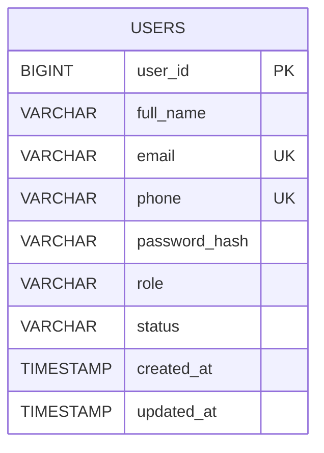
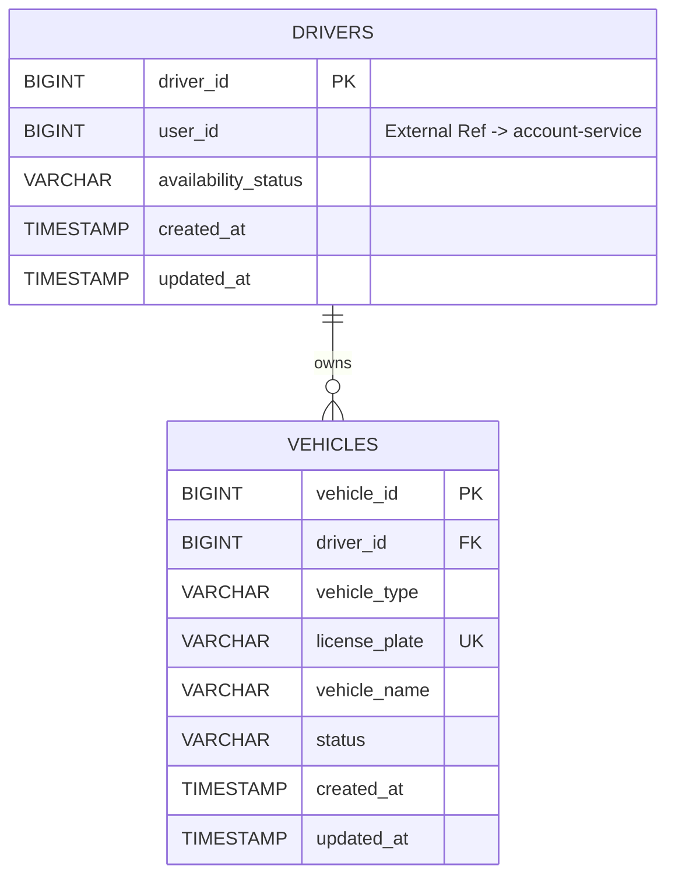
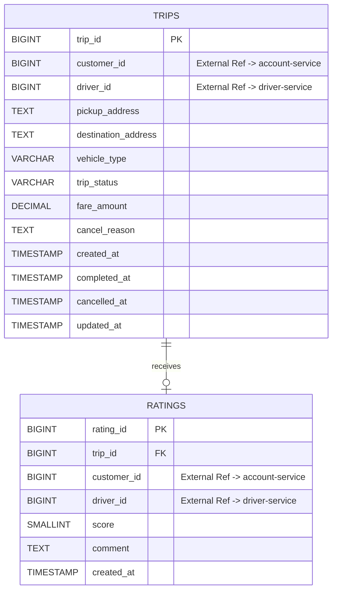
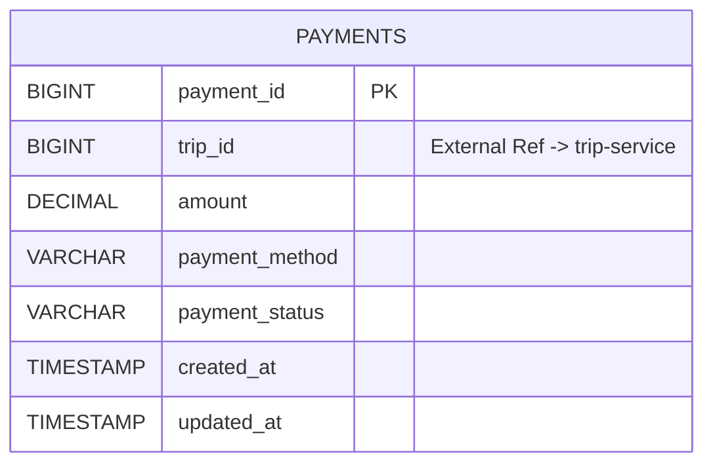
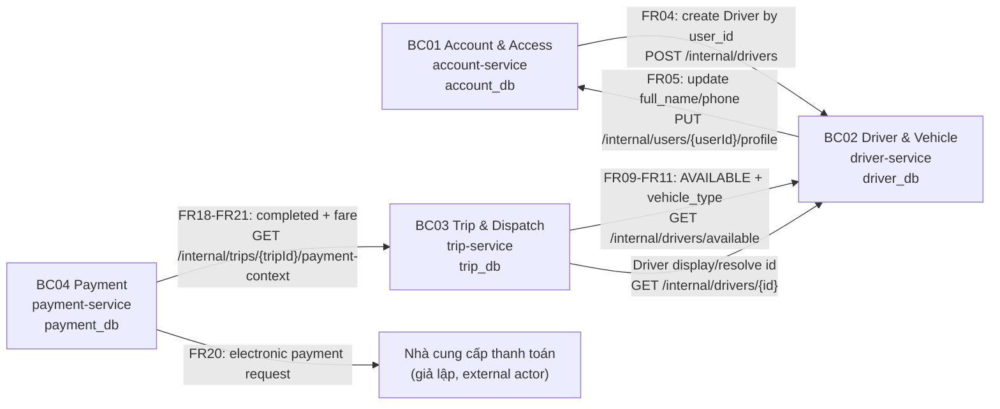
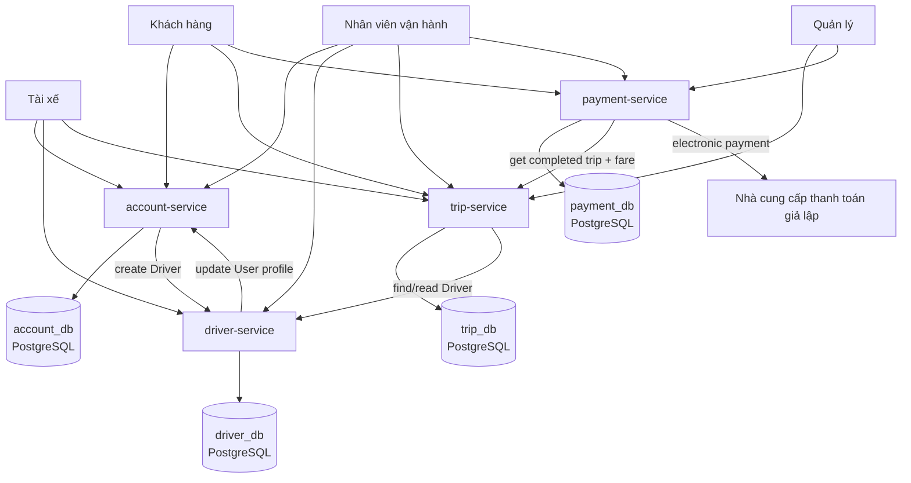

# DDD BOUNDED CONTEXT & MICROSERVICE DESIGN – CAB SYSTEM

## 0. Cơ sở thiết kế và các quyết định kiến trúc

### 0.1. Phạm vi đã đối chiếu

Thiết kế này bám theo phiên bản hiện tại của repository, trong đó:

- `srs.md` xác định 33 Functional Requirement từ `FR01` đến `FR33`.
- Quy trình chính là: khách hàng tạo yêu cầu đặt xe → hệ thống tự động tìm và gán tài xế phù hợp → tài xế cập nhật trạng thái chuyến → hệ thống tính cước → khách hàng thanh toán → khách hàng đánh giá tài xế.
- Phiên bản hiện tại **không có bước tài xế chấp nhận/từ chối chuyến**; cơ chế đó được đưa sang Phase 2.
- Theo dõi GPS liên tục, cổng thanh toán thật, SMS/push notification thật, AI điều phối tài xế và xử lý sự cố nhiều bước đều nằm ngoài phạm vi.
- ERD hiện tại gồm các thực thể `User`, `Driver`, `Vehicle`, `Trip`, `Payment`, `Rating`.
- API hiện tại được tách thành các tài liệu:
  - `01_authentication.yaml`
  - `02_customer.yaml`
  - `03_driver_vehicle.yaml`
  - `04_trip.yaml`
  - `05_payment.yaml`
  - `06_rating.yaml`
  - `07_staff.yaml`
  - `08_reports.yaml`

### 0.2. Trình tự thiết kế được áp dụng

```text
Business Process + Functional Requirement
            ↓
       Bounded Context
            ↓
    Ubiquitous Language
            ↓
       Microservice
            ↓
       Domain Model
            ↓
        Data Model
            ↓
Phân tích đặc điểm dữ liệu
            ↓
    Lựa chọn Database
            ↓
      Database Model
            ↓
            ERD
            ↓
            API
            ↓
Microservice Communication
```

### 0.3. Nguyên tắc ranh giới dữ liệu

```text
1 Bounded Context
= 1 Sub-domain
= 1 Microservice
= 1 Database riêng
```

- Không dùng chung database giữa các microservice.
- Không tạo Foreign Key xuyên database.
- ID của thực thể thuộc service khác chỉ là **External Reference ID**.
- Service muốn lấy dữ liệu do service khác sở hữu phải gọi REST API của service đó.
- Không thêm actor mới.
- Không thêm chức năng nghiệp vụ ngoài SRS.
- Không dùng Kafka, RabbitMQ, Event Bus, CQRS, Event Sourcing hoặc Kubernetes cho phiên bản 7 tuần.
- Ưu tiên REST đồng bộ để dễ triển khai và demo bằng Node.js.

### 0.4. Các điểm không thống nhất / cần diễn giải khi chuyển từ ERD đơn khối sang Microservice

| Điểm | Hiện trạng trong repository | Cách xử lý trong thiết kế DDD |
|---|---|---|
| ERD hiện tại | `Driver.user_id`, `Trip.customer_id`, `Trip.driver_id`, `Payment.trip_id`, `Rating.customer_id`, `Rating.driver_id` được mô tả như FK trong một mô hình chung | Sau khi tách service, chỉ giữ FK nếu hai bảng cùng database. FK xuyên service chuyển thành **External Reference ID** |
| `07_staff.yaml` | Gom tạo tài xế, tra cứu customer/driver/vehicle/trip/payment vào một file Staff API | Không tạo `Staff Service`. Endpoint vẫn có thể giữ path `/staff/...`, nhưng được thực thi bởi service sở hữu dữ liệu |
| `08_reports.yaml` | Gom báo cáo chuyến và doanh thu vào một file | Không tạo Report Service riêng trong Phase 1. `GET /reports/trips` thuộc Trip Service; `GET /reports/revenue` thuộc Payment Service |
| `PUT /drivers/me` | API hiện có cập nhật `full_name`, `phone`, trong khi hai trường này nằm ở `User` của ERD | Driver Service giữ API ngoài để tương thích, nhưng gọi Account Service để cập nhật dữ liệu người dùng; Driver DB không sao chép các trường này |
| Công thức tính cước | SRS ghi TBD | Không tự đặt công thức. Domain giữ `fare_amount` và điểm mở rộng `FareCalculator`, công thức được bổ sung khi yêu cầu được chốt |
| Tiêu chí chọn tài xế khi nhiều người phù hợp | SRS ghi TBD | Chỉ xác định điều kiện `AVAILABLE` + đúng `vehicle_type`; thứ tự chọn ứng viên chưa cố định |
| Chính sách hủy chuyến | SRS ghi TBD | API hủy được giữ, nhưng điều kiện chi tiết không được tự bổ sung |
| Xử lý thanh toán thất bại | SRS ghi TBD | Chỉ ghi nhận `FAILED`; không tự thêm retry/refund workflow |

### 0.5. Quyết định số lượng Bounded Context

Thiết kế chọn **4 Bounded Context**. Đây là mức đủ tách ranh giới nghiệp vụ nhưng vẫn phù hợp thời gian triển khai khoảng 7 tuần:

1. **BC01 – Account & Access Context**
2. **BC02 – Driver & Vehicle Context**
3. **BC03 – Trip & Dispatch Context**
4. **BC04 – Payment Context**

`Rating` được đặt trong Trip & Dispatch Context vì đánh giá phụ thuộc trực tiếp vào vòng đời chuyến và chỉ được tạo khi chuyến đã hoàn thành. Báo cáo không tách thành service riêng vì hai báo cáo hiện tại chỉ là truy vấn trên dữ liệu mà Trip Service và Payment Service đã sở hữu.
## I. Bảng tổng quan Bounded Context
| STT | Bounded Context | Sub-domain | Mục đích | Microservice | FR chính | Business Process |
|---|---|---|---|---|---|---|
| 1 | BC01 – Account & Access | Identity & Account | Đăng ký, đăng nhập, hồ sơ khách hàng, tạo tài khoản tài xế, xác thực/phân quyền, tra cứu khách hàng | `account-service` | FR01–FR04, FR24, FR32–FR33 | Tạo tài khoản tài xế; xác thực trước các workflow |
| 2 | BC02 – Driver & Vehicle | Driver Operations | Hồ sơ nghiệp vụ tài xế, phương tiện, trạng thái sẵn sàng, cung cấp ứng viên cho điều phối | `driver-service` | FR05–FR07, FR25–FR26 | Chuẩn bị tài xế; tìm tài xế sẵn sàng và đúng loại xe |
| 3 | BC03 – Trip & Dispatch | Booking, Dispatch & Trip Lifecycle | Tạo chuyến, tìm/gán tài xế, theo dõi, hủy, lịch sử, cập nhật trạng thái, tính cước, đánh giá, báo cáo số chuyến | `trip-service` | FR08–FR17, FR22–FR23, FR27–FR28, FR30 | Đặt và thực hiện chuyến; hủy; đánh giá |
| 4 | BC04 – Payment | Payment Transaction | Chọn phương thức, ghi nhận tiền mặt/điện tử, lưu kết quả giao dịch, tra cứu và báo cáo doanh thu | `payment-service` | FR18–FR21, FR29, FR31 | Thanh toán sau khi chuyến hoàn thành |

# BC01 – Account & Access Context

## 1. Mục đích

Quản lý danh tính và tài khoản của người dùng CAB System, bao gồm đăng ký khách hàng, đăng nhập, cập nhật hồ sơ khách hàng, tạo tài khoản tài xế bởi nhân viên vận hành, tra cứu khách hàng, xác thực và kiểm tra quyền truy cập.

## 2. Phạm vi nghiệp vụ

**Thuộc Context:**

- Tài khoản `User`.
- Thông tin `full_name`, `email`, `phone`.
- Mật khẩu đã băm.
- Vai trò `CUSTOMER`, `DRIVER`, `STAFF`, `MANAGER`.
- Trạng thái tài khoản.
- Đăng ký khách hàng.
- Đăng nhập.
- Cập nhật thông tin cá nhân khách hàng.
- Tạo credential/tài khoản người dùng cho tài xế.
- Tra cứu khách hàng cho nhân viên vận hành.
- Xác thực và phân quyền.

**Không thuộc Context:**

- Trạng thái sẵn sàng của tài xế.
- Phương tiện.
- Chuyến đi.
- Thanh toán.
- Đánh giá.

## 3. Functional Requirements

| Mã FR | Chức năng | Vai trò trong Microservice |
|---|---|---|
| FR01 | Hệ thống cho phép khách hàng đăng ký tài khoản | Owner |
| FR02 | Hệ thống cho phép người dùng đăng nhập | Owner |
| FR03 | Hệ thống cho phép khách hàng cập nhật thông tin cá nhân | Owner |
| FR04 | Hệ thống cho phép nhân viên vận hành tạo tài khoản tài xế | Owner; Driver Service hỗ trợ khởi tạo hồ sơ Driver |
| FR24 | Hệ thống cho phép nhân viên vận hành tra cứu khách hàng | Owner |
| FR32 | Hệ thống xác thực người dùng | Owner |
| FR33 | Hệ thống kiểm tra quyền truy cập | Owner về cơ chế; mọi service phải thực thi quyền trên request |

**Business Rules chính:** `BRL01`, `BRL02`, `BRL03`, `BRL15`.

## 4. Business Process / Workflow

| Workflow | Bước xử lý | Kết quả |
|---|---|---|
| Đăng ký khách hàng | Khách hàng gửi thông tin → kiểm tra dữ liệu/uniqueness → băm mật khẩu → tạo User role CUSTOMER | Tài khoản khách hàng được tạo |
| Đăng nhập | Nhận email/password → kiểm tra password hash → kiểm tra tài khoản → phát token | Người dùng được xác thực |
| Cập nhật hồ sơ khách hàng | Xác định user từ token → kiểm tra dữ liệu → cập nhật `full_name`, `phone` | Hồ sơ khách hàng được cập nhật |
| Tạo tài khoản tài xế | Staff gửi thông tin → Account Service tạo User role DRIVER → gọi Driver Service tạo Driver theo `user_id` | Tài khoản tài xế có thể đăng nhập và có hồ sơ Driver |
| Tra cứu khách hàng | Staff gửi keyword → tìm User role CUSTOMER | Trả danh sách khách hàng phù hợp |
| Phân quyền | Mỗi request có token → kiểm tra role với endpoint | Cho phép hoặc từ chối truy cập |

## 5. Ubiquitous Language

| Thuật ngữ | Code Term | Ý nghĩa trong Context | Quy tắc sử dụng |
|---|---|---|---|
| Người dùng | `User` | Tài khoản có thể đăng nhập CAB System | Là Aggregate Root của Account Context |
| Khách hàng | `CustomerAccount` / role `CUSTOMER` | User sử dụng chức năng đặt xe | Không tạo bảng Customer riêng vì SRS hiện dùng `User.role` |
| Tài khoản tài xế | `DriverAccount` / role `DRIVER` | Credential của tài xế | Khác với `Driver` của Driver Context |
| Vai trò | `Role` | Quyền nghiệp vụ của user | Chỉ nhận CUSTOMER, DRIVER, STAFF, MANAGER |
| Trạng thái tài khoản | `AccountStatus` | Trạng thái sử dụng tài khoản | Giá trị chi tiết chưa được SRS quy định |
| Đăng ký | `Register` | Tạo tài khoản CUSTOMER | Chỉ khách hàng tự đăng ký |
| Tạo tài khoản tài xế | `CreateDriverAccount` | Staff tạo User role DRIVER | Sau đó cần tạo Driver ở Driver Service |
| Xác thực | `Authentication` | Kiểm tra danh tính người dùng | Password không lưu dạng rõ |
| Phân quyền | `Authorization` | Kiểm tra role có được gọi chức năng hay không | Thực thi ở middleware mỗi service |
| Hồ sơ cá nhân | `UserProfile` | `full_name`, `email`, `phone` của User | Account Service là owner dữ liệu |

## 6. Microservice tương ứng

**Tên:** `account-service`

**Trách nhiệm:**

- Sở hữu dữ liệu tài khoản và hồ sơ cá nhân.
- Xử lý đăng ký và đăng nhập.
- Phát/kiểm tra thông tin xác thực theo cơ chế JWT của API hiện tại.
- Kiểm tra role cho endpoint thuộc service.
- Cung cấp API tra cứu khách hàng.
- Tạo User role DRIVER cho FR04.
- Cung cấp internal API để Driver Service cập nhật phần hồ sơ cá nhân được lưu ở Account DB.

**Database sở hữu:** `account_db`.

## 7. Domain Model

| Thành phần | Loại | Vai trò |
|---|---|---|
| `User` | Aggregate Root / Entity | Quản lý danh tính, credential, role và trạng thái tài khoản |
| `Role` | Value Object / Enum | CUSTOMER, DRIVER, STAFF, MANAGER |
| `AccountStatus` | Value Object | Trạng thái tài khoản; SRS chưa chốt tập giá trị |
| `Email` | Value Object | Danh tính đăng nhập, phải duy nhất |
| `Phone` | Value Object | Số điện thoại, phải duy nhất theo thiết kế dữ liệu |
| `PasswordHash` | Value Object | Mật khẩu đã băm; không lưu mật khẩu rõ |

**Invariant quan trọng:**

- Email và phone không được trùng khi đăng ký.
- User phải đăng nhập trước chức năng yêu cầu xác thực (`BRL03`).
- Chỉ role phù hợp mới được truy cập endpoint (`BRL15`).
- Khách hàng được tự đăng ký (`BRL01`).
- Tài khoản tài xế do staff tạo (`BRL02`).

## 8. Data Model

| Entity | Thuộc tính chính | Quan hệ | ID nội bộ / External ID | Ghi chú |
|---|---|---|---|---|
| `User` | `user_id`, `full_name`, `email`, `phone`, `password_hash`, `role`, `status`, timestamps | Không cần quan hệ nội bộ khác | `user_id` là ID nội bộ | `driver-service` có thể giữ `user_id` dưới dạng External Reference ID |

## 9. Phân tích đặc điểm dữ liệu

| Tiêu chí | Phân tích |
|---|---|
| Structure | Cấu trúc rõ ràng, trường dữ liệu ổn định |
| Relationship | Ít bảng nhưng dữ liệu tài khoản có ràng buộc logic chặt |
| Integrity | Rất cao: email/phone unique, role hợp lệ, password hash |
| Transaction | Cần transaction khi tạo/cập nhật tài khoản |
| Consistency | Cao vì đăng nhập/phân quyền phụ thuộc dữ liệu chính xác |
| Query | Tra cứu theo email, phone, role, keyword; không cần document query linh hoạt |
| Flexibility | Không cần schema linh hoạt ở Phase 1 |
| Read Speed | Cần nhanh nhưng có thể đáp ứng bằng index |
| Persistence | Phải lưu lâu dài |
| Temporary Data | Không phải dữ liệu tạm |
| Volume | Thấp đến trung bình trong demo; có thể tăng theo số user |
| Access Pattern | Login đọc theo email thường xuyên; profile đọc/cập nhật ít hơn |

## 10. Lựa chọn Database

**Loại:** Relational Database  
**DBMS:** PostgreSQL  
**Database:** `account_db`

## 11. Lý do kỹ thuật lựa chọn Database

Account Context có dữ liệu danh tính có cấu trúc, yêu cầu uniqueness, consistency và lưu bền vững. Đăng ký/đăng nhập không phù hợp với Redis làm nguồn dữ liệu chính; MongoDB cũng không đem lại lợi ích rõ ràng vì schema không linh hoạt và cần ràng buộc chặt. PostgreSQL phù hợp nhất với `UNIQUE`, `CHECK`, transaction và index trên email/phone.

## 12. Database Model

### Table `users`

| Column | Data Type | Constraint | Mô tả |
|---|---|---|---|
| `user_id` | BIGSERIAL | PK | ID nội bộ của User |
| `full_name` | VARCHAR(120) | NOT NULL | Họ tên |
| `email` | VARCHAR(255) | NOT NULL, UNIQUE | Email đăng nhập |
| `phone` | VARCHAR(20) | NOT NULL, UNIQUE | Số điện thoại |
| `password_hash` | VARCHAR(255) | NOT NULL | Mật khẩu đã băm |
| `role` | VARCHAR(20) | NOT NULL, CHECK | CUSTOMER/DRIVER/STAFF/MANAGER |
| `status` | VARCHAR(30) | NOT NULL | Trạng thái tài khoản; tập giá trị chưa chốt trong SRS |
| `created_at` | TIMESTAMP | NOT NULL, DEFAULT CURRENT_TIMESTAMP | Thời điểm tạo |
| `updated_at` | TIMESTAMP | NOT NULL, DEFAULT CURRENT_TIMESTAMP | Thời điểm cập nhật gần nhất |

**Index đề xuất:**

```sql
CREATE UNIQUE INDEX ux_users_email ON users(email);
CREATE UNIQUE INDEX ux_users_phone ON users(phone);
CREATE INDEX ix_users_role_status ON users(role, status);
```

## 13. ERD / Data Structure



> `driver_db.drivers.user_id`, `trip_db.trips.customer_id` là External Reference ID đến `users.user_id`; không vẽ FK xuyên database.

## 14. API của Microservice

| Method | Endpoint | Chức năng | Actor/Service gọi | FR | Entity/Data |
|---|---|---|---|---|---|
| POST | `/api/v1/auth/register` | Đăng ký tài khoản khách hàng | Khách hàng | FR01 | User |
| POST | `/api/v1/auth/login` | Đăng nhập | Customer/Driver/Staff/Manager | FR02, FR32 | User/Auth token |
| PUT | `/api/v1/customers/me` | Cập nhật thông tin cá nhân | Khách hàng | FR03 | User |
| POST | `/api/v1/staff/drivers` | Tạo tài khoản tài xế | Nhân viên vận hành | FR04 | User; gọi Driver Service |
| GET | `/api/v1/staff/customers` | Tra cứu khách hàng | Nhân viên vận hành | FR24 | User |
| PUT | `/internal/users/{userId}/profile` | Cập nhật phần hồ sơ User từ Driver workflow | Driver Service | FR05 hỗ trợ | User |
| Middleware | `Authorization middleware` | Kiểm tra quyền endpoint theo role | Mọi request | FR33 | Token/Role |

> `GET /customers/me` đang tồn tại trong `02_customer.yaml` và có thể giữ làm API hỗ trợ hiển thị hồ sơ, nhưng không được xem là một Functional Requirement mới.

## 15. Giao tiếp với Microservice khác

| Service gọi | Service được gọi | Endpoint | Dữ liệu | Mục đích |
|---|---|---|---|---|
| Account Service | Driver Service | `POST /internal/drivers` | `user_id` | Hoàn tất FR04 sau khi tạo User role DRIVER |
| Driver Service | Account Service | `PUT /internal/users/{userId}/profile` | `full_name`, `phone` | Giữ tương thích `PUT /drivers/me` mà không sao chép dữ liệu User |

# BC02 – Driver & Vehicle Context

## 1. Mục đích

Quản lý phần nghiệp vụ riêng của tài xế: hồ sơ Driver gắn với một tài khoản User, phương tiện và trạng thái sẵn sàng. Context này cũng cung cấp dữ liệu ứng viên cho Trip Service khi hệ thống tự động tìm/gán tài xế.

## 2. Phạm vi nghiệp vụ

**Thuộc Context:**

- `Driver`.
- `Vehicle`.
- `availability_status`.
- `vehicle_type`, biển số, tên xe, trạng thái phương tiện.
- Tra cứu tài xế/phương tiện.
- Cung cấp danh sách tài xế sẵn sàng có phương tiện phù hợp.

**Không thuộc Context:**

- Credential/mật khẩu/role của User.
- Chuyến và trạng thái chuyến.
- Thanh toán.
- Rating.

## 3. Functional Requirements

| Mã FR | Chức năng | Vai trò trong Microservice |
|---|---|---|
| FR05 | Hệ thống cho phép tài xế cập nhật hồ sơ | Owner; phần `full_name`, `phone` gọi Account Service |
| FR06 | Hệ thống cho phép tài xế cập nhật phương tiện | Owner |
| FR07 | Hệ thống cho phép tài xế cập nhật trạng thái tài xế | Owner |
| FR25 | Hệ thống cho phép nhân viên vận hành tra cứu tài xế | Owner |
| FR26 | Hệ thống cho phép nhân viên vận hành tra cứu phương tiện | Owner |
| FR09 | Hệ thống tìm tài xế đang sẵn sàng | Service hỗ trợ cho Trip Service |
| FR10 | Hệ thống tìm tài xế có phương tiện phù hợp | Service hỗ trợ cho Trip Service |

**Business Rules chính:** `BRL04`, `BRL05`.

## 4. Business Process / Workflow

| Workflow | Bước xử lý | Kết quả |
|---|---|---|
| Khởi tạo Driver | Nhận `user_id` từ Account Service → tạo Driver | Có hồ sơ nghiệp vụ Driver |
| Cập nhật hồ sơ | Driver gửi thay đổi → dữ liệu account gọi Account Service; dữ liệu driver cập nhật Driver DB | Hồ sơ được cập nhật đúng owner |
| Cập nhật phương tiện | Driver gửi loại xe/biển số/tên xe/status → kiểm tra → upsert Vehicle | Vehicle sẵn sàng cho matching |
| Cập nhật sẵn sàng | Driver đặt AVAILABLE/UNAVAILABLE | Trạng thái dùng cho FR09 |
| Tìm tài xế | Trip Service gửi `vehicle_type` → lọc Driver AVAILABLE + Vehicle đúng loại và hợp lệ | Trả danh sách/ứng viên phù hợp |
| Staff tra cứu | Staff gửi keyword/filter | Trả Driver/Vehicle phù hợp |

## 5. Ubiquitous Language

| Thuật ngữ | Code Term | Ý nghĩa trong Context | Quy tắc sử dụng |
|---|---|---|---|
| Tài xế | `Driver` | Hồ sơ nghiệp vụ tài xế | Không chứa password/role; liên kết User bằng External `user_id` |
| Tài khoản tài xế | `DriverAccount` | User role DRIVER ở Account Context | Không phải entity thuộc Driver DB |
| Phương tiện | `Vehicle` | Xe thuộc một Driver | `driver_id` là FK nội bộ vì cùng Driver DB |
| Loại xe | `VehicleType` | MOTORBIKE hoặc CAR theo API hiện tại | Dùng để matching với yêu cầu chuyến |
| Trạng thái sẵn sàng | `AvailabilityStatus` | AVAILABLE/UNAVAILABLE | Chỉ AVAILABLE được đưa vào matching |
| Tài xế phù hợp | `EligibleDriver` | Driver AVAILABLE và có Vehicle đúng loại | Chưa bao gồm tiêu chí xếp hạng vì SRS còn TBD |
| Ứng viên tài xế | `DriverCandidate` | Kết quả query nội bộ trả cho Trip Service | Chỉ là DTO, không phải entity lưu DB |

## 6. Microservice tương ứng

**Tên:** `driver-service`

**Trách nhiệm:**

- Sở hữu Driver và Vehicle.
- Quản lý trạng thái sẵn sàng.
- Tìm các Driver thỏa `AVAILABLE` và `vehicle_type`.
- Cung cấp thông tin tài xế cho Trip Service khi cần hiển thị.
- Cung cấp lookup cho staff.

**Database sở hữu:** `driver_db`.

## 7. Domain Model

| Thành phần | Loại | Vai trò |
|---|---|---|
| `Driver` | Aggregate Root | Quản lý trạng thái nghiệp vụ của tài xế |
| `Vehicle` | Entity | Phương tiện thuộc Driver |
| `AvailabilityStatus` | Value Object / Enum | AVAILABLE, UNAVAILABLE |
| `VehicleType` | Value Object / Enum | MOTORBIKE, CAR |
| `VehicleStatus` | Value Object / Enum | ACTIVE, INACTIVE theo API hiện tại |
| `DriverCandidate` | Domain DTO | Kết quả matching cho Trip Service |

**Invariant:**

- Chỉ Driver `AVAILABLE` mới được trả về cho FR09.
- Vehicle phải đúng `vehicle_type` của yêu cầu (`BRL05`).
- `Vehicle.driver_id` chỉ tham chiếu Driver trong cùng `driver_db`.
- Tiêu chí chọn ai là “đầu tiên” khi nhiều Driver cùng phù hợp **không được tự đặt** vì SRS đang TBD.

## 8. Data Model

| Entity | Thuộc tính chính | Quan hệ | ID nội bộ / External ID | Ghi chú |
|---|---|---|---|---|
| `Driver` | `driver_id`, `user_id`, `availability_status`, timestamps | 1 Driver – N Vehicle | `driver_id` nội bộ; `user_id` External đến Account Service | Không FK sang `account_db` |
| `Vehicle` | `vehicle_id`, `driver_id`, `vehicle_type`, `license_plate`, `vehicle_name`, `status`, timestamps | N Vehicle – 1 Driver | Cả hai ID nội bộ Driver DB | `driver_id` là Internal FK |

## 9. Phân tích đặc điểm dữ liệu

| Tiêu chí | Phân tích |
|---|---|
| Structure | Rõ ràng: Driver và Vehicle có schema ổn định |
| Relationship | Có quan hệ nội bộ Driver–Vehicle |
| Integrity | Cần đảm bảo Vehicle thuộc Driver hợp lệ, biển số unique |
| Transaction | Cần khi tạo/cập nhật Driver/Vehicle |
| Consistency | Cao cho matching; trạng thái và loại xe phải chính xác |
| Query | Query thường xuyên theo `availability_status`, `vehicle_type`, `status` |
| Flexibility | Không cần document schema linh hoạt |
| Read Speed | Matching cần nhanh nhưng quy mô demo đáp ứng được bằng index PostgreSQL |
| Persistence | Driver, Vehicle và trạng thái hiện tại cần được lưu bền vững |
| Temporary Data | Không phải chỉ là cache/session |
| Volume | Thấp–trung bình ở Phase 1 |
| Access Pattern | Nhiều đọc lọc ứng viên; cập nhật availability định kỳ theo thao tác tài xế |

## 10. Lựa chọn Database

**Loại:** Relational Database  
**DBMS:** PostgreSQL  
**Database:** `driver_db`

## 11. Lý do kỹ thuật lựa chọn Database

Driver–Vehicle có quan hệ rõ, cần Internal FK và uniqueness biển số. Trạng thái sẵn sàng cần đọc nhanh nhưng vẫn là dữ liệu nghiệp vụ cần lưu, vì vậy dùng Redis làm nguồn dữ liệu chính là không phù hợp. PostgreSQL với index trên availability và vehicle type đủ cho quy mô Phase 1 và đơn giản hơn mô hình kết hợp PostgreSQL + Redis.

## 12. Database Model

### Table `drivers`

| Column | Data Type | Constraint | Mô tả |
|---|---|---|---|
| `driver_id` | BIGSERIAL | PK | ID Driver |
| `user_id` | BIGINT | NOT NULL, UNIQUE | External Reference ID đến Account Service; **không FK** |
| `availability_status` | VARCHAR(20) | NOT NULL, CHECK | AVAILABLE/UNAVAILABLE |
| `created_at` | TIMESTAMP | NOT NULL, DEFAULT CURRENT_TIMESTAMP | Ngày tạo |
| `updated_at` | TIMESTAMP | NOT NULL, DEFAULT CURRENT_TIMESTAMP | Ngày cập nhật |

### Table `vehicles`

| Column | Data Type | Constraint | Mô tả |
|---|---|---|---|
| `vehicle_id` | BIGSERIAL | PK | ID phương tiện |
| `driver_id` | BIGINT | NOT NULL, FK → `drivers.driver_id` | Internal FK |
| `vehicle_type` | VARCHAR(20) | NOT NULL, CHECK | MOTORBIKE/CAR |
| `license_plate` | VARCHAR(30) | NOT NULL, UNIQUE | Biển số |
| `vehicle_name` | VARCHAR(100) | NOT NULL | Tên xe |
| `status` | VARCHAR(20) | NOT NULL, CHECK | ACTIVE/INACTIVE theo API hiện có |
| `created_at` | TIMESTAMP | NOT NULL, DEFAULT CURRENT_TIMESTAMP | Ngày tạo |
| `updated_at` | TIMESTAMP | NOT NULL, DEFAULT CURRENT_TIMESTAMP | Ngày cập nhật |

**Index đề xuất:**

```sql
CREATE INDEX ix_drivers_availability ON drivers(availability_status);
CREATE INDEX ix_vehicles_match ON vehicles(vehicle_type, status, driver_id);
CREATE UNIQUE INDEX ux_vehicles_license_plate ON vehicles(license_plate);
```

## 13. ERD / Data Structure



## 14. API của Microservice

| Method | Endpoint | Chức năng | Actor/Service gọi | FR | Entity/Data |
|---|---|---|---|---|---|
| PUT | `/api/v1/drivers/me` | Cập nhật hồ sơ tài xế | Tài xế | FR05 | Driver + Account profile |
| PUT | `/api/v1/drivers/me/vehicle` | Tạo/cập nhật phương tiện | Tài xế | FR06 | Vehicle |
| PUT | `/api/v1/drivers/me/availability` | Cập nhật trạng thái sẵn sàng | Tài xế | FR07 | Driver |
| GET | `/api/v1/staff/drivers` | Tra cứu tài xế | Nhân viên vận hành | FR25 | Driver |
| GET | `/api/v1/staff/vehicles` | Tra cứu phương tiện | Nhân viên vận hành | FR26 | Vehicle |
| POST | `/internal/drivers` | Khởi tạo Driver từ `user_id` | Account Service | FR04 hỗ trợ | Driver |
| GET | `/internal/drivers/available?vehicle_type={type}` | Tìm ứng viên sẵn sàng đúng loại xe | Trip Service | FR09, FR10 | DriverCandidate |
| GET | `/internal/drivers/{driverId}` | Lấy thông tin tài xế phục vụ hiển thị chuyến | Trip Service | FR13 hỗ trợ | Driver/Vehicle summary |
| GET | `/internal/drivers/by-user/{userId}` | Resolve `driver_id` từ user đăng nhập | Trip Service | FR16 hỗ trợ | Driver ID |

> Các endpoint `/internal/...` không tạo nghiệp vụ mới; chúng chỉ thay thế việc truy cập DB chéo sau khi tách microservice.

## 15. Giao tiếp với Microservice khác

| Service gọi | Service được gọi | Endpoint | Dữ liệu | Mục đích |
|---|---|---|---|---|
| Driver Service | Account Service | `PUT /internal/users/{userId}/profile` | full_name, phone | Hoàn tất FR05 mà không duplicate User data |
| Trip Service | Driver Service | `GET /internal/drivers/available?vehicle_type=...` | vehicle type | FR09–FR11 tìm/gán tài xế |
| Trip Service | Driver Service | `GET /internal/drivers/{driverId}` | driver id | Hiển thị thông tin tài xế cho khách hàng |
| Trip Service | Driver Service | `GET /internal/drivers/by-user/{userId}` | user id | Kiểm tra Driver đang cập nhật đúng chuyến được phân công |

# BC03 – Trip & Dispatch Context

## 1. Mục đích

Quản lý toàn bộ vòng đời chuyến từ lúc khách hàng gửi yêu cầu đến khi chuyến hoàn thành hoặc kết thúc ở trạng thái khác; thực hiện điều phối tài xế tự động, tính `fare_amount` sau hoàn thành, lưu đánh giá và cung cấp chức năng theo dõi/tra cứu chuyến.

## 2. Phạm vi nghiệp vụ

**Thuộc Context:**

- Yêu cầu đặt xe được hiện thực thành `Trip`.
- Điểm đón, điểm đến, loại xe yêu cầu.
- Trạng thái chuyến.
- `customer_id`, `driver_id` dạng External Reference ID.
- Tự động tìm/gán tài xế.
- Theo dõi chuyến.
- Hủy chuyến.
- Lịch sử chuyến.
- Cập nhật trạng thái đúng trình tự.
- Tính `fare_amount` sau khi COMPLETED.
- `Rating`.
- Staff theo dõi/hủy chuyến sự cố.
- Báo cáo số lượng chuyến.

**Không thuộc Context:**

- Hồ sơ chuẩn của Customer/Driver.
- Vehicle master data.
- Payment transaction.

## 3. Functional Requirements

| Mã FR | Chức năng | Vai trò trong Microservice |
|---|---|---|
| FR08 | Hệ thống cho phép khách hàng tạo yêu cầu đặt xe | Owner |
| FR09 | Hệ thống tìm tài xế đang sẵn sàng | Owner orchestration; Driver Service cung cấp dữ liệu |
| FR10 | Hệ thống tìm tài xế có phương tiện phù hợp | Owner orchestration; Driver Service cung cấp dữ liệu |
| FR11 | Hệ thống tự động gán tài xế phù hợp đầu tiên cho chuyến | Owner |
| FR12 | Hệ thống thông báo khi không tìm được tài xế | Owner ở mức response/trạng thái; không tạo Notification Service |
| FR13 | Hệ thống cho phép khách hàng theo dõi chuyến | Owner |
| FR14 | Hệ thống cho phép khách hàng hủy chuyến | Owner |
| FR15 | Hệ thống cho phép khách hàng xem lịch sử chuyến | Owner |
| FR16 | Hệ thống cho phép tài xế cập nhật trạng thái chuyến theo đúng trình tự | Owner |
| FR17 | Hệ thống tính số tiền phải trả | Owner; `fare_amount` là dữ liệu của Trip theo ERD hiện tại |
| FR22 | Hệ thống cho phép khách hàng đánh giá tài xế | Owner |
| FR23 | Hệ thống lưu đánh giá | Owner |
| FR27 | Hệ thống cho phép nhân viên vận hành theo dõi chuyến | Owner |
| FR28 | Hệ thống cho phép nhân viên vận hành hủy chuyến kèm lý do khi có sự cố | Owner |
| FR30 | Hệ thống cho phép quản lý xem báo cáo số lượng chuyến | Owner |

**Business Rules chính:** `BRL04`–`BRL10`, `BRL13`, `BRL14`.

## 4. Business Process / Workflow

| Workflow | Bước xử lý | Kết quả |
|---|---|---|
| Tạo chuyến | Nhận pickup/destination/vehicle_type → validate → tạo Trip SEARCHING_DRIVER | Trip mới |
| Tìm tài xế | Gọi Driver Service lấy Driver AVAILABLE + Vehicle đúng loại | Danh sách ứng viên |
| Gán tự động | Chọn ứng viên phù hợp đầu tiên theo tiêu chí sẽ được chốt | `driver_id` được gán, status DRIVER_ASSIGNED |
| Không có tài xế | Không có ứng viên → status NO_DRIVER → trả thông báo | Chuyến kết thúc ở NO_DRIVER |
| Theo dõi chuyến | Đọc Trip theo quyền customer/staff/driver | Trả status và dữ liệu chuyến |
| Cập nhật trạng thái | Driver đúng chuyến cập nhật lần lượt DRIVER_ARRIVED → PICKED_UP → IN_PROGRESS → COMPLETED | Vòng đời Trip tiến đúng thứ tự |
| Tính cước | Khi chuyển COMPLETED → gọi `FareCalculator` | `fare_amount` được lưu |
| Hủy bởi khách hàng | Kiểm tra chính sách hủy (TBD) → cập nhật CANCELLED | Lưu cancel_reason/time nếu có |
| Hủy sự cố bởi staff | Chuyến chưa hoàn thành → staff nhập lý do → CANCELLED | Lưu lý do hủy |
| Đánh giá | Chuyến COMPLETED → customer gửi score/comment → kiểm tra chưa đánh giá → lưu Rating | Rating được tạo |
| Báo cáo số chuyến | Đếm Trip theo phạm vi báo cáo hiện có | Trả `total_trips` |

## 5. Ubiquitous Language

| Thuật ngữ | Code Term | Ý nghĩa trong Context | Quy tắc sử dụng |
|---|---|---|---|
| Yêu cầu đặt xe | `BookingRequest` | Input tạo một Trip | Không cần bảng riêng trong Phase 1 |
| Chuyến | `Trip` | Aggregate quản lý toàn bộ vòng đời chuyến | Là Aggregate Root |
| Điểm đón | `PickupAddress` | Nơi bắt đầu chuyến | Value Object dạng chuỗi theo SRS hiện tại |
| Điểm đến | `DestinationAddress` | Nơi kết thúc chuyến | Value Object dạng chuỗi |
| Loại xe yêu cầu | `RequestedVehicleType` | MOTORBIKE/CAR | Dùng gọi Driver Service |
| Gán tài xế | `DriverAssignment` | Hành vi gán `driver_id` vào Trip | Không tạo bảng Assignment riêng trong Phase 1 |
| Tài xế của chuyến | `driver_id` | ID tài xế được gán | Chỉ là External Reference ID |
| Khách hàng của chuyến | `customer_id` | ID User role CUSTOMER | External Reference ID |
| Trạng thái chuyến | `TripStatus` | Trạng thái vòng đời Trip | Tuân thủ state sequence |
| Cước chuyến | `FareAmount` | Số tiền cuối cùng sau khi COMPLETED | Công thức đang TBD |
| Hủy chuyến | `CancelTrip` | Chuyển Trip sang CANCELLED nếu thỏa chính sách | Chính sách chi tiết TBD |
| Không tìm được tài xế | `NO_DRIVER` | Trạng thái khi matching thất bại | Kết thúc flow đặt xe |
| Đánh giá | `Rating` | Phản hồi của customer về driver sau Trip | Chỉ sau COMPLETED; tối đa một Rating/Trip |

### State Model

```text
SEARCHING_DRIVER
    ├──> DRIVER_ASSIGNED
    │       └──> DRIVER_ARRIVED
    │               └──> PICKED_UP
    │                       └──> IN_PROGRESS
    │                               └──> COMPLETED
    └──> NO_DRIVER

Các trạng thái đang cho phép hủy theo chính sách có thể chuyển sang:
CANCELLED
```

> Không tự xác định chính xác các state được khách hàng phép hủy vì chính sách hủy đang là TBD.

## 6. Microservice tương ứng

**Tên:** `trip-service`

**Trách nhiệm:**

- Sở hữu Trip và Rating.
- Điều phối matching bằng cách gọi Driver Service.
- Lưu `driver_id` sau assignment.
- Kiểm soát state transition.
- Tính và lưu `fare_amount` sau COMPLETED.
- Trả dữ liệu lịch sử/theo dõi.
- Hủy chuyến theo rule hiện có.
- Báo cáo số lượng chuyến.

**Database sở hữu:** `trip_db`.

## 7. Domain Model

| Thành phần | Loại | Vai trò |
|---|---|---|
| `Trip` | Aggregate Root | Quản lý vòng đời, assignment, cancellation và fare |
| `Rating` | Entity | Đánh giá gắn trực tiếp với một Trip |
| `TripStatus` | Value Object / Enum | State machine của chuyến |
| `PickupAddress` | Value Object | Điểm đón |
| `DestinationAddress` | Value Object | Điểm đến |
| `RequestedVehicleType` | Value Object | Loại xe khách yêu cầu |
| `FareAmount` | Value Object | Giá trị cước cuối cùng |
| `FareCalculator` | Domain Service | Tính cước khi Trip COMPLETED; công thức để TBD |
| `DriverAssignment` | Domain Behavior | Chọn/gán một External `driver_id` vào Trip |

**Invariant:**

- Một Trip tại một thời điểm chỉ có một `driver_id` (`BRL06`).
- Assignment chỉ dùng Driver đáp ứng `AVAILABLE` và đúng loại xe (`BRL04`, `BRL05`).
- Không có bước tài xế accept/reject (`BRL07`).
- Driver chỉ cập nhật chuyến được phân công (`BRL08`).
- Trạng thái phải theo đúng sequence (`BRL09`).
- Chỉ COMPLETED mới tính cước (`BRL10`).
- Chỉ COMPLETED mới được Rating (`BRL13`).

## 8. Data Model

| Entity | Thuộc tính chính | Quan hệ | ID nội bộ / External ID | Ghi chú |
|---|---|---|---|---|
| `Trip` | `trip_id`, `customer_id`, `driver_id`, addresses, `vehicle_type`, `trip_status`, `fare_amount`, cancel/timestamps | 1 Trip – 0..1 Rating | `trip_id` nội bộ; `customer_id`, `driver_id` External | Không FK sang Account/Driver DB |
| `Rating` | `rating_id`, `trip_id`, `customer_id`, `driver_id`, `score`, `comment`, timestamp | N Rating – 1 Trip, nhưng unique `trip_id` để tối đa 1 Rating/Trip | `trip_id` Internal FK; customer/driver External IDs | Theo ERD SRS hiện tại |

## 9. Phân tích đặc điểm dữ liệu

| Tiêu chí | Phân tích |
|---|---|
| Structure | Cấu trúc rất rõ; status enum và trường nghiệp vụ ổn định |
| Relationship | Có quan hệ nội bộ Trip–Rating |
| Integrity | Cao: state transition, one rating per trip, assignment, fare only after complete |
| Transaction | Cần transaction khi cập nhật state/fare/cancel/rating |
| Consistency | Cao vì trạng thái chuyến là dữ liệu cốt lõi |
| Query | Lịch sử theo customer, chuyến theo driver/status, staff monitor, count report |
| Flexibility | Không cần document schema linh hoạt |
| Read Speed | Cần phản hồi nhanh nhưng query có thể index |
| Persistence | Bắt buộc lưu lâu dài cho lịch sử |
| Temporary Data | Không phải dữ liệu tạm |
| Volume | Cao nhất trong hệ thống khi số chuyến tăng |
| Access Pattern | Nhiều insert Trip, nhiều update status, nhiều read history/monitor |

## 10. Lựa chọn Database

**Loại:** Relational Database  
**DBMS:** PostgreSQL  
**Database:** `trip_db`

## 11. Lý do kỹ thuật lựa chọn Database

Trip là nghiệp vụ cốt lõi với state transition chặt, dữ liệu quan hệ và yêu cầu transaction/consistency cao. PostgreSQL hỗ trợ constraint, transaction và index để bảo vệ trạng thái và tối ưu lịch sử/monitoring. MongoDB không tạo lợi ích đủ lớn vì schema Trip ổn định; Redis không phù hợp làm nguồn lưu lịch sử chuyến bền vững. Continuous GPS đã nằm ngoài scope nên chưa có nhu cầu tách time-series/cache store.

## 12. Database Model

### Table `trips`

| Column | Data Type | Constraint | Mô tả |
|---|---|---|---|
| `trip_id` | BIGSERIAL | PK | ID Trip |
| `customer_id` | BIGINT | NOT NULL | External Ref → Account Service |
| `driver_id` | BIGINT | NULL | External Ref → Driver Service |
| `pickup_address` | TEXT | NOT NULL | Điểm đón |
| `destination_address` | TEXT | NOT NULL | Điểm đến |
| `vehicle_type` | VARCHAR(20) | NOT NULL, CHECK | MOTORBIKE/CAR |
| `trip_status` | VARCHAR(30) | NOT NULL, CHECK | SEARCHING_DRIVER, DRIVER_ASSIGNED, DRIVER_ARRIVED, PICKED_UP, IN_PROGRESS, COMPLETED, NO_DRIVER, CANCELLED |
| `fare_amount` | NUMERIC(12,2) | NULL, CHECK (`fare_amount >= 0`) | Chỉ có sau khi tính cước |
| `cancel_reason` | TEXT | NULL | Lý do hủy |
| `created_at` | TIMESTAMP | NOT NULL, DEFAULT CURRENT_TIMESTAMP | Ngày tạo |
| `completed_at` | TIMESTAMP | NULL | Ngày hoàn thành |
| `cancelled_at` | TIMESTAMP | NULL | Ngày hủy |
| `updated_at` | TIMESTAMP | NOT NULL, DEFAULT CURRENT_TIMESTAMP | Ngày cập nhật |

### Table `ratings`

| Column | Data Type | Constraint | Mô tả |
|---|---|---|---|
| `rating_id` | BIGSERIAL | PK | ID Rating |
| `trip_id` | BIGINT | NOT NULL, FK → `trips.trip_id`, UNIQUE | Internal FK; một Rating/Trip |
| `customer_id` | BIGINT | NOT NULL | External Ref → Account Service |
| `driver_id` | BIGINT | NOT NULL | External Ref → Driver Service |
| `score` | SMALLINT | NOT NULL, CHECK 1..5 | Điểm |
| `comment` | TEXT | NULL | Nhận xét |
| `created_at` | TIMESTAMP | NOT NULL, DEFAULT CURRENT_TIMESTAMP | Thời điểm đánh giá |

**Index đề xuất:**

```sql
CREATE INDEX ix_trips_customer_history
    ON trips(customer_id, created_at DESC);

CREATE INDEX ix_trips_driver_active
    ON trips(driver_id, trip_status);

CREATE INDEX ix_trips_status
    ON trips(trip_status);

CREATE UNIQUE INDEX ux_ratings_trip
    ON ratings(trip_id);
```

## 13. ERD / Data Structure



## 14. API của Microservice

| Method | Endpoint | Chức năng | Actor/Service gọi | FR | Entity/Data |
|---|---|---|---|---|---|
| POST | `/api/v1/trips` | Tạo yêu cầu đặt xe và điều phối tự động | Khách hàng | FR08–FR12 | Trip |
| GET | `/api/v1/trips/{tripId}` | Theo dõi/xem chuyến | Khách hàng | FR13 | Trip |
| PUT | `/api/v1/trips/{tripId}/cancel` | Hủy chuyến theo chính sách | Khách hàng | FR14 | Trip |
| GET | `/api/v1/trips` | Xem lịch sử chuyến | Khách hàng | FR15 | Trip |
| GET | `/api/v1/driver/trips` | Lấy chuyến được phân công cho tài xế | Tài xế | FR16 hỗ trợ | Trip |
| PUT | `/api/v1/driver/trips/{tripId}/status` | Cập nhật trạng thái đúng trình tự; khi COMPLETED tính cước | Tài xế | FR16, FR17 | Trip |
| POST | `/api/v1/trips/{tripId}/rating` | Đánh giá tài xế sau chuyến | Khách hàng | FR22, FR23 | Rating |
| GET | `/api/v1/staff/trips` | Theo dõi/tra cứu chuyến | Nhân viên vận hành | FR27 | Trip |
| PUT | `/api/v1/staff/trips/{tripId}/cancel` | Hủy chuyến gặp sự cố kèm lý do | Nhân viên vận hành | FR28 | Trip |
| GET | `/api/v1/reports/trips` | Báo cáo số lượng chuyến | Quản lý | FR30 | Aggregate count |
| GET | `/internal/trips/{tripId}/payment-context` | Trả status + fare + customer_id cho Payment Service | Payment Service | FR18–FR21 hỗ trợ | Trip payment context |

## 15. Giao tiếp với Microservice khác

| Service gọi | Service được gọi | Endpoint | Dữ liệu | Mục đích |
|---|---|---|---|---|
| Trip Service | Driver Service | `GET /internal/drivers/available?vehicle_type=...` | Loại xe | FR09–FR11 matching |
| Trip Service | Driver Service | `GET /internal/drivers/{driverId}` | driver id | Lấy thông tin cần hiển thị sau assignment |
| Trip Service | Driver Service | `GET /internal/drivers/by-user/{userId}` | user id | Kiểm tra Driver cập nhật đúng Trip |
| Payment Service | Trip Service | `GET /internal/trips/{tripId}/payment-context` | trip id | Xác nhận COMPLETED và lấy `fare_amount` trước thanh toán |

# BC04 – Payment Context

## 1. Mục đích

Quản lý giao dịch thanh toán của một chuyến đã hoàn thành: nhận phương thức thanh toán, ghi nhận tiền mặt hoặc gọi Nhà cung cấp thanh toán giả lập đối với thanh toán điện tử, lưu kết quả, cho staff tra cứu giao dịch và cho quản lý xem doanh thu.

## 2. Phạm vi nghiệp vụ

**Thuộc Context:**

- `Payment`.
- `payment_method`.
- `payment_status`.
- `amount` tại thời điểm thanh toán.
- Giao dịch tiền mặt.
- Giao dịch điện tử giả lập.
- Tra cứu giao dịch.
- Báo cáo doanh thu.

**Không thuộc Context:**

- Tính công thức cước; Trip Service là owner `fare_amount`.
- Thông tin thẻ/tài khoản nhạy cảm.
- Trip lifecycle.
- Driver/Customer master data.

## 3. Functional Requirements

| Mã FR | Chức năng | Vai trò trong Microservice |
|---|---|---|
| FR18 | Hệ thống cho phép khách hàng chọn phương thức thanh toán | Owner |
| FR19 | Hệ thống ghi nhận thanh toán tiền mặt | Owner |
| FR20 | Hệ thống gửi yêu cầu thanh toán điện tử tới bộ giả lập | Owner |
| FR21 | Hệ thống ghi nhận kết quả thanh toán | Owner |
| FR29 | Hệ thống cho phép nhân viên vận hành tra cứu giao dịch | Owner |
| FR31 | Hệ thống cho phép quản lý xem báo cáo doanh thu | Owner |
| FR17 | Hệ thống tính số tiền phải trả | Không sở hữu; nhận `fare_amount` từ Trip Service |

**Business Rules chính:** `BRL10`, `BRL11`, `BRL12`.

## 4. Business Process / Workflow

| Workflow | Bước xử lý | Kết quả |
|---|---|---|
| Chuẩn bị thanh toán | Nhận `tripId` → gọi Trip Service → chỉ tiếp tục khi Trip COMPLETED → nhận fare | Có amount hợp lệ |
| Chọn phương thức | Customer chọn CASH hoặc ELECTRONIC | Payment method được xác định |
| Tiền mặt | Tạo Payment với amount → ghi SUCCESS | Thanh toán tiền mặt được ghi nhận |
| Điện tử giả lập | Tạo Payment PENDING → gửi request tới provider giả lập → nhận success/fail → cập nhật status | Kết quả được lưu |
| Tra cứu giao dịch | Staff lọc theo status | Trả danh sách Payment |
| Báo cáo doanh thu | Cộng `amount` của các giao dịch thành công theo phạm vi báo cáo hiện có | Trả `total_revenue` |

## 5. Ubiquitous Language

| Thuật ngữ | Code Term | Ý nghĩa trong Context | Quy tắc sử dụng |
|---|---|---|---|
| Thanh toán | `Payment` | Aggregate giao dịch theo chuyến | Chỉ tạo khi Trip đủ điều kiện |
| Mã chuyến | `trip_id` | Chuyến đang được thanh toán | External Reference ID, không FK |
| Số tiền thanh toán | `Amount` | Bản chụp `fare_amount` từ Trip tại thời điểm tạo Payment | Payment Service lưu để bảo toàn lịch sử giao dịch |
| Phương thức thanh toán | `PaymentMethod` | CASH hoặc ELECTRONIC | Theo BRL11 |
| Trạng thái thanh toán | `PaymentStatus` | PENDING, SUCCESS, FAILED | Theo ERD/SRS hiện tại |
| Nhà cung cấp thanh toán giả lập | `MockPaymentProvider` | Actor ngoài trả kết quả electronic payment | Không phải CAB microservice |
| Giao dịch thành công | `SuccessfulPayment` | Payment có status SUCCESS | Được tính vào báo cáo doanh thu |

## 6. Microservice tương ứng

**Tên:** `payment-service`

**Trách nhiệm:**

- Sở hữu Payment.
- Kiểm tra Trip đã COMPLETED và lấy fare qua Trip API.
- Ghi nhận CASH.
- Gọi provider giả lập cho ELECTRONIC.
- Lưu success/failure.
- Cung cấp staff transaction lookup.
- Tính báo cáo doanh thu.

**Database sở hữu:** `payment_db`.

## 7. Domain Model

| Thành phần | Loại | Vai trò |
|---|---|---|
| `Payment` | Aggregate Root | Quản lý phương thức, amount và payment status |
| `PaymentMethod` | Value Object / Enum | CASH/ELECTRONIC |
| `PaymentStatus` | Value Object / Enum | PENDING/SUCCESS/FAILED |
| `Money` | Value Object | Số tiền giao dịch |
| `PaymentGateway` | Domain Port | Hợp đồng gọi Nhà cung cấp thanh toán giả lập |

**Invariant:**

- Chỉ thanh toán chuyến đã COMPLETED (`BRL10` kết hợp UC09).
- Phương thức chỉ CASH hoặc ELECTRONIC (`BRL11`).
- Electronic đi qua provider giả lập (`BRL12`).
- Không lưu dữ liệu nhạy cảm của thẻ/tài khoản.
- Payment failure chỉ được ghi `FAILED`; retry/refund không được tự thêm khi policy còn TBD.

## 8. Data Model

| Entity | Thuộc tính chính | Quan hệ | ID nội bộ / External ID | Ghi chú |
|---|---|---|---|---|
| `Payment` | `payment_id`, `trip_id`, `amount`, `payment_method`, `payment_status`, timestamps | Không có quan hệ nội bộ bắt buộc khác | `payment_id` nội bộ; `trip_id` External đến Trip Service | Không FK sang `trip_db` |

## 9. Phân tích đặc điểm dữ liệu

| Tiêu chí | Phân tích |
|---|---|
| Structure | Cấu trúc rõ và ổn định |
| Relationship | Ít quan hệ nội bộ; có External trip reference |
| Integrity | Rất cao vì là dữ liệu giao dịch |
| Transaction | Cần transaction khi tạo/cập nhật Payment |
| Consistency | Cao; amount/status phải chính xác |
| Query | Tra cứu theo trip, status; aggregate doanh thu |
| Flexibility | Không cần schema linh hoạt |
| Read Speed | Không yêu cầu cực nhanh kiểu cache |
| Persistence | Bắt buộc lưu lâu dài |
| Temporary Data | PENDING là trạng thái nghiệp vụ, không phải dữ liệu cache |
| Volume | Trung bình, tăng theo số chuyến |
| Access Pattern | Insert khi thanh toán; update một số lần; staff/report đọc thường xuyên |

## 10. Lựa chọn Database

**Loại:** Relational Database  
**DBMS:** PostgreSQL  
**Database:** `payment_db`

## 11. Lý do kỹ thuật lựa chọn Database

Payment là dữ liệu giao dịch cần consistency, transaction và lưu bền vững. PostgreSQL phù hợp hơn MongoDB/Redis vì schema cố định, cần constraint trạng thái/phương thức và cần aggregate doanh thu chính xác. Redis không phù hợp làm nguồn dữ liệu chính cho giao dịch tài chính.

## 12. Database Model

### Table `payments`

| Column | Data Type | Constraint | Mô tả |
|---|---|---|---|
| `payment_id` | BIGSERIAL | PK | ID Payment |
| `trip_id` | BIGINT | NOT NULL | External Ref → Trip Service; **không FK** |
| `amount` | NUMERIC(12,2) | NOT NULL, CHECK (`amount >= 0`) | Số tiền nhận từ Trip fare |
| `payment_method` | VARCHAR(20) | NOT NULL, CHECK | CASH/ELECTRONIC |
| `payment_status` | VARCHAR(20) | NOT NULL, CHECK | PENDING/SUCCESS/FAILED |
| `created_at` | TIMESTAMP | NOT NULL, DEFAULT CURRENT_TIMESTAMP | Thời điểm tạo giao dịch |
| `updated_at` | TIMESTAMP | NOT NULL, DEFAULT CURRENT_TIMESTAMP | Thời điểm cập nhật kết quả |

**Không đặt `UNIQUE(trip_id)` ở thời điểm thiết kế này** vì SRS vẫn để chính sách xử lý thanh toán thất bại ở trạng thái TBD; khóa unique quá sớm có thể vô tình ngăn một chính sách retry hợp lệ sau này.

**Index đề xuất:**

```sql
CREATE INDEX ix_payments_trip_id ON payments(trip_id);
CREATE INDEX ix_payments_status_created
    ON payments(payment_status, created_at);
```

## 13. ERD / Data Structure



## 14. API của Microservice

| Method | Endpoint | Chức năng | Actor/Service gọi | FR | Entity/Data |
|---|---|---|---|---|---|
| GET | `/api/v1/trips/{tripId}/payment` | Xem thông tin payment theo trip | Khách hàng/Staff theo quyền | FR18–FR21 hỗ trợ | Payment |
| POST | `/api/v1/trips/{tripId}/payment` | Chọn phương thức và tạo/ghi nhận payment | Khách hàng | FR18–FR21 | Payment |
| GET | `/api/v1/staff/payments` | Tra cứu giao dịch | Nhân viên vận hành | FR29 | Payment |
| GET | `/api/v1/reports/revenue` | Báo cáo doanh thu | Quản lý | FR31 | Revenue aggregate |

## 15. Giao tiếp với Microservice khác

| Service gọi | Service được gọi | Endpoint | Dữ liệu | Mục đích |
|---|---|---|---|---|
| Payment Service | Trip Service | `GET /internal/trips/{tripId}/payment-context` | status, fare_amount, customer_id | Xác nhận điều kiện thanh toán và lấy amount |
| Payment Service | Nhà cung cấp thanh toán giả lập | API mô phỏng do demo cấu hình | amount + mã giao dịch kỹ thuật cần thiết | FR20 nhận kết quả electronic payment |

> Nhà cung cấp thanh toán giả lập là **actor ngoài hệ thống**, không phải Bounded Context hay CAB microservice.

# V. Tổng hợp phân tích và lựa chọn Database

| Microservice | Đặc điểm dữ liệu | Yêu cầu kỹ thuật | Loại DB | DBMS | Database Name | Lý do lựa chọn |
|---|---|---|---|---|---|---|
| `account-service` | User có schema rõ, email/phone unique, credential/role quan trọng | Integrity, uniqueness, transaction, persistence | Relational | PostgreSQL | `account_db` | Cần constraint và consistency cao cho tài khoản; không có nhu cầu document linh hoạt hoặc dữ liệu tạm |
| `driver-service` | Driver–Vehicle có quan hệ nội bộ; matching theo status/type | Internal FK, index lọc nhanh, persistence | Relational | PostgreSQL | `driver_db` | Quan hệ Driver–Vehicle rõ và trạng thái cần lưu; index PostgreSQL đủ cho Phase 1 |
| `trip-service` | Dữ liệu vòng đời chuyến, state transition, history, Rating | Transaction, consistency, query lịch sử, internal FK Trip–Rating | Relational | PostgreSQL | `trip_db` | Trip là core transactional data, cần kiểm soát state và lưu lâu dài |
| `payment-service` | Dữ liệu giao dịch amount/method/status | Transaction, consistency, aggregate revenue, persistence | Relational | PostgreSQL | `payment_db` | Giao dịch cần chính xác và bền vững; PostgreSQL phù hợp hơn document/cache |

## Kết luận về MongoDB và Redis

Thiết kế Phase 1 **không dùng MongoDB và Redis** vì Data Model hiện tại không tạo nhu cầu kỹ thuật đủ mạnh:

- Không có bounded context nào có document schema biến đổi mạnh hoặc ít ràng buộc đến mức MongoDB đem lại lợi ích rõ ràng.
- Không có dữ liệu cache/session/realtime tạm thời nào bắt buộc phải dùng Redis làm store riêng.
- Theo dõi GPS liên tục đã Out-of-Scope.
- Matching tài xế chỉ cần lọc `availability_status` và `vehicle_type`; với quy mô 7 tuần, PostgreSQL + index là đủ và đơn giản hơn.
- Việc dùng cùng DBMS **không vi phạm** nguyên tắc microservice vì bốn service vẫn có bốn database độc lập.

# VI. Internal FK và External Reference ID

| Vị trí | Cột | Loại | Có FK DB không? | Owner thật |
|---|---|---|---|---|
| `driver_db.vehicles` | `driver_id` | Internal ID | Có, FK → `driver_db.drivers.driver_id` | Driver Service |
| `driver_db.drivers` | `user_id` | External Reference ID | **Không** | Account Service |
| `trip_db.trips` | `customer_id` | External Reference ID | **Không** | Account Service |
| `trip_db.trips` | `driver_id` | External Reference ID | **Không** | Driver Service |
| `trip_db.ratings` | `trip_id` | Internal ID | Có, FK → `trip_db.trips.trip_id` | Trip Service |
| `trip_db.ratings` | `customer_id` | External Reference ID | **Không** | Account Service |
| `trip_db.ratings` | `driver_id` | External Reference ID | **Không** | Driver Service |
| `payment_db.payments` | `trip_id` | External Reference ID | **Không** | Trip Service |

Ví dụ luồng lấy Driver từ một Trip:

```text
trip_db.trips.driver_id
        │
        │ External Reference ID
        ▼
Trip Service
        │ REST
        ▼
Driver Service
        │
        ▼
driver_db.drivers
```

Tuyệt đối không tạo:

```text
trip_db.trips.driver_id
    FOREIGN KEY REFERENCES driver_db.drivers(driver_id)
```

# VII. API giao tiếp giữa các Microservice

| Service gọi | Service được gọi | Endpoint | Dữ liệu trao đổi | Mục đích |
|---|---|---|---|---|
| Account Service | Driver Service | `POST /internal/drivers` | `user_id` | Tạo Driver sau khi staff tạo User role DRIVER – FR04 |
| Driver Service | Account Service | `PUT /internal/users/{userId}/profile` | `full_name`, `phone` | Cập nhật phần profile do Account Service sở hữu – hỗ trợ FR05 |
| Trip Service | Driver Service | `GET /internal/drivers/available?vehicle_type={type}` | `driver_id`, availability, vehicle summary | FR09, FR10, FR11 |
| Trip Service | Driver Service | `GET /internal/drivers/{driverId}` | Driver/Vehicle summary | Hiển thị tài xế sau assignment |
| Trip Service | Driver Service | `GET /internal/drivers/by-user/{userId}` | `driver_id` | Xác nhận driver đang thao tác Trip được phân công – FR16 |
| Payment Service | Trip Service | `GET /internal/trips/{tripId}/payment-context` | `trip_status`, `fare_amount`, `customer_id` | Chỉ cho phép thanh toán Trip COMPLETED, lấy amount – FR18–FR21 |

## Quy tắc cho API nội bộ

- Dùng REST JSON đồng bộ.
- Prefix `/internal/` để phân biệt API service-to-service với API actor-facing.
- Không expose database trực tiếp.
- Không tạo distributed transaction.
- Không thêm message broker trong Phase 1.
- Timeout/lỗi internal call được trả về dưới dạng lỗi ứng dụng; không làm mất dữ liệu đã commit trong service sở hữu.

# VIII. Context Map



## Quan hệ Context

| Upstream / Owner | Downstream / Consumer | Dữ liệu contract | Kiểu giao tiếp |
|---|---|---|---|
| Account Context | Driver Context | User identity/profile | REST đồng bộ |
| Driver Context | Trip Context | Driver eligibility và driver summary | REST đồng bộ |
| Trip Context | Payment Context | Trip status + fare | REST đồng bộ |
| Payment Context | External mock provider | Payment request/result | REST/mock call |

# IX. Mapping Business Process → Bounded Context → Microservice

## 9.1. Quy trình tạo tài khoản tài xế

| STT | Business Activity | Bounded Context | Microservice | Entity liên quan |
|---|---|---|---|---|
| 1 | Nhân viên vận hành đăng nhập | BC01 Account & Access | account-service | User |
| 2 | Chọn chức năng Tạo tài khoản tài xế | BC01 Account & Access | account-service | User |
| 3 | Nhập thông tin tài xế | BC01 Account & Access | account-service | User input |
| 4 | Hệ thống kiểm tra thông tin | BC01 Account & Access | account-service | User |
| 5 | Tạo User role DRIVER | BC01 Account & Access | account-service | User |
| 6 | Khởi tạo hồ sơ Driver bằng `user_id` | BC02 Driver & Vehicle | driver-service | Driver |
| 7 | Tài xế dùng tài khoản để đăng nhập | BC01 Account & Access | account-service | User |

## 9.2. Quy trình đặt và thực hiện chuyến

| STT | Business Activity | Bounded Context | Microservice | Entity liên quan |
|---|---|---|---|---|
| 1 | Khách hàng đăng nhập | BC01 Account & Access | account-service | User |
| 2 | Nhập điểm đón | BC03 Trip & Dispatch | trip-service | BookingRequest/Trip |
| 3 | Nhập điểm đến | BC03 Trip & Dispatch | trip-service | BookingRequest/Trip |
| 4 | Chọn loại xe | BC03 Trip & Dispatch | trip-service | RequestedVehicleType |
| 5 | Gửi yêu cầu đặt xe | BC03 Trip & Dispatch | trip-service | Trip |
| 6 | Kiểm tra thông tin đặt xe | BC03 Trip & Dispatch | trip-service | Trip |
| 7 | Tạo Trip trạng thái SEARCHING_DRIVER | BC03 Trip & Dispatch | trip-service | Trip |
| 8 | Tìm Driver đang AVAILABLE | BC02 + BC03 | trip-service → driver-service | Driver |
| 9 | Tìm Vehicle phù hợp | BC02 + BC03 | trip-service → driver-service | Vehicle |
| 10 | Gán tài xế phù hợp đầu tiên | BC03 Trip & Dispatch | trip-service | Trip.driver_id |
| 11 | Không có tài xế → NO_DRIVER | BC03 Trip & Dispatch | trip-service | Trip |
| 12 | Thông báo không tìm được qua response/UI | BC03 Trip & Dispatch | trip-service | Trip status |
| 13 | Gán thành công → DRIVER_ASSIGNED | BC03 Trip & Dispatch | trip-service | Trip |
| 14 | Hiển thị thông tin tài xế | BC03 gọi BC02 | trip-service → driver-service | Driver summary |
| 15 | Tài xế cập nhật DRIVER_ARRIVED | BC03 Trip & Dispatch | trip-service | Trip |
| 16 | Tài xế cập nhật PICKED_UP | BC03 Trip & Dispatch | trip-service | Trip |
| 17 | Tài xế cập nhật IN_PROGRESS | BC03 Trip & Dispatch | trip-service | Trip |
| 18 | Tài xế cập nhật COMPLETED | BC03 Trip & Dispatch | trip-service | Trip |
| 19 | Tính số tiền phải trả | BC03 Trip & Dispatch | trip-service | FareAmount |
| 20 | Khách hàng chọn phương thức thanh toán | BC04 Payment | payment-service | Payment |
| 21 | Tiền mặt → ghi nhận thanh toán | BC04 Payment | payment-service | Payment |
| 22 | Điện tử → gửi bộ giả lập | BC04 Payment | payment-service | Payment |
| 23 | Bộ giả lập trả kết quả | External actor + BC04 | payment-service | Payment result |
| 24 | Ghi nhận kết quả thanh toán | BC04 Payment | payment-service | Payment |
| 25 | Khách hàng đánh giá tài xế | BC03 Trip & Dispatch | trip-service | Rating |
| 26 | Lưu đánh giá | BC03 Trip & Dispatch | trip-service | Rating |

## 9.3. Luồng thay thế / ngoại lệ

| Trường hợp | Bounded Context | Xử lý |
|---|---|---|
| Thông tin đặt xe không hợp lệ – BE01 | BC03 | Từ chối tạo/tiếp tục Trip, trả lỗi để khách sửa |
| Không có tài xế phù hợp – BE02 | BC03 + BC02 | Trip nhận danh sách rỗng từ Driver Service, cập nhật NO_DRIVER |
| Thanh toán điện tử thất bại – BE03 | BC04 | Ghi Payment FAILED |
| Đăng nhập sai – BE04 | BC01 | Từ chối xác thực |
| Trạng thái chuyến không hợp lệ – BE05 | BC03 | Không cập nhật state |
| Khách hàng yêu cầu hủy – BE06 | BC03 | Áp dụng chính sách hủy khi chính sách được chốt |
| Chuyến gặp sự cố – BE07 | BC03 | Staff hủy Trip và lưu lý do |
# X. Mapping toàn bộ FR → Bounded Context

| FR | Chức năng đúng theo SRS | Bounded Context | Microservice | Entity/Data | Database | Vai trò |
|---|---|---|---|---|---|---|
| FR01 | Hệ thống cho phép khách hàng đăng ký tài khoản | BC01 Account & Access | account-service | User | account_db | Owner |
| FR02 | Hệ thống cho phép người dùng đăng nhập | BC01 Account & Access | account-service | User | account_db | Owner |
| FR03 | Hệ thống cho phép khách hàng cập nhật thông tin cá nhân | BC01 Account & Access | account-service | User | account_db | Owner |
| FR04 | Hệ thống cho phép nhân viên vận hành tạo tài khoản tài xế | BC01 Account & Access | account-service | User | account_db | Owner; driver-service hỗ trợ tạo Driver |
| FR05 | Hệ thống cho phép tài xế cập nhật hồ sơ | BC02 Driver & Vehicle | driver-service | Driver + User profile | driver_db + call account-service | Owner; Account hỗ trợ phần full_name/phone |
| FR06 | Hệ thống cho phép tài xế cập nhật phương tiện | BC02 Driver & Vehicle | driver-service | Vehicle | driver_db | Owner |
| FR07 | Hệ thống cho phép tài xế cập nhật trạng thái tài xế | BC02 Driver & Vehicle | driver-service | Driver | driver_db | Owner |
| FR08 | Hệ thống cho phép khách hàng tạo yêu cầu đặt xe | BC03 Trip & Dispatch | trip-service | Trip | trip_db | Owner |
| FR09 | Hệ thống tìm tài xế đang sẵn sàng | BC03 Trip & Dispatch | trip-service | Trip / DriverCandidate | trip_db + call driver-service | Owner orchestration; Driver hỗ trợ |
| FR10 | Hệ thống tìm tài xế có phương tiện phù hợp | BC03 Trip & Dispatch | trip-service | Trip / DriverCandidate | trip_db + call driver-service | Owner orchestration; Driver hỗ trợ |
| FR11 | Hệ thống tự động gán tài xế phù hợp đầu tiên cho chuyến | BC03 Trip & Dispatch | trip-service | Trip.driver_id | trip_db | Owner |
| FR12 | Hệ thống thông báo khi không tìm được tài xế | BC03 Trip & Dispatch | trip-service | Trip.status | trip_db | Owner; response/UI, không Notification Service |
| FR13 | Hệ thống cho phép khách hàng theo dõi chuyến | BC03 Trip & Dispatch | trip-service | Trip | trip_db | Owner |
| FR14 | Hệ thống cho phép khách hàng hủy chuyến | BC03 Trip & Dispatch | trip-service | Trip | trip_db | Owner |
| FR15 | Hệ thống cho phép khách hàng xem lịch sử chuyến | BC03 Trip & Dispatch | trip-service | Trip | trip_db | Owner |
| FR16 | Hệ thống cho phép tài xế cập nhật trạng thái chuyến theo đúng trình tự | BC03 Trip & Dispatch | trip-service | Trip | trip_db | Owner |
| FR17 | Hệ thống tính số tiền phải trả | BC03 Trip & Dispatch | trip-service | Trip.fare_amount | trip_db | Owner |
| FR18 | Hệ thống cho phép khách hàng chọn phương thức thanh toán | BC04 Payment | payment-service | Payment | payment_db | Owner |
| FR19 | Hệ thống ghi nhận thanh toán tiền mặt | BC04 Payment | payment-service | Payment | payment_db | Owner |
| FR20 | Hệ thống gửi yêu cầu thanh toán điện tử tới bộ giả lập | BC04 Payment | payment-service | Payment | payment_db | Owner |
| FR21 | Hệ thống ghi nhận kết quả thanh toán | BC04 Payment | payment-service | Payment | payment_db | Owner |
| FR22 | Hệ thống cho phép khách hàng đánh giá tài xế | BC03 Trip & Dispatch | trip-service | Rating | trip_db | Owner |
| FR23 | Hệ thống lưu đánh giá | BC03 Trip & Dispatch | trip-service | Rating | trip_db | Owner |
| FR24 | Hệ thống cho phép nhân viên vận hành tra cứu khách hàng | BC01 Account & Access | account-service | User | account_db | Owner |
| FR25 | Hệ thống cho phép nhân viên vận hành tra cứu tài xế | BC02 Driver & Vehicle | driver-service | Driver | driver_db | Owner |
| FR26 | Hệ thống cho phép nhân viên vận hành tra cứu phương tiện | BC02 Driver & Vehicle | driver-service | Vehicle | driver_db | Owner |
| FR27 | Hệ thống cho phép nhân viên vận hành theo dõi chuyến | BC03 Trip & Dispatch | trip-service | Trip | trip_db | Owner |
| FR28 | Hệ thống cho phép nhân viên vận hành hủy chuyến kèm lý do khi có sự cố | BC03 Trip & Dispatch | trip-service | Trip | trip_db | Owner |
| FR29 | Hệ thống cho phép nhân viên vận hành tra cứu giao dịch | BC04 Payment | payment-service | Payment | payment_db | Owner |
| FR30 | Hệ thống cho phép quản lý xem báo cáo số lượng chuyến | BC03 Trip & Dispatch | trip-service | Trip aggregate | trip_db | Owner |
| FR31 | Hệ thống cho phép quản lý xem báo cáo doanh thu | BC04 Payment | payment-service | Payment aggregate | payment_db | Owner |
| FR32 | Hệ thống xác thực người dùng | BC01 Account & Access | account-service | User/Auth | account_db | Owner |
| FR33 | Hệ thống kiểm tra quyền truy cập | BC01 Account & Access | account-service | Role/token | account_db | Owner cơ chế; mọi service enforce |

# XI. Mapping API hiện tại → Microservice sau khi tách

| File API hiện tại | Endpoint chính | Microservice thực thi sau DDD | Ghi chú |
|---|---|---|---|
| `01_authentication.yaml` | `/auth/register`, `/auth/login` | account-service | Giữ nguyên |
| `02_customer.yaml` | `/customers/me` | account-service | Giữ nguyên |
| `03_driver_vehicle.yaml` | `/drivers/me`, `/drivers/me/vehicle`, `/drivers/me/availability` | driver-service | `PUT /drivers/me` gọi account-service cho full_name/phone |
| `04_trip.yaml` | `/trips`, `/trips/{tripId}`, `/trips/{tripId}/cancel`, `/driver/trips`, `/driver/trips/{tripId}/status` | trip-service | Giữ contract ngoài |
| `05_payment.yaml` | `/trips/{tripId}/payment` | payment-service | Payment Service gọi Trip Service nội bộ |
| `06_rating.yaml` | `/trips/{tripId}/rating` | trip-service | Rating thuộc Trip Context |
| `07_staff.yaml` | `/staff/drivers` POST | account-service | Tạo User DRIVER; account-service gọi driver-service |
| `07_staff.yaml` | `/staff/drivers` GET, `/staff/vehicles` | driver-service | Theo data owner |
| `07_staff.yaml` | `/staff/customers` | account-service | Theo data owner |
| `07_staff.yaml` | `/staff/trips`, `/staff/trips/{tripId}/cancel` | trip-service | Theo data owner |
| `07_staff.yaml` | `/staff/payments` | payment-service | Theo data owner |
| `08_reports.yaml` | `/reports/trips` | trip-service | Đếm Trip |
| `08_reports.yaml` | `/reports/revenue` | payment-service | Tổng hợp Payment SUCCESS |

## Lưu ý về API Gateway

Thiết kế này **không bắt buộc thêm API Gateway**. Khi demo, có thể:

- chạy mỗi service ở một port riêng; hoặc
- dùng reverse proxy rất mỏng nếu cần giữ một base URL.

Reverse proxy chỉ là hạ tầng routing, không sở hữu business logic hay database.

# XII. Bảng tổng hợp kiến trúc

| Bounded Context | Microservice | Entity chính | Database | Loại DB | API chính | FR |
|---|---|---|---|---|---|---|
| BC01 Account & Access | `account-service` | User | `account_db` | PostgreSQL | `/auth/register`, `/auth/login`, `/customers/me`, `/staff/customers`, `POST /staff/drivers` | FR01–FR04, FR24, FR32–FR33 |
| BC02 Driver & Vehicle | `driver-service` | Driver, Vehicle | `driver_db` | PostgreSQL | `/drivers/me`, `/drivers/me/vehicle`, `/drivers/me/availability`, `/staff/drivers`, `/staff/vehicles` | FR05–FR07, FR25–FR26; hỗ trợ FR04, FR09–FR10 |
| BC03 Trip & Dispatch | `trip-service` | Trip, Rating | `trip_db` | PostgreSQL | `/trips`, `/trips/{id}`, `/driver/trips/{id}/status`, `/trips/{id}/rating`, `/staff/trips`, `/reports/trips` | FR08–FR17, FR22–FR23, FR27–FR28, FR30 |
| BC04 Payment | `payment-service` | Payment | `payment_db` | PostgreSQL | `/trips/{id}/payment`, `/staff/payments`, `/reports/revenue` | FR18–FR21, FR29, FR31 |

# XIII. Sơ đồ kiến trúc triển khai tối giản



# XIV. Quy tắc triển khai Node.js đề xuất

Phần này chỉ mô tả cấu trúc code để hiện thực đúng ranh giới, không thêm chức năng nghiệp vụ.

```text
services/
├── account-service/
│   ├── src/domain/
│   ├── src/application/
│   ├── src/infrastructure/
│   ├── src/api/
│   └── database: account_db
├── driver-service/
│   ├── src/domain/
│   ├── src/application/
│   ├── src/infrastructure/
│   ├── src/api/
│   └── database: driver_db
├── trip-service/
│   ├── src/domain/
│   ├── src/application/
│   ├── src/infrastructure/
│   ├── src/api/
│   └── database: trip_db
└── payment-service/
    ├── src/domain/
    ├── src/application/
    ├── src/infrastructure/
    ├── src/api/
    └── database: payment_db
```

Mỗi service chỉ được truy cập database của chính nó. Ví dụ:

```text
trip-service  ──X──> driver_db
trip-service  ──X──> account_db
payment-service ──X──> trip_db
```

Thay vào đó:

```text
trip-service    ──REST──> driver-service ──> driver_db
payment-service ──REST──> trip-service   ──> trip_db
```

# XV. Các quyết định chưa được phép chốt thay SRS

Bốn vấn đề sau phải giữ trạng thái TBD cho đến khi SRS được cập nhật:

1. **Công thức tính cước** – `FareCalculator` có interface nhưng chưa hard-code công thức.
2. **Tiêu chí chọn tài xế khi nhiều tài xế cùng phù hợp** – không tự thêm nearest-driver, random, FIFO hay rating-based.
3. **Chính sách hủy chuyến** – không tự định nghĩa mốc trạng thái/phí hủy.
4. **Chính sách thanh toán thất bại** – không tự thêm retry, refund hoặc payment attempt policy.

Việc giữ các điểm này ở mức TBD giúp tài liệu DDD không tạo nghiệp vụ mới ngoài repository.

# XVI. Kết luận thiết kế

CAB System Phase 1 được phân thành bốn Bounded Context có ranh giới theo nghiệp vụ, không theo tên file API hoặc tên bảng:

```text
Account & Access
      │
      ├──────────> Driver & Vehicle
      │                  ▲
      │                  │ matching
      │                  │
      └────────────── Trip & Dispatch
                              ▲
                              │ trip status + fare
                              │
                         Payment
```

Bốn context tương ứng bốn microservice và bốn database PostgreSQL độc lập:

```text
account-service  → account_db
driver-service   → driver_db
trip-service     → trip_db
payment-service  → payment_db
```

Thiết kế này:

- bao phủ đủ `FR01`–`FR33`;
- giữ nguyên actor và nghiệp vụ hiện tại;
- giữ API public hiện có ở mức tối đa;
- chỉ thêm internal REST API tối thiểu vì yêu cầu database-per-service;
- không tạo FK xuyên database;
- không ép dùng MongoDB/Redis khi Data Model chưa cần;
- không thêm cơ chế bất đồng bộ phức tạp;
- phù hợp mục tiêu triển khai/demo trong khoảng 7 tuần.
