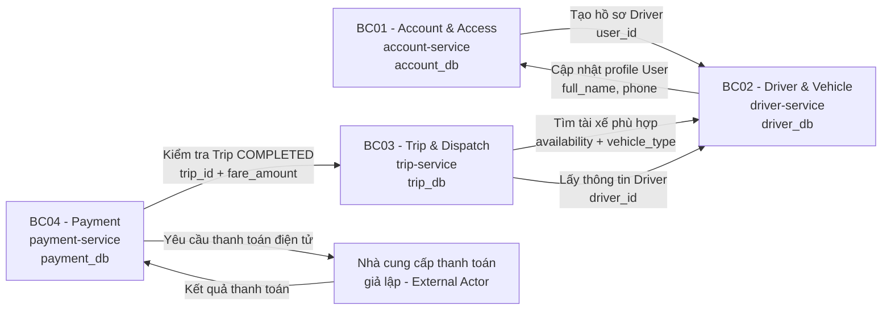
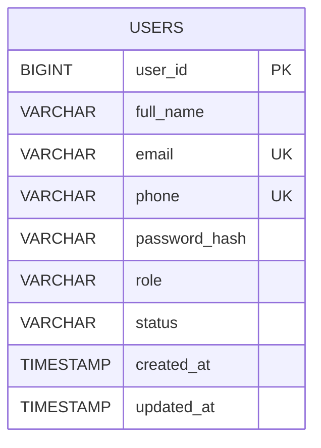
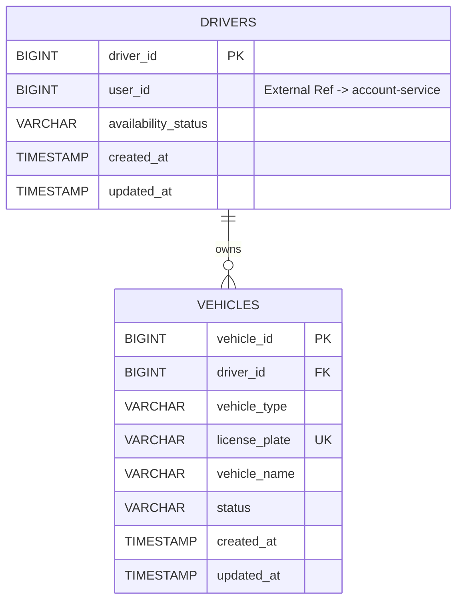
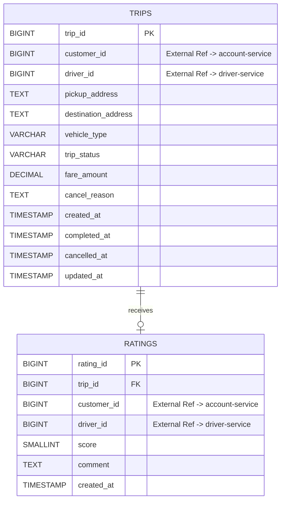
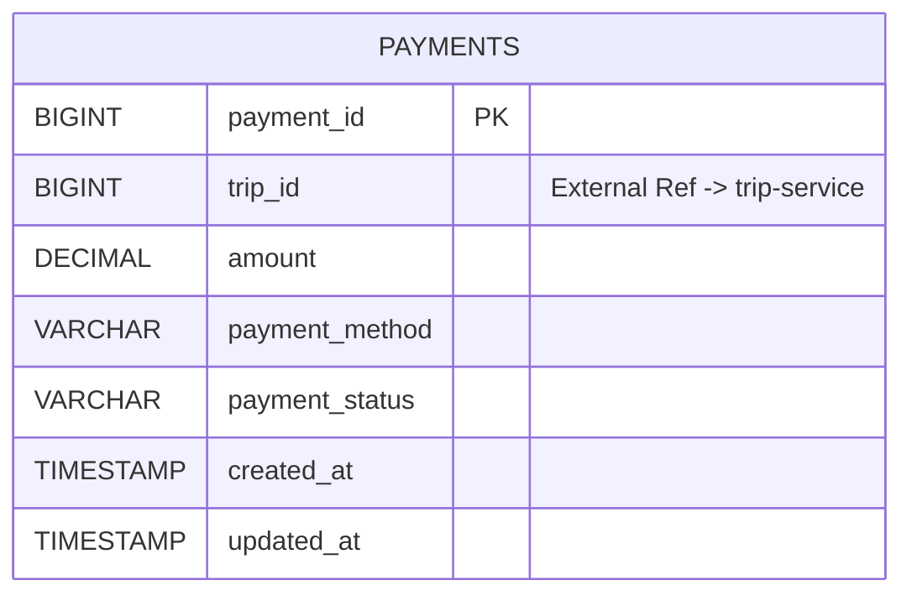

# DDD BOUNDED CONTEXT & MICROSERVICE DESIGN – CAB SYSTEM

## Cách trình bày

Tài liệu này được rút gọn theo đúng **5 nội dung chính** trên sơ đồ giảng viên hướng dẫn:

```text
FR + Business Process / Workflow
            ↓
     1. Bounded Context
            ↓
  2. Ubiquitous Language
            ↓
       Microservice
        ↙        ↘
  3. API      4. ERD / CSDL
                    ↓
             5. Database Type
```

Nguyên tắc áp dụng:

```text
1 Bounded Context = 1 Sub-domain = 1 Microservice = 1 Database riêng
```

- Không dùng chung database giữa các microservice.
- Không tạo Foreign Key trực tiếp giữa database của hai microservice.
- ID trỏ tới dữ liệu do service khác sở hữu chỉ là **External Reference ID**.
- Khi cần dữ liệu của service khác phải gọi REST API của service đó.
- Không thêm actor hoặc chức năng ngoài SRS.
- Không thêm Kafka, RabbitMQ, Event Bus, CQRS, Event Sourcing hoặc Kubernetes trong phiên bản đồ án 7 tuần.
- Ưu tiên REST API và kiến trúc đơn giản, dễ triển khai bằng Node.js.
- Khi có khác biệt giữa tài liệu, ưu tiên SRS mới nhất rồi mới đến Business Process/Business Rules, Use Case/RTM, API và ERD hiện tại.

---

# 1. XÁC ĐỊNH BOUNDED CONTEXT

## 1.1. Cơ sở phân rã

Bounded Context không được chia theo tên bảng mà dựa trên **ranh giới nghiệp vụ** của CAB System.

Workflow chính trong phạm vi hiện tại:

```text
Khách hàng đăng nhập
        ↓
Tạo yêu cầu đặt xe
        ↓
Hệ thống tìm tài xế AVAILABLE
        ↓
Kiểm tra phương tiện phù hợp
        ↓
Tự động gán tài xế
        ↓
Tài xế cập nhật tiến trình chuyến
        ↓
Hoàn thành chuyến
        ↓
Tính cước
        ↓
Khách hàng chọn phương thức thanh toán
        ↓
Ghi nhận kết quả thanh toán
        ↓
Khách hàng đánh giá tài xế
```

Phiên bản SRS hiện tại sử dụng cơ chế **hệ thống tự động gán tài xế**, không có bước tài xế chấp nhận/từ chối chuyến trong workflow chính.

## 1.2. Kết quả phân rã

CAB System được chia thành **4 Bounded Context**. Số lượng này đủ tách ranh giới nghiệp vụ nhưng vẫn phù hợp phạm vi triển khai khoảng 7 tuần.

| STT | Bounded Context | Sub-domain | Microservice | Database | FR chính | Business Process |
|---|---|---|---|---|---|---|
| 1 | **BC01 – Account & Access** | Identity & Account | `account-service` | `account_db` | FR01–FR04, FR24, FR32–FR33 | Đăng ký, đăng nhập, quản lý hồ sơ, tạo tài khoản tài xế, xác thực/phân quyền |
| 2 | **BC02 – Driver & Vehicle** | Driver Operations | `driver-service` | `driver_db` | FR05–FR07, FR25–FR26; hỗ trợ FR09–FR10 | Quản lý hồ sơ tài xế, phương tiện, trạng thái sẵn sàng, cung cấp tài xế phù hợp |
| 3 | **BC03 – Trip & Dispatch** | Booking, Dispatch & Trip Lifecycle | `trip-service` | `trip_db` | FR08–FR17, FR22–FR23, FR27–FR28, FR30 | Tạo chuyến, tìm/gán tài xế, thực hiện chuyến, tính cước, đánh giá, báo cáo chuyến |
| 4 | **BC04 – Payment** | Payment Transaction | `payment-service` | `payment_db` | FR18–FR21, FR29, FR31 | Thanh toán tiền mặt/điện tử, tra cứu giao dịch, báo cáo doanh thu |

> `Rating` được đặt trong Trip & Dispatch Context vì chỉ phát sinh sau một chuyến đã hoàn thành và phụ thuộc trực tiếp vào vòng đời Trip.  
> `Report` không tách thành microservice riêng: báo cáo số chuyến thuộc Trip Service và báo cáo doanh thu thuộc Payment Service.  
> `Staff` là actor sử dụng API vận hành, không phải một sub-domain riêng nên không tạo Staff Service.

---

## 1.3. BC01 – Account & Access Context

### Mục đích

Quản lý danh tính và tài khoản người dùng CAB System: đăng ký khách hàng, đăng nhập, cập nhật hồ sơ cá nhân, tạo tài khoản tài xế, tra cứu khách hàng, xác thực và phân quyền.

### Functional Requirements

| Mã FR | Chức năng | Vai trò |
|---|---|---|
| FR01 | Hệ thống cho phép khách hàng đăng ký tài khoản | Owner |
| FR02 | Hệ thống cho phép người dùng đăng nhập | Owner |
| FR03 | Hệ thống cho phép khách hàng cập nhật thông tin cá nhân | Owner |
| FR04 | Hệ thống cho phép nhân viên vận hành tạo tài khoản tài xế | Owner; Driver Service hỗ trợ tạo hồ sơ Driver |
| FR24 | Hệ thống cho phép nhân viên vận hành tra cứu khách hàng | Owner |
| FR32 | Hệ thống xác thực người dùng | Owner |
| FR33 | Hệ thống kiểm tra quyền truy cập | Owner cơ chế; các service thực thi quyền ở endpoint của mình |

### Workflow tham gia

| Workflow | Xử lý | Kết quả |
|---|---|---|
| Đăng ký khách hàng | Kiểm tra dữ liệu → kiểm tra email/phone → băm mật khẩu → tạo User role CUSTOMER | Tạo tài khoản khách hàng |
| Đăng nhập | Kiểm tra thông tin đăng nhập → kiểm tra password hash → phát token | Người dùng được xác thực |
| Cập nhật hồ sơ | Xác định User từ token → kiểm tra dữ liệu → cập nhật hồ sơ | Hồ sơ được cập nhật |
| Tạo tài khoản tài xế | Staff tạo User role DRIVER → gọi Driver Service tạo Driver theo `user_id` | Có tài khoản và hồ sơ nghiệp vụ tài xế |
| Tra cứu khách hàng | Staff tìm User role CUSTOMER | Trả danh sách khách hàng |
| Phân quyền | Kiểm tra token và role tại endpoint | Cho phép/từ chối request |

### Microservice và dữ liệu sở hữu

**Microservice:** `account-service`  
**Database:** `account_db`

Dữ liệu sở hữu:

- `User`
- `Role`
- `AccountStatus`
- `Email`
- `Phone`
- `PasswordHash`

Không sở hữu `Driver`, `Vehicle`, `Trip`, `Payment`, `Rating`.

---

## 1.4. BC02 – Driver & Vehicle Context

### Mục đích

Quản lý hồ sơ nghiệp vụ tài xế, phương tiện và trạng thái sẵn sàng; cung cấp dữ liệu tài xế phù hợp cho Trip Service khi điều phối chuyến.

### Functional Requirements

| Mã FR | Chức năng | Vai trò |
|---|---|---|
| FR05 | Hệ thống cho phép tài xế cập nhật hồ sơ | Owner; phần `full_name`, `phone` do Account Service sở hữu |
| FR06 | Hệ thống cho phép tài xế cập nhật phương tiện | Owner |
| FR07 | Hệ thống cho phép tài xế cập nhật trạng thái tài xế | Owner |
| FR09 | Hệ thống tìm tài xế đang sẵn sàng | Service hỗ trợ Trip Service |
| FR10 | Hệ thống tìm tài xế có phương tiện phù hợp | Service hỗ trợ Trip Service |
| FR25 | Hệ thống cho phép nhân viên vận hành tra cứu tài xế | Owner |
| FR26 | Hệ thống cho phép nhân viên vận hành tra cứu phương tiện | Owner |

### Workflow tham gia

| Workflow | Xử lý | Kết quả |
|---|---|---|
| Khởi tạo tài xế | Nhận `user_id` từ Account Service → tạo Driver | Có hồ sơ Driver |
| Cập nhật hồ sơ | Cập nhật dữ liệu Driver; dữ liệu User gọi Account Service | Hồ sơ đúng theo data owner |
| Cập nhật phương tiện | Kiểm tra dữ liệu → tạo/cập nhật Vehicle | Vehicle được lưu |
| Cập nhật sẵn sàng | Driver chuyển AVAILABLE/UNAVAILABLE | Trạng thái phục vụ matching |
| Tìm tài xế phù hợp | Lọc AVAILABLE + phương tiện đúng loại | Trả ứng viên cho Trip Service |
| Tra cứu vận hành | Staff lọc Driver/Vehicle | Trả dữ liệu phù hợp |

### Microservice và dữ liệu sở hữu

**Microservice:** `driver-service`  
**Database:** `driver_db`

Dữ liệu sở hữu:

- `Driver`
- `Vehicle`
- `AvailabilityStatus`
- `VehicleType`

`drivers.user_id` chỉ là **External Reference ID** tới Account Service.

---

## 1.5. BC03 – Trip & Dispatch Context

### Mục đích

Quản lý nghiệp vụ cốt lõi của CAB System từ tạo yêu cầu đặt xe, tìm và gán tài xế, theo dõi vòng đời chuyến, tính cước, hủy chuyến, lịch sử, đánh giá và báo cáo số lượng chuyến.

### Functional Requirements

| Mã FR | Chức năng | Vai trò |
|---|---|---|
| FR08 | Hệ thống cho phép khách hàng tạo yêu cầu đặt xe | Owner |
| FR09 | Hệ thống tìm tài xế đang sẵn sàng | Owner orchestration; Driver Service cung cấp dữ liệu |
| FR10 | Hệ thống tìm tài xế có phương tiện phù hợp | Owner orchestration; Driver Service cung cấp dữ liệu |
| FR11 | Hệ thống tự động gán tài xế phù hợp đầu tiên cho chuyến | Owner |
| FR12 | Hệ thống thông báo khi không tìm được tài xế | Owner; không tạo Notification Service riêng |
| FR13 | Hệ thống cho phép khách hàng theo dõi chuyến | Owner |
| FR14 | Hệ thống cho phép khách hàng hủy chuyến | Owner |
| FR15 | Hệ thống cho phép khách hàng xem lịch sử chuyến | Owner |
| FR16 | Hệ thống cho phép tài xế cập nhật trạng thái chuyến theo đúng trình tự | Owner |
| FR17 | Hệ thống tính số tiền phải trả | Owner |
| FR22 | Hệ thống cho phép khách hàng đánh giá tài xế | Owner |
| FR23 | Hệ thống lưu đánh giá | Owner |
| FR27 | Hệ thống cho phép nhân viên vận hành theo dõi chuyến | Owner |
| FR28 | Hệ thống cho phép nhân viên vận hành hủy chuyến kèm lý do khi có sự cố | Owner |
| FR30 | Hệ thống cho phép quản lý xem báo cáo số lượng chuyến | Owner |

### Workflow tham gia

| Workflow | Xử lý | Kết quả |
|---|---|---|
| Tạo chuyến | Nhận điểm đón, điểm đến, loại xe → tạo Trip `SEARCHING_DRIVER` | Trip mới |
| Tìm tài xế | Gọi Driver Service để lấy Driver AVAILABLE + Vehicle đúng loại | Có danh sách ứng viên |
| Gán tài xế | Gán ứng viên phù hợp đầu tiên | Trip `DRIVER_ASSIGNED` |
| Không có tài xế | Không có ứng viên | Trip `NO_DRIVER` và trả thông báo |
| Thực hiện chuyến | Driver cập nhật trạng thái đúng trình tự | Vòng đời Trip tiến triển |
| Hoàn thành | Trip chuyển `COMPLETED` → tính cước | Có `fare_amount` |
| Hủy chuyến | Customer hoặc Staff thực hiện theo quyền | Trip `CANCELLED` |
| Đánh giá | Trip đã COMPLETED → customer gửi score/comment | Rating được lưu |
| Báo cáo chuyến | Tổng hợp dữ liệu Trip | Trả số lượng chuyến |

### Trạng thái Trip

```text
SEARCHING_DRIVER
    ├──> DRIVER_ASSIGNED
    │       └──> DRIVER_ARRIVED
    │               └──> PICKED_UP
    │                       └──> IN_PROGRESS
    │                               └──> COMPLETED
    ├──> NO_DRIVER
    └──> CANCELLED
```

### Microservice và dữ liệu sở hữu

**Microservice:** `trip-service`  
**Database:** `trip_db`

Dữ liệu sở hữu:

- `Trip`
- `Rating`
- `TripStatus`
- `FareAmount`
- `PickupAddress`
- `DestinationAddress`

`trips.customer_id` là External Reference ID tới Account Service.  
`trips.driver_id` là External Reference ID tới Driver Service.

---

## 1.6. BC04 – Payment Context

### Mục đích

Quản lý giao dịch thanh toán của chuyến, bao gồm chọn phương thức, ghi nhận tiền mặt, gửi thanh toán điện tử tới bộ giả lập, lưu kết quả, tra cứu giao dịch và báo cáo doanh thu.

### Functional Requirements

| Mã FR | Chức năng | Vai trò |
|---|---|---|
| FR18 | Hệ thống cho phép khách hàng chọn phương thức thanh toán | Owner |
| FR19 | Hệ thống ghi nhận thanh toán tiền mặt | Owner |
| FR20 | Hệ thống gửi yêu cầu thanh toán điện tử tới bộ giả lập | Owner |
| FR21 | Hệ thống ghi nhận kết quả thanh toán | Owner |
| FR29 | Hệ thống cho phép nhân viên vận hành tra cứu giao dịch | Owner |
| FR31 | Hệ thống cho phép quản lý xem báo cáo doanh thu | Owner |
| FR17 | Hệ thống tính số tiền phải trả | Không sở hữu; nhận `fare_amount` từ Trip Service |

### Workflow tham gia

| Workflow | Xử lý | Kết quả |
|---|---|---|
| Chuẩn bị thanh toán | Gọi Trip Service → kiểm tra Trip COMPLETED → lấy fare | Có số tiền hợp lệ |
| Chọn phương thức | Customer chọn CASH hoặc ELECTRONIC | Xác định payment method |
| Thanh toán tiền mặt | Tạo Payment và ghi nhận thành công | Giao dịch được lưu |
| Thanh toán điện tử | Tạo Payment PENDING → gửi bộ giả lập → nhận kết quả → cập nhật status | Lưu kết quả điện tử |
| Tra cứu giao dịch | Staff lọc Payment | Trả danh sách giao dịch |
| Báo cáo doanh thu | Tổng hợp các giao dịch thành công | Trả tổng doanh thu |

### Microservice và dữ liệu sở hữu

**Microservice:** `payment-service`  
**Database:** `payment_db`

Dữ liệu sở hữu:

- `Payment`
- `PaymentMethod`
- `PaymentStatus`
- `Amount`

`payments.trip_id` chỉ là External Reference ID tới Trip Service.

---

## 1.7. Mapping toàn bộ FR → Bounded Context

| FR | Chức năng | Bounded Context | Microservice |
|---|---|---|---|
| FR01 | Khách hàng đăng ký tài khoản | BC01 | `account-service` |
| FR02 | Người dùng đăng nhập | BC01 | `account-service` |
| FR03 | Khách hàng cập nhật thông tin cá nhân | BC01 | `account-service` |
| FR04 | Nhân viên vận hành tạo tài khoản tài xế | BC01 | `account-service`, Driver Service hỗ trợ |
| FR05 | Tài xế cập nhật hồ sơ | BC02 | `driver-service`, Account Service hỗ trợ phần User |
| FR06 | Tài xế cập nhật phương tiện | BC02 | `driver-service` |
| FR07 | Tài xế cập nhật trạng thái tài xế | BC02 | `driver-service` |
| FR08 | Khách hàng tạo yêu cầu đặt xe | BC03 | `trip-service` |
| FR09 | Tìm tài xế đang sẵn sàng | BC03 | `trip-service`, Driver Service hỗ trợ |
| FR10 | Tìm tài xế có phương tiện phù hợp | BC03 | `trip-service`, Driver Service hỗ trợ |
| FR11 | Tự động gán tài xế phù hợp đầu tiên | BC03 | `trip-service` |
| FR12 | Thông báo khi không tìm được tài xế | BC03 | `trip-service` |
| FR13 | Khách hàng theo dõi chuyến | BC03 | `trip-service` |
| FR14 | Khách hàng hủy chuyến | BC03 | `trip-service` |
| FR15 | Khách hàng xem lịch sử chuyến | BC03 | `trip-service` |
| FR16 | Tài xế cập nhật trạng thái chuyến theo đúng trình tự | BC03 | `trip-service` |
| FR17 | Tính số tiền phải trả | BC03 | `trip-service` |
| FR18 | Khách hàng chọn phương thức thanh toán | BC04 | `payment-service` |
| FR19 | Ghi nhận thanh toán tiền mặt | BC04 | `payment-service` |
| FR20 | Gửi yêu cầu thanh toán điện tử tới bộ giả lập | BC04 | `payment-service` |
| FR21 | Ghi nhận kết quả thanh toán | BC04 | `payment-service` |
| FR22 | Khách hàng đánh giá tài xế | BC03 | `trip-service` |
| FR23 | Lưu đánh giá | BC03 | `trip-service` |
| FR24 | Nhân viên vận hành tra cứu khách hàng | BC01 | `account-service` |
| FR25 | Nhân viên vận hành tra cứu tài xế | BC02 | `driver-service` |
| FR26 | Nhân viên vận hành tra cứu phương tiện | BC02 | `driver-service` |
| FR27 | Nhân viên vận hành theo dõi chuyến | BC03 | `trip-service` |
| FR28 | Nhân viên vận hành hủy chuyến kèm lý do | BC03 | `trip-service` |
| FR29 | Nhân viên vận hành tra cứu giao dịch | BC04 | `payment-service` |
| FR30 | Quản lý xem báo cáo số lượng chuyến | BC03 | `trip-service` |
| FR31 | Quản lý xem báo cáo doanh thu | BC04 | `payment-service` |
| FR32 | Xác thực người dùng | BC01 | `account-service` |
| FR33 | Kiểm tra quyền truy cập | BC01 | `account-service` + middleware tại từng service |

---

## 1.8. Context Map



---

# 2. UBIQUITOUS LANGUAGE

Mỗi Bounded Context có bộ ngôn ngữ riêng. Không dùng một định nghĩa chung cho toàn hệ thống nếu ý nghĩa nghiệp vụ khác nhau.

## 2.1. BC01 – Account & Access

| Thuật ngữ | Code Term | Ý nghĩa trong Context | Quy tắc sử dụng |
|---|---|---|---|
| Người dùng | `User` | Tài khoản có thể đăng nhập CAB System | Aggregate Root của Account Context |
| Khách hàng | `CustomerAccount` / `CUSTOMER` | User sử dụng chức năng đặt xe | Không tạo bảng Customer riêng |
| Tài khoản tài xế | `DriverAccount` / `DRIVER` | Credential đăng nhập của tài xế | Khác với entity `Driver` ở BC02 |
| Nhân viên vận hành | `STAFF` | User có quyền vận hành | Dùng cho các API staff theo SRS |
| Quản lý | `MANAGER` | User có quyền xem báo cáo | Không phải một service riêng |
| Vai trò | `Role` | Quyền nghiệp vụ của User | CUSTOMER/DRIVER/STAFF/MANAGER |
| Trạng thái tài khoản | `AccountStatus` | Tình trạng sử dụng tài khoản | Tập giá trị chi tiết theo SRS/API hiện tại |
| Xác thực | `Authentication` | Xác minh danh tính người dùng | Mật khẩu chỉ lưu dạng hash |
| Phân quyền | `Authorization` | Kiểm tra role được gọi chức năng nào | Thực thi ở endpoint/middleware |
| Hồ sơ người dùng | `UserProfile` | `full_name`, `email`, `phone` | Account Service là owner |

## 2.2. BC02 – Driver & Vehicle

| Thuật ngữ | Code Term | Ý nghĩa trong Context | Quy tắc sử dụng |
|---|---|---|---|
| Tài xế | `Driver` | Hồ sơ nghiệp vụ của tài xế | Không chứa password/role |
| Mã tài khoản | `user_id` | User gắn với Driver | External Reference ID, không FK sang Account DB |
| Phương tiện | `Vehicle` | Xe thuộc một Driver | `driver_id` là FK nội bộ trong Driver DB |
| Loại xe | `VehicleType` | Loại phương tiện dùng để matching | MOTORBIKE/CAR theo API hiện tại |
| Trạng thái sẵn sàng | `AvailabilityStatus` | Khả năng nhận chuyến của Driver | AVAILABLE/UNAVAILABLE |
| Tài xế phù hợp | `EligibleDriver` | Driver AVAILABLE và có Vehicle đúng loại | Không tự thêm thuật toán xếp hạng |
| Ứng viên tài xế | `DriverCandidate` | DTO trả cho Trip Service khi tìm tài xế | Không phải entity lưu DB |

## 2.3. BC03 – Trip & Dispatch

| Thuật ngữ | Code Term | Ý nghĩa trong Context | Quy tắc sử dụng |
|---|---|---|---|
| Yêu cầu đặt xe | `BookingRequest` | Input để tạo Trip | Không cần bảng Booking riêng trong Phase 1 |
| Chuyến | `Trip` | Aggregate quản lý vòng đời một chuyến | Aggregate Root của BC03 |
| Khách hàng của chuyến | `customer_id` | User đã tạo chuyến | External Reference ID tới Account Service |
| Tài xế của chuyến | `driver_id` | Driver được gán cho chuyến | External Reference ID tới Driver Service |
| Điểm đón | `PickupAddress` | Nơi bắt đầu chuyến | Thuộc Trip |
| Điểm đến | `DestinationAddress` | Nơi kết thúc chuyến | Thuộc Trip |
| Loại xe yêu cầu | `RequestedVehicleType` | Loại xe khách chọn | Dùng khi gọi Driver Service |
| Gán tài xế | `DriverAssignment` | Hành vi gán `driver_id` vào Trip | Không tạo bảng Assignment riêng |
| Trạng thái chuyến | `TripStatus` | Trạng thái vòng đời Trip | Phải theo đúng state transition |
| Không có tài xế | `NO_DRIVER` | Matching thất bại | Kết thúc nhánh tìm tài xế |
| Cước chuyến | `FareAmount` | Số tiền phải trả sau khi hoàn thành | Công thức chi tiết chưa tự suy diễn nếu SRS chưa chốt |
| Hủy chuyến | `CancelTrip` | Chuyển Trip sang CANCELLED | Tuân theo quyền và chính sách trong SRS |
| Đánh giá | `Rating` | Phản hồi sau chuyến | Chỉ sau COMPLETED; một Rating/Trip |

## 2.4. BC04 – Payment

| Thuật ngữ | Code Term | Ý nghĩa trong Context | Quy tắc sử dụng |
|---|---|---|---|
| Thanh toán | `Payment` | Aggregate ghi nhận giao dịch của một chuyến | Aggregate Root của BC04 |
| Mã chuyến | `trip_id` | Chuyến được thanh toán | External Reference ID, không FK sang Trip DB |
| Số tiền | `Amount` | Số tiền lấy từ `fare_amount` của Trip | Payment lưu bản ghi của giá trị khi thanh toán |
| Phương thức thanh toán | `PaymentMethod` | Cách khách thanh toán | CASH/ELECTRONIC |
| Trạng thái thanh toán | `PaymentStatus` | Trạng thái xử lý giao dịch | PENDING/SUCCESS/FAILED theo mô hình hiện tại |
| Thanh toán tiền mặt | `CashPayment` | Giao dịch tiền mặt được hệ thống ghi nhận | Không gọi provider ngoài |
| Thanh toán điện tử | `ElectronicPayment` | Giao dịch gửi tới bộ giả lập | Không lưu dữ liệu thẻ nhạy cảm |
| Nhà cung cấp thanh toán giả lập | `MockPaymentProvider` | Actor ngoài trả kết quả giao dịch điện tử | Không phải CAB microservice |
| Giao dịch thành công | `SuccessfulPayment` | Payment có trạng thái SUCCESS | Được dùng trong báo cáo doanh thu |

---

# 3. API CỦA CÁC MICROSERVICE

Các API dưới đây ưu tiên giữ cấu trúc đã có trong `API_document`. Endpoint `/internal/...` chỉ phục vụ giao tiếp giữa service sau khi tách database; chúng không tạo chức năng nghiệp vụ mới.

## 3.1. `account-service`

| Method | Endpoint | Chức năng | Actor/Service gọi | FR | Entity/Data |
|---|---|---|---|---|---|
| POST | `/api/v1/auth/register` | Đăng ký tài khoản khách hàng | Khách hàng | FR01 | User |
| POST | `/api/v1/auth/login` | Đăng nhập | Customer/Driver/Staff/Manager | FR02, FR32 | User/Auth |
| PUT | `/api/v1/customers/me` | Cập nhật thông tin cá nhân | Khách hàng | FR03 | User |
| POST | `/api/v1/staff/drivers` | Tạo tài khoản tài xế | Nhân viên vận hành | FR04 | User; gọi Driver Service |
| GET | `/api/v1/staff/customers` | Tra cứu khách hàng | Nhân viên vận hành | FR24 | User |
| PUT | `/internal/users/{userId}/profile` | Cập nhật phần hồ sơ User từ Driver workflow | Driver Service | Hỗ trợ FR05 | User |
| Middleware | `Authorization middleware` | Kiểm tra quyền theo role | Mọi request | FR33 | Token/Role |

> Nếu `GET /customers/me` đang có trong API hiện tại thì có thể tiếp tục giữ làm API đọc hồ sơ; đây là API hỗ trợ, không phải Functional Requirement mới.

## 3.2. `driver-service`

| Method | Endpoint | Chức năng | Actor/Service gọi | FR | Entity/Data |
|---|---|---|---|---|---|
| PUT | `/api/v1/drivers/me` | Cập nhật hồ sơ tài xế | Tài xế | FR05 | Driver + User profile |
| PUT | `/api/v1/drivers/me/vehicle` | Tạo/cập nhật phương tiện | Tài xế | FR06 | Vehicle |
| PUT | `/api/v1/drivers/me/availability` | Cập nhật trạng thái sẵn sàng | Tài xế | FR07 | Driver |
| GET | `/api/v1/staff/drivers` | Tra cứu tài xế | Nhân viên vận hành | FR25 | Driver |
| GET | `/api/v1/staff/vehicles` | Tra cứu phương tiện | Nhân viên vận hành | FR26 | Vehicle |
| POST | `/internal/drivers` | Khởi tạo Driver từ `user_id` | Account Service | Hỗ trợ FR04 | Driver |
| GET | `/internal/drivers/available?vehicle_type={type}` | Tìm tài xế AVAILABLE có loại xe phù hợp | Trip Service | FR09, FR10 | DriverCandidate |
| GET | `/internal/drivers/{driverId}` | Lấy thông tin Driver/Vehicle tóm tắt | Trip Service | Hỗ trợ FR13 | Driver summary |
| GET | `/internal/drivers/by-user/{userId}` | Resolve `driver_id` từ User đăng nhập | Trip Service | Hỗ trợ FR16 | Driver ID |

## 3.3. `trip-service`

| Method | Endpoint | Chức năng | Actor/Service gọi | FR | Entity/Data |
|---|---|---|---|---|---|
| POST | `/api/v1/trips` | Tạo yêu cầu đặt xe và điều phối tự động | Khách hàng | FR08–FR12 | Trip |
| GET | `/api/v1/trips/{tripId}` | Theo dõi/xem chuyến | Khách hàng | FR13 | Trip |
| PUT | `/api/v1/trips/{tripId}/cancel` | Hủy chuyến | Khách hàng | FR14 | Trip |
| GET | `/api/v1/trips` | Xem lịch sử chuyến | Khách hàng | FR15 | Trip |
| GET | `/api/v1/driver/trips` | Lấy chuyến được phân công | Tài xế | Hỗ trợ FR16 | Trip |
| PUT | `/api/v1/driver/trips/{tripId}/status` | Cập nhật trạng thái chuyến; khi COMPLETED tính cước | Tài xế | FR16, FR17 | Trip |
| POST | `/api/v1/trips/{tripId}/rating` | Đánh giá tài xế sau chuyến | Khách hàng | FR22, FR23 | Rating |
| GET | `/api/v1/staff/trips` | Theo dõi/tra cứu chuyến | Nhân viên vận hành | FR27 | Trip |
| PUT | `/api/v1/staff/trips/{tripId}/cancel` | Hủy chuyến gặp sự cố kèm lý do | Nhân viên vận hành | FR28 | Trip |
| GET | `/api/v1/reports/trips` | Báo cáo số lượng chuyến | Quản lý | FR30 | Trip aggregate |
| GET | `/internal/trips/{tripId}/payment-context` | Trả trạng thái, cước và customer cho Payment Service | Payment Service | Hỗ trợ FR18–FR21 | Trip payment context |

## 3.4. `payment-service`

| Method | Endpoint | Chức năng | Actor/Service gọi | FR | Entity/Data |
|---|---|---|---|---|---|
| GET | `/api/v1/trips/{tripId}/payment` | Xem thông tin thanh toán của chuyến | Khách hàng/Staff theo quyền | Hỗ trợ FR18–FR21 | Payment |
| POST | `/api/v1/trips/{tripId}/payment` | Chọn phương thức và tạo/ghi nhận thanh toán | Khách hàng | FR18–FR21 | Payment |
| GET | `/api/v1/staff/payments` | Tra cứu giao dịch | Nhân viên vận hành | FR29 | Payment |
| GET | `/api/v1/reports/revenue` | Báo cáo doanh thu | Quản lý | FR31 | Revenue aggregate |

## 3.5. API giao tiếp giữa Microservice

| Service gọi | Service được gọi | Endpoint | Dữ liệu trao đổi | Mục đích |
|---|---|---|---|---|
| Account Service | Driver Service | `POST /internal/drivers` | `user_id` | Tạo Driver sau khi tạo User role DRIVER |
| Driver Service | Account Service | `PUT /internal/users/{userId}/profile` | `full_name`, `phone` | Cập nhật dữ liệu hồ sơ do Account Service sở hữu |
| Trip Service | Driver Service | `GET /internal/drivers/available?vehicle_type={type}` | vehicle type → driver candidates | Tìm tài xế sẵn sàng và đúng loại xe |
| Trip Service | Driver Service | `GET /internal/drivers/{driverId}` | `driver_id` | Lấy thông tin cần hiển thị sau khi gán |
| Trip Service | Driver Service | `GET /internal/drivers/by-user/{userId}` | `user_id` → `driver_id` | Kiểm tra tài xế cập nhật đúng Trip |
| Payment Service | Trip Service | `GET /internal/trips/{tripId}/payment-context` | `trip_status`, `fare_amount`, `customer_id` | Kiểm tra điều kiện thanh toán và lấy số tiền |
| Payment Service | Mock Payment Provider | API giả lập | amount + mã giao dịch kỹ thuật | Thực hiện FR20 và nhận kết quả điện tử |

Quy tắc:

- Giao tiếp service-to-service dùng REST/JSON đồng bộ.
- Không đọc trực tiếp database của service khác.
- Không tạo Foreign Key xuyên database.
- Không dùng message broker trong phạm vi hiện tại.

---

# 4. ERD VÀ CƠ SỞ DỮ LIỆU CỦA TỪNG MICROSERVICE

Phần này đi theo thứ tự:

```text
Domain Model → Data Model → Database Model → ERD
```

## 4.1. `account-service`

### Domain Model

| Thành phần | Loại | Vai trò |
|---|---|---|
| `User` | Aggregate Root / Entity | Quản lý danh tính, credential, role và trạng thái tài khoản |
| `Role` | Value Object / Enum | CUSTOMER, DRIVER, STAFF, MANAGER |
| `Email` | Value Object | Email đăng nhập, duy nhất |
| `Phone` | Value Object | Số điện thoại, duy nhất |
| `PasswordHash` | Value Object | Mật khẩu đã băm |
| `AccountStatus` | Value Object | Trạng thái tài khoản |

### Data Model

| Entity | Thuộc tính chính | Quan hệ | Loại ID | Ghi chú |
|---|---|---|---|---|
| `User` | `user_id`, `full_name`, `email`, `phone`, `password_hash`, `role`, `status`, timestamps | Không cần quan hệ nội bộ khác | `user_id` nội bộ | Các service khác chỉ giữ ID tham chiếu ngoài |

### Database Model – `users`

| Column | Data Type | Constraint | Mô tả |
|---|---|---|---|
| `user_id` | BIGSERIAL | PK | ID User |
| `full_name` | VARCHAR(120) | NOT NULL | Họ tên |
| `email` | VARCHAR(255) | NOT NULL, UNIQUE | Email đăng nhập |
| `phone` | VARCHAR(20) | NOT NULL, UNIQUE | Số điện thoại |
| `password_hash` | VARCHAR(255) | NOT NULL | Mật khẩu đã băm |
| `role` | VARCHAR(20) | NOT NULL, CHECK | CUSTOMER/DRIVER/STAFF/MANAGER |
| `status` | VARCHAR(30) | NOT NULL | Trạng thái tài khoản |
| `created_at` | TIMESTAMP | NOT NULL, DEFAULT CURRENT_TIMESTAMP | Ngày tạo |
| `updated_at` | TIMESTAMP | NOT NULL, DEFAULT CURRENT_TIMESTAMP | Ngày cập nhật |

Index chính:

```sql
CREATE UNIQUE INDEX ux_users_email ON users(email);
CREATE UNIQUE INDEX ux_users_phone ON users(phone);
CREATE INDEX ix_users_role_status ON users(role, status);
```

### ERD



---

## 4.2. `driver-service`

### Domain Model

| Thành phần | Loại | Vai trò |
|---|---|---|
| `Driver` | Aggregate Root / Entity | Quản lý hồ sơ nghiệp vụ và availability |
| `Vehicle` | Entity | Phương tiện thuộc Driver |
| `AvailabilityStatus` | Value Object / Enum | AVAILABLE/UNAVAILABLE |
| `VehicleType` | Value Object / Enum | MOTORBIKE/CAR |
| `DriverCandidate` | DTO | Dữ liệu trả cho Trip Service khi matching |

### Data Model

| Entity | Thuộc tính chính | Quan hệ | Loại ID | Ghi chú |
|---|---|---|---|---|
| `Driver` | `driver_id`, `user_id`, `availability_status`, timestamps | 1-N Vehicle | `driver_id` nội bộ; `user_id` external | `user_id` không FK sang Account DB |
| `Vehicle` | `vehicle_id`, `driver_id`, `vehicle_type`, `license_plate`, `vehicle_name`, `status`, timestamps | Thuộc Driver | `vehicle_id` nội bộ; `driver_id` internal FK | Cùng `driver_db` nên được phép tạo FK |

### Database Model – `drivers`

| Column | Data Type | Constraint | Mô tả |
|---|---|---|---|
| `driver_id` | BIGSERIAL | PK | ID Driver |
| `user_id` | BIGINT | NOT NULL, UNIQUE | External Ref tới Account Service; không FK |
| `availability_status` | VARCHAR(20) | NOT NULL, CHECK | AVAILABLE/UNAVAILABLE |
| `created_at` | TIMESTAMP | NOT NULL, DEFAULT CURRENT_TIMESTAMP | Ngày tạo |
| `updated_at` | TIMESTAMP | NOT NULL, DEFAULT CURRENT_TIMESTAMP | Ngày cập nhật |

### Database Model – `vehicles`

| Column | Data Type | Constraint | Mô tả |
|---|---|---|---|
| `vehicle_id` | BIGSERIAL | PK | ID Vehicle |
| `driver_id` | BIGINT | NOT NULL, FK → `drivers.driver_id` | Internal FK |
| `vehicle_type` | VARCHAR(20) | NOT NULL, CHECK | MOTORBIKE/CAR |
| `license_plate` | VARCHAR(30) | NOT NULL, UNIQUE | Biển số |
| `vehicle_name` | VARCHAR(100) | NOT NULL | Tên xe |
| `status` | VARCHAR(20) | NOT NULL, CHECK | Trạng thái Vehicle |
| `created_at` | TIMESTAMP | NOT NULL, DEFAULT CURRENT_TIMESTAMP | Ngày tạo |
| `updated_at` | TIMESTAMP | NOT NULL, DEFAULT CURRENT_TIMESTAMP | Ngày cập nhật |

Index chính:

```sql
CREATE INDEX ix_drivers_availability ON drivers(availability_status);
CREATE INDEX ix_vehicles_match ON vehicles(vehicle_type, status, driver_id);
CREATE UNIQUE INDEX ux_vehicles_license_plate ON vehicles(license_plate);
```

### ERD



---

## 4.3. `trip-service`

### Domain Model

| Thành phần | Loại | Vai trò |
|---|---|---|
| `Trip` | Aggregate Root | Quản lý toàn bộ vòng đời chuyến |
| `Rating` | Entity | Đánh giá sau khi Trip hoàn thành |
| `TripStatus` | Value Object / Enum | Kiểm soát state transition |
| `PickupAddress` | Value Object | Điểm đón |
| `DestinationAddress` | Value Object | Điểm đến |
| `RequestedVehicleType` | Value Object | Loại xe khách chọn |
| `FareAmount` | Value Object | Số tiền phải trả |

### Data Model

| Entity | Thuộc tính chính | Quan hệ | Loại ID | Ghi chú |
|---|---|---|---|---|
| `Trip` | `trip_id`, `customer_id`, `driver_id`, pickup, destination, vehicle_type, status, fare, cancel data, timestamps | 1-0..1 Rating | `trip_id` nội bộ; customer/driver external | Không FK sang Account/Driver DB |
| `Rating` | `rating_id`, `trip_id`, `customer_id`, `driver_id`, `score`, `comment`, `created_at` | Thuộc Trip | `trip_id` internal FK; customer/driver external | Một Rating/Trip |

### Database Model – `trips`

| Column | Data Type | Constraint | Mô tả |
|---|---|---|---|
| `trip_id` | BIGSERIAL | PK | ID Trip |
| `customer_id` | BIGINT | NOT NULL | External Ref → Account Service |
| `driver_id` | BIGINT | NULL | External Ref → Driver Service |
| `pickup_address` | TEXT | NOT NULL | Điểm đón |
| `destination_address` | TEXT | NOT NULL | Điểm đến |
| `vehicle_type` | VARCHAR(20) | NOT NULL, CHECK | MOTORBIKE/CAR |
| `trip_status` | VARCHAR(30) | NOT NULL, CHECK | SEARCHING_DRIVER, DRIVER_ASSIGNED, DRIVER_ARRIVED, PICKED_UP, IN_PROGRESS, COMPLETED, NO_DRIVER, CANCELLED |
| `fare_amount` | NUMERIC(12,2) | NULL, CHECK `>= 0` | Cước chuyến |
| `cancel_reason` | TEXT | NULL | Lý do hủy |
| `created_at` | TIMESTAMP | NOT NULL, DEFAULT CURRENT_TIMESTAMP | Ngày tạo |
| `completed_at` | TIMESTAMP | NULL | Ngày hoàn thành |
| `cancelled_at` | TIMESTAMP | NULL | Ngày hủy |
| `updated_at` | TIMESTAMP | NOT NULL, DEFAULT CURRENT_TIMESTAMP | Ngày cập nhật |

### Database Model – `ratings`

| Column | Data Type | Constraint | Mô tả |
|---|---|---|---|
| `rating_id` | BIGSERIAL | PK | ID Rating |
| `trip_id` | BIGINT | NOT NULL, FK → `trips.trip_id`, UNIQUE | Internal FK; một Rating/Trip |
| `customer_id` | BIGINT | NOT NULL | External Ref → Account Service |
| `driver_id` | BIGINT | NOT NULL | External Ref → Driver Service |
| `score` | SMALLINT | NOT NULL, CHECK 1..5 | Điểm đánh giá |
| `comment` | TEXT | NULL | Nhận xét |
| `created_at` | TIMESTAMP | NOT NULL, DEFAULT CURRENT_TIMESTAMP | Ngày đánh giá |

Index chính:

```sql
CREATE INDEX ix_trips_customer_history
    ON trips(customer_id, created_at DESC);

CREATE INDEX ix_trips_driver_active
    ON trips(driver_id, trip_status);

CREATE INDEX ix_trips_status
    ON trips(trip_status);

CREATE UNIQUE INDEX ux_ratings_trip
    ON ratings(trip_id);
```

### ERD



---

## 4.4. `payment-service`

### Domain Model

| Thành phần | Loại | Vai trò |
|---|---|---|
| `Payment` | Aggregate Root | Quản lý một giao dịch thanh toán |
| `PaymentMethod` | Value Object / Enum | CASH/ELECTRONIC |
| `PaymentStatus` | Value Object / Enum | PENDING/SUCCESS/FAILED |
| `Amount` | Value Object | Số tiền thanh toán |

### Data Model

| Entity | Thuộc tính chính | Quan hệ | Loại ID | Ghi chú |
|---|---|---|---|---|
| `Payment` | `payment_id`, `trip_id`, `amount`, `payment_method`, `payment_status`, timestamps | Không FK sang Trip DB | `payment_id` nội bộ; `trip_id` external | Trip Service là owner của Trip |

### Database Model – `payments`

| Column | Data Type | Constraint | Mô tả |
|---|---|---|---|
| `payment_id` | BIGSERIAL | PK | ID Payment |
| `trip_id` | BIGINT | NOT NULL | External Ref → Trip Service; không FK |
| `amount` | NUMERIC(12,2) | NOT NULL, CHECK `>= 0` | Số tiền thanh toán |
| `payment_method` | VARCHAR(20) | NOT NULL, CHECK | CASH/ELECTRONIC |
| `payment_status` | VARCHAR(20) | NOT NULL, CHECK | PENDING/SUCCESS/FAILED |
| `created_at` | TIMESTAMP | NOT NULL, DEFAULT CURRENT_TIMESTAMP | Ngày tạo |
| `updated_at` | TIMESTAMP | NOT NULL, DEFAULT CURRENT_TIMESTAMP | Ngày cập nhật |

Không đặt `UNIQUE(trip_id)` ở giai đoạn này vì chính sách retry khi thanh toán thất bại chưa được chốt hoàn toàn; không nên khóa thiết kế trước yêu cầu nghiệp vụ.

Index chính:

```sql
CREATE INDEX ix_payments_trip_id ON payments(trip_id);
CREATE INDEX ix_payments_status_created
    ON payments(payment_status, created_at);
```

### ERD



---

## 4.5. Quy tắc Internal FK và External Reference ID

| Vị trí | Cột | Loại | Có FK database? | Service sở hữu dữ liệu đích |
|---|---|---|---|---|
| `driver_db.vehicles` | `driver_id` | Internal ID | Có | Driver Service |
| `driver_db.drivers` | `user_id` | External Reference ID | **Không** | Account Service |
| `trip_db.trips` | `customer_id` | External Reference ID | **Không** | Account Service |
| `trip_db.trips` | `driver_id` | External Reference ID | **Không** | Driver Service |
| `trip_db.ratings` | `trip_id` | Internal ID | Có | Trip Service |
| `trip_db.ratings` | `customer_id` | External Reference ID | **Không** | Account Service |
| `trip_db.ratings` | `driver_id` | External Reference ID | **Không** | Driver Service |
| `payment_db.payments` | `trip_id` | External Reference ID | **Không** | Trip Service |

Ví dụ đúng:

```text
trip_db.trips.driver_id
        │
        │ External Reference ID
        ▼
   Trip Service
        │ REST API
        ▼
  Driver Service
        │
        ▼
 driver_db.drivers
```

Không được tạo:

```text
trip_db.trips.driver_id
    FOREIGN KEY REFERENCES driver_db.drivers(driver_id)
```

---

# 5. PHÂN TÍCH VÀ LỰA CHỌN DATABASE TYPE

Không chọn DBMS trước. Việc lựa chọn được thực hiện sau khi đã có Domain Model, Data Model và ERD ở mục 4.

## 5.1. `account-service`

| Tiêu chí | Phân tích |
|---|---|
| Structure | User có schema rõ và ổn định |
| Relationship | Ít quan hệ nhưng có nhiều ràng buộc dữ liệu |
| Integrity | Cao; email/phone phải duy nhất |
| Transaction | Có, đặc biệt khi tạo/cập nhật tài khoản |
| Consistency | Cao vì liên quan xác thực và role |
| Query | Chủ yếu tìm theo email, phone, role, keyword |
| Flexibility | Không cần schema linh hoạt |
| Read Speed | Cần nhanh nhưng index quan hệ đáp ứng đủ |
| Persistence | Bắt buộc lưu lâu dài |
| Temporary Data | Không phải dữ liệu tạm |
| Volume | Trung bình trong phạm vi đồ án |
| Access Pattern | Đọc theo ID/email/phone; ghi khi đăng ký/cập nhật |

**Lựa chọn:** Relational Database → **PostgreSQL** → `account_db`.

**Lý do:** dữ liệu tài khoản có cấu trúc rõ, cần UNIQUE, CHECK, consistency và persistence. MongoDB không mang lại lợi ích rõ ràng; Redis không phù hợp làm nguồn dữ liệu chính cho tài khoản.

---

## 5.2. `driver-service`

| Tiêu chí | Phân tích |
|---|---|
| Structure | Driver và Vehicle có schema rõ |
| Relationship | Có quan hệ 1-N Driver–Vehicle |
| Integrity | Cần bảo đảm Vehicle thuộc Driver và biển số không trùng |
| Transaction | Có khi tạo/cập nhật dữ liệu |
| Consistency | Cần nhất quán giữa Driver và Vehicle |
| Query | Lọc nhiều theo availability và vehicle type |
| Flexibility | Không cần document linh hoạt |
| Read Speed | Matching cần nhanh nhưng có thể giải quyết bằng index |
| Persistence | Driver/Vehicle cần lưu lâu dài |
| Temporary Data | Availability thay đổi thường xuyên nhưng vẫn là trạng thái nghiệp vụ cần lưu |
| Volume | Trung bình trong phạm vi đồ án |
| Access Pattern | Cập nhật availability; đọc theo driverId; lọc theo status/type |

**Lựa chọn:** Relational Database → **PostgreSQL** → `driver_db`.

**Lý do:** Driver–Vehicle có quan hệ rõ và cần Internal FK/UNIQUE. Với quy mô Phase 1, PostgreSQL + index đủ nhanh cho matching; chưa cần Redis và không có lý do dùng MongoDB.

---

## 5.3. `trip-service`

| Tiêu chí | Phân tích |
|---|---|
| Structure | Trip và Rating có schema rõ |
| Relationship | Có quan hệ nội bộ Trip–Rating |
| Integrity | Cao; TripStatus phải đúng trình tự và một Rating/Trip |
| Transaction | Cần khi cập nhật trạng thái, hoàn thành và tính cước |
| Consistency | Cao vì Trip là dữ liệu nghiệp vụ cốt lõi |
| Query | Lịch sử theo customer, chuyến theo driver/status, báo cáo số chuyến |
| Flexibility | Không yêu cầu schema linh hoạt |
| Read Speed | Cần nhanh cho theo dõi chuyến; index là đủ trong scope hiện tại |
| Persistence | Bắt buộc lưu lịch sử chuyến |
| Temporary Data | Không phải dữ liệu tạm |
| Volume | Có thể tăng nhanh nhưng vẫn trong mức PostgreSQL xử lý tốt cho đồ án |
| Access Pattern | Ghi nhiều khi state thay đổi; đọc lịch sử và trạng thái hiện tại |

**Lựa chọn:** Relational Database → **PostgreSQL** → `trip_db`.

**Lý do:** Trip có state transition chặt, cần transaction, consistency, lịch sử lâu dài và FK nội bộ Trip–Rating. MongoDB không tạo lợi ích đủ lớn; Redis không thích hợp làm nguồn lưu Trip bền vững. GPS realtime liên tục nằm ngoài phạm vi nên chưa có lý do thêm Redis/time-series store.

---

## 5.4. `payment-service`

| Tiêu chí | Phân tích |
|---|---|
| Structure | Payment có schema cố định |
| Relationship | Ít quan hệ nội bộ; `trip_id` là external reference |
| Integrity | Rất cao vì là dữ liệu giao dịch |
| Transaction | Cần để ghi nhận kết quả thanh toán chính xác |
| Consistency | Cao |
| Query | Tra cứu theo trip/status và tổng hợp doanh thu |
| Flexibility | Không cần schema document linh hoạt |
| Read Speed | Cần ổn định, không yêu cầu cache chuyên biệt |
| Persistence | Bắt buộc lưu lâu dài |
| Temporary Data | PENDING là trạng thái nghiệp vụ, không phải cache tạm |
| Volume | Trung bình trong phạm vi đồ án |
| Access Pattern | Tạo giao dịch, cập nhật status, tra cứu và aggregate doanh thu |

**Lựa chọn:** Relational Database → **PostgreSQL** → `payment_db`.

**Lý do:** Payment là dữ liệu giao dịch cần consistency, transaction và persistence. PostgreSQL phù hợp để bảo đảm constraint và tổng hợp doanh thu chính xác. MongoDB/Redis không có ưu thế rõ trong Data Model hiện tại.

---

## 5.5. Bảng tổng hợp Database

| Microservice | Đặc điểm dữ liệu | Yêu cầu kỹ thuật | Loại DB | DBMS | Database Name | Lý do lựa chọn |
|---|---|---|---|---|---|---|
| `account-service` | User có schema rõ, email/phone unique, role quan trọng | Integrity, uniqueness, transaction, persistence | Relational | PostgreSQL | `account_db` | Cần constraint và consistency cao cho tài khoản |
| `driver-service` | Driver–Vehicle có quan hệ nội bộ; matching theo status/type | Internal FK, index, persistence | Relational | PostgreSQL | `driver_db` | Quan hệ rõ; PostgreSQL + index đáp ứng matching trong Phase 1 |
| `trip-service` | Dữ liệu vòng đời chuyến, state transition, history, Rating | Transaction, consistency, query lịch sử | Relational | PostgreSQL | `trip_db` | Core transactional data, cần kiểm soát trạng thái và lưu bền vững |
| `payment-service` | Giao dịch amount/method/status | Transaction, consistency, aggregate revenue | Relational | PostgreSQL | `payment_db` | Giao dịch cần chính xác và lưu lâu dài |

## 5.6. Vì sao chưa dùng MongoDB hoặc Redis?

- Không Bounded Context nào hiện có document schema biến đổi mạnh đến mức MongoDB mang lại lợi ích rõ ràng.
- Dữ liệu nghiệp vụ chính đều cần lưu bền vững và có ràng buộc rõ.
- Matching tài xế chỉ cần lọc theo `availability_status` và `vehicle_type`; PostgreSQL + index đủ cho phạm vi 7 tuần.
- Theo dõi GPS liên tục nằm ngoài scope nên chưa cần Redis cho realtime location.
- Redis có thể được bổ sung sau này làm cache nếu có yêu cầu hiệu năng thực tế, nhưng không nên thêm chỉ để kiến trúc có nhiều loại database.
- Dùng cùng PostgreSQL cho bốn service **không vi phạm microservice**, vì mỗi service vẫn sở hữu database riêng và không truy cập DB của service khác.

---

